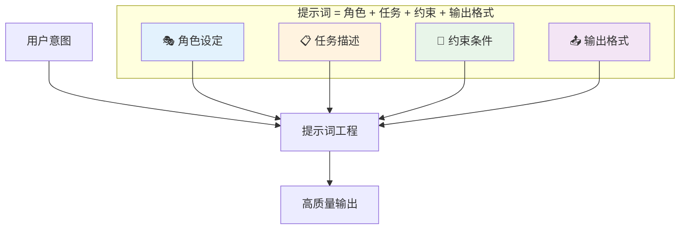
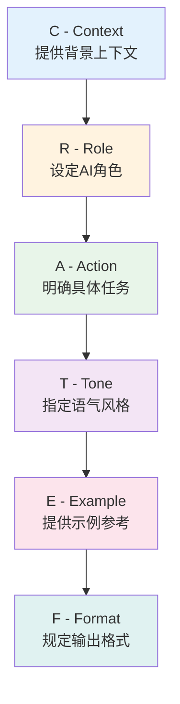
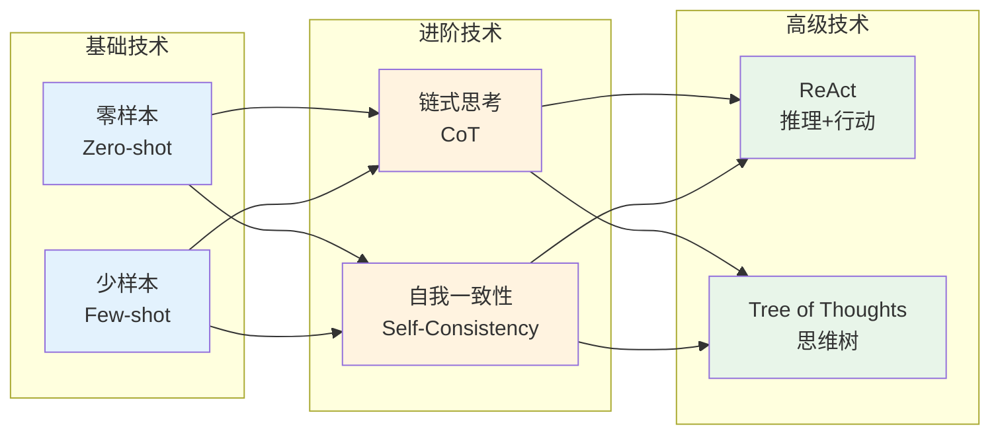
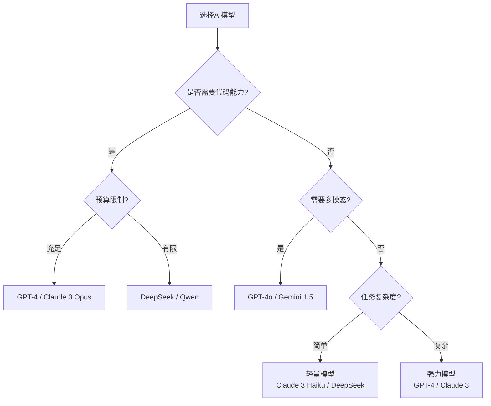
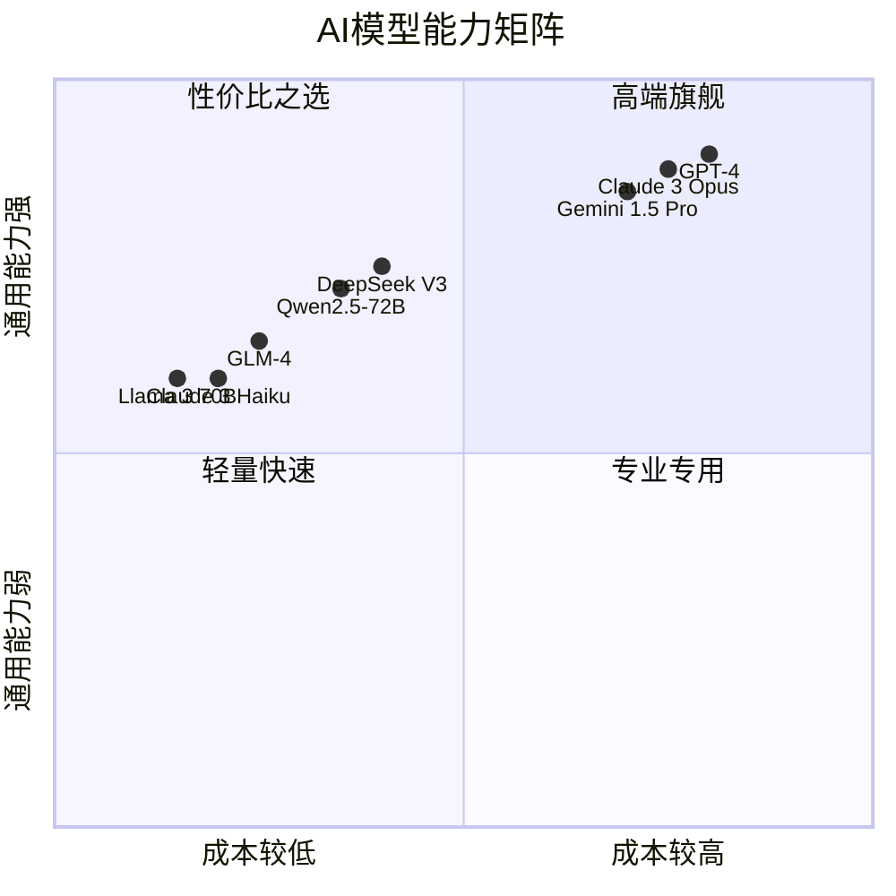
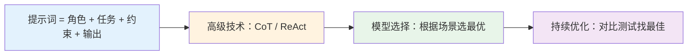

# 02 — LLM 与提示词工程

> 掌握与AI高效交互的核心技能：提示词设计方法论与模型选择策略
> 目标：能够写出高质量提示词，根据场景选择合适的模型

---

## 一、提示词工程基础

### 1.1 什么是提示词工程？



### 1.2 提示词设计框架（CREATE框架）



### 1.3 提示词模板

```
【角色】你是一位资深的[领域]专家
【背景】[上下文信息]
【任务】请帮我[具体任务]
【约束】[具体要求，如字数、格式、风格]
【示例】[参考示例，可选]
【输出】返回[具体的输出格式]
```

---

## 二、高级提示词技术

### 2.1 常见技术对比



### 2.2 各技术详解

#### 零样本（Zero-shot）

```
直接给出任务，不提供示例

示例：
"请将以下中文翻译成英文：今天天气很好"

输出：
"The weather is nice today."
```

#### 少样本（Few-shot）

```
提供少量示例，让AI学习模式

示例：
"将以下动词变为过去式：
跑 → 跑了
走 → 走了
看 → 看了
写 → ?"

输出：
"写 → 写了"
```

#### 链式思考（Chain-of-Thought, CoT）

```
引导AI逐步推理，提高复杂任务准确率

示例：
"小明有5个苹果，小红给了他3个，
他又吃了2个，请问他现在有几个苹果？
请一步一步思考。"

输出：
"第一步：小明最初有5个苹果
第二步：小红给了3个，现在有5+3=8个
第三步：吃了2个，现在有8-2=6个
答案：6个"
```

#### ReAct（推理+行动）

```
结合推理和行动，适合Agent系统

示例：
"查询北京今天的天气，如果超过30度，
提醒用户注意防暑。"

AI输出：
"我需要先查询北京天气...
[调用天气API]
[获取结果：35°C]
根据结果，温度超过30度，
建议提醒用户防暑..."
```

---

## 三、提示词实战案例

### 3.1 软件开发场景

```
【角色】你是一位资深的全栈工程师
【背景】我们正在开发一个电商系统，使用 Laravel + Vue 技术栈
【任务】请帮我生成一个商品管理的 CRUD API
【约束】
- 遵循 PSR-12 编码规范
- 包含完整的错误处理
- 使用 FormRequest 进行验证
- 返回统一的 JSON 格式
【输出】提供完整的控制器、模型、迁移文件代码
```

### 3.2 数据分析场景

```
【角色】你是一位数据分析师
【背景】我们有以下销售数据：[粘贴数据]
【任务】分析销售趋势，找出增长最快的产品类别
【约束】
- 使用 Python pandas 处理
- 输出可视化图表代码
- 给出业务建议
【输出】分析报告 + 可视化代码
```

### 3.3 内容创作场景

```
【角色】你是一位专业的内容运营
【背景】我们需要为新产品写一篇推广文案
【任务】撰写一篇吸引年轻用户的社交媒体文案
【约束】
- 风格活泼有趣
- 包含3个emoji
- 不超过200字
- 结尾有互动引导
【输出】完整的文案内容
```

---

## 四、模型选择策略

### 4.1 选型决策树



### 4.2 模型能力对比



### 4.3 选型建议

| 场景 | 推荐模型 | 理由 |
|------|----------|------|
| **代码生成** | DeepSeek V3 / GPT-4 | 代码能力强，成本低 |
| **长文档分析** | Claude 3 / Gemini 1.5 | 支持128K+上下文 |
| **中文内容创作** | 通义千问 / DeepSeek | 中文理解优秀 |
| **数学推理** | DeepSeek R1 / GPT-4 | 推理能力强 |
| **多模态任务** | GPT-4o / Gemini 1.5 | 原生支持图像 |
| **私有化部署** | Llama 3 / Qwen2.5 | 开源可本地运行 |

---

## 五、提示词优化技巧

### 5.1 常见问题与解决方案

| 问题 | 原因 | 解决方案 |
|------|------|----------|
| 输出太长 | 未限制长度 | 添加"控制在X字以内" |
| 内容跑题 | 任务描述不清 | 明确指定范围和格式 |
| 格式不对 | 未规定输出格式 | 用示例明确格式要求 |
| 重复内容 | 提示词模糊 | 明确唯一性要求 |
| 忽略约束 | 约束不够突出 | 用【必须】等强调词 |

### 5.2 优化前后对比

```
❌ 差的提示词：
"写一段关于AI的文字"

✅ 好的提示词：
【角色】你是一位科技博主
【任务】写一篇介绍AI应用的短文
【约束】200字以内，通俗易懂，面向普通读者
【格式】标题+正文，使用3个bullet point
【示例风格】"AI就像你家里的智能音箱，
虽然看不见，但它在帮你做很多事..."
```

---

## 六、常用 Prompt 模板库

### 6.1 代码相关

```markdown
# 代码解释
请解释以下代码的功能，用简洁的语言说明：
```[language]
[代码]
```

# 代码重构
请重构以下代码，使其更符合[规范名称]：
```[language]
[代码]
```
要求：可读性更强、性能更好、遵循[规范]

# Bug排查
我遇到以下错误，请帮我分析原因并提供解决方案：
错误信息：[粘贴错误]
相关代码：[粘贴代码]
```

### 6.2 内容创作

```markdown
# 文章改写
将以下内容改写为[风格]风格，目标读者是[人群]：
[原文]

# 摘要生成
请总结以下文章的要点，不超过100字：
[文章]

# 内容扩展
请基于以下要点，扩展成一篇完整的文章：
[要点列表]
要求：500字以上，逻辑清晰，案例生动
```

### 6.3 数据分析

```markdown
# 数据解读
请分析以下数据，指出关键趋势和洞察：
[数据]
重点关注：[关注点]

# SQL生成
请根据以下需求生成SQL查询：
需求：[描述]
表结构：[结构]
```

---

## 七、本章总结



> **核心结论：** 提示词工程是与AI沟通的艺术。好的提示词 = 清晰的意图 + 充分的上下文 + 明确的约束 + 合适的示例。

---

## 延伸阅读

- [01 AI基础知识](./01-AI基础知识与概念.md) — 理解AI底层原理
- [03 RAG检索增强生成系统](./03-RAG检索增强生成系统.md) — 提示词在RAG中的应用
- [11 AI工具链与平台推荐](./11-AI工具链与平台推荐.md) — 查看可用模型和API
