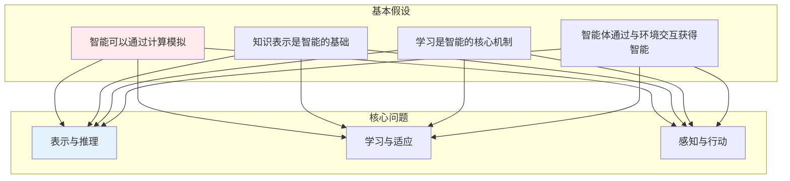
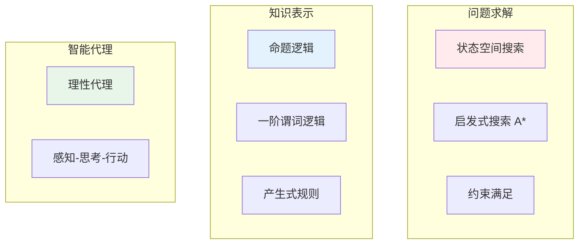
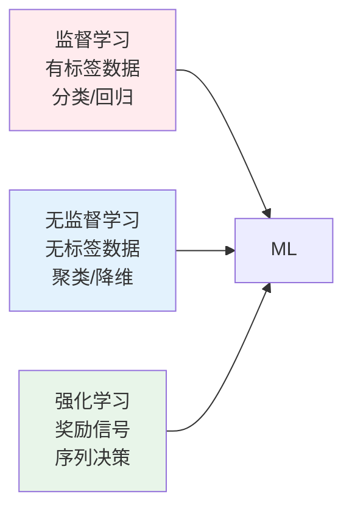
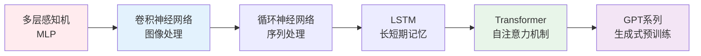
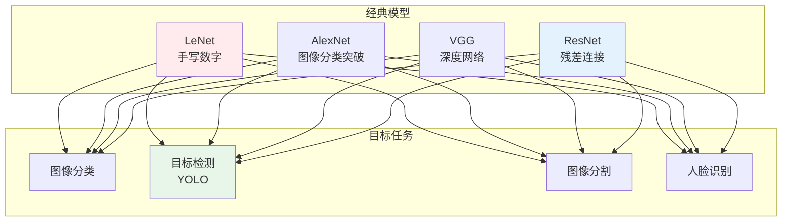
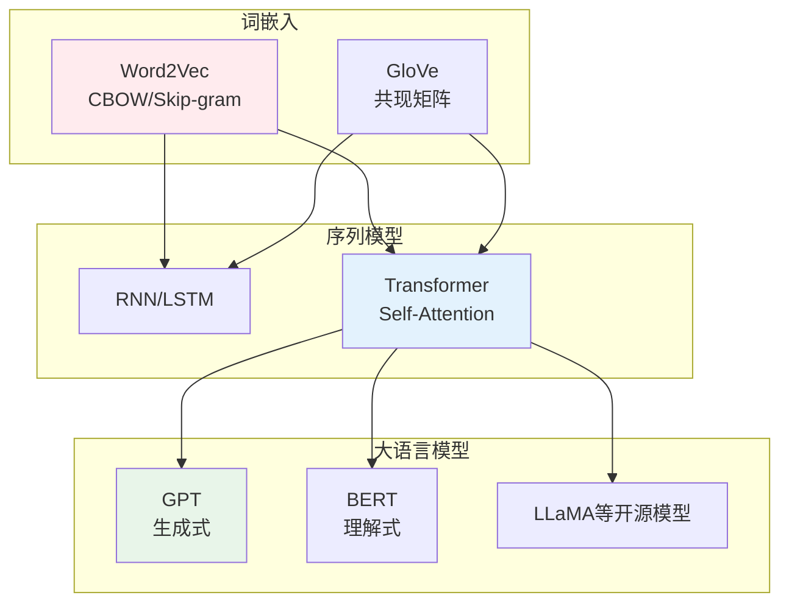
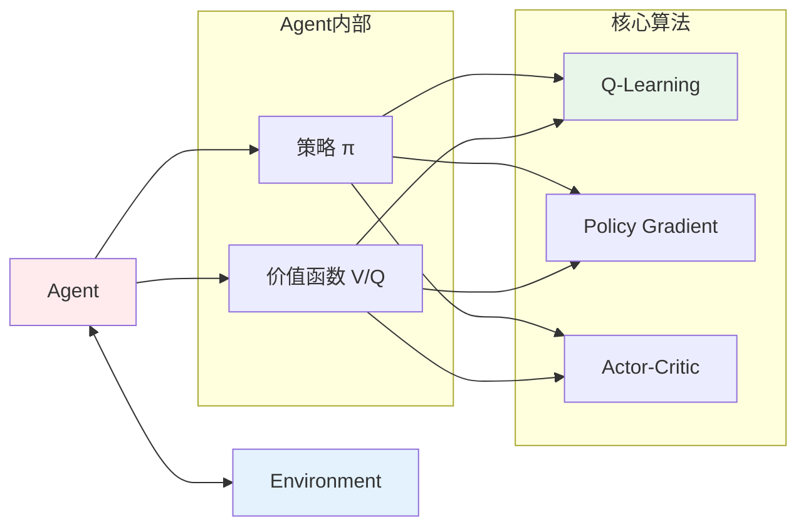
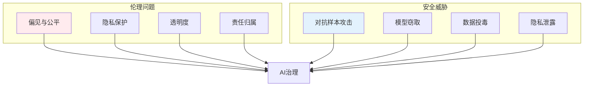
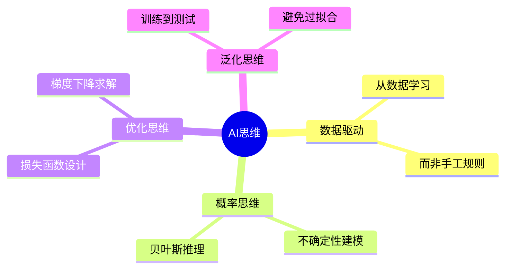
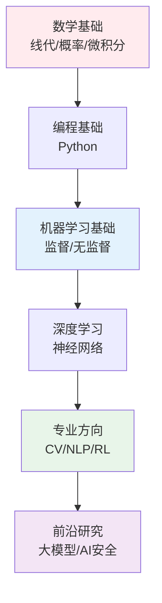

# AI核心知识体系

> **第一性原理**：人工智能是研究如何使机器模拟、延伸和扩展人类智能的学科，核心问题是"如何让机器像人一样思考和行动"。

---

## 📚 AI的公理体系



---

## 一、AI基础 AI Fundamentals



---

## 二、机器学习 Machine Learning

### 学习类型



### 监督学习算法

```mermaid
flowchart TD
    subgraph 回归
        R1[线性回归<br/>y = wx + b]
        R2[逻辑回归<br/>P = σ(wx+b)]
    end
    
    subgraph 分类
        C1[决策树]
        C2[支持向量机 SVM]
        C3[K近邻 KNN]
    end
    
    subgraph 集成方法
        E1[随机森林]
        E2[梯度提升 XGBoost]
    end
    
    style R1 fill:#fff3e0
    style C1 fill:#e3f2fd
    style E1 fill:#e8f5e9
```

### 神经网络基础

```mermaid
flowchart LR
    Input[输入层] --> Hidden[隐藏层]
    Hidden --> Output[输出层]
    
    Input -.-> Hidden
    Hidden -.-> Output
    
    subgraph 训练过程
        FWD[前向传播<br/>Z=W·X+B, A=σ(Z)]
        BACK[反向传播<br/>梯度下降更新权重]
    end
    
    style Input fill:#ffebee
    style Hidden fill:#e3f2fd
    style Output fill:#e8f5e9
    style FWD fill:#fff3e0
    style BACK fill:#fce4ec
```

---

## 三、深度学习 Deep Learning

### 网络架构演进



### 计算机视觉 CV



### 自然语言处理 NLP



---

## 四、强化学习 Reinforcement Learning



---

## 五、AI伦理与安全



---

## 六、AI思维方式



---

## 📖 学习路径



---

## 参考文献

1. 《机器学习》- 周志华
2. 《深度学习》- Ian Goodfellow
3. 《强化学习》- Sutton & Barto
4. 《Pattern Recognition and Machine Learning》- Bishop