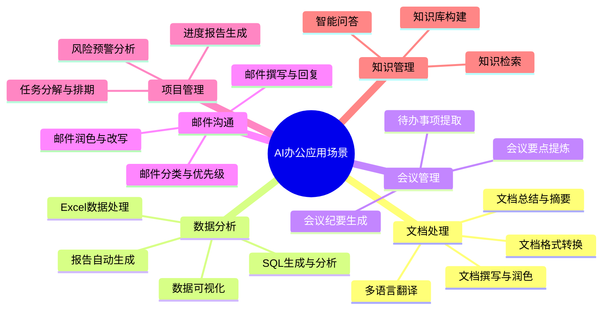
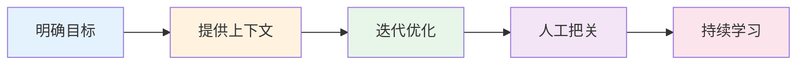

# 08 — AI 辅助办公提效指南

> 将AI融入日常办公，释放生产力
> 目标：掌握AI在办公场景中的高效应用方法

---

## 一、AI办公应用场景总览



---

## 二、文档处理AI化

### 2.1 高效写作助手

```
【写作场景模板】商务邮件

请帮我写一封商务邮件：
收件人：[对方姓名/职位]
主题：[邮件主题]
目的：[邮件目的]
要点：
- [要点1]
- [要点2]
- [要点3]
语气：[正式/友好/委婉]

【写作场景模板】工作报告

请帮我撰写本周工作报告：
工作周期：[日期范围]
已完成工作：
- [工作1]
- [工作2]
遇到的问题：
- [问题1]
下周计划：
- [计划1]
- [计划2]
```

### 2.2 文档快速处理

```
【文档总结模板】

请总结以下文档的核心要点：
[粘贴文档内容]

要求：
1. 控制在200字以内
2. 提取关键结论和数据
3. 列出3-5个核心要点
4. 标注重要风险提示

【文档润色模板】

请润色以下文本，使其更加专业和流畅：
[粘贴原文]

要求：
1. 保持原意不变
2. 优化表达逻辑
3. 修正语法错误
4. 提升专业度
```

---

## 三、数据分析AI化

### 3.1 Excel智能分析

```
【Excel分析模板】

请帮我分析以下Excel数据：
[粘贴数据或描述数据结构]

分析需求：
1. [分析需求1]
2. [分析需求2]
3. 输出格式：[表格/图表描述/文字报告]
```

### 3.2 SQL智能生成

```
【SQL生成模板】

请生成以下查询的SQL语句：
数据库类型：[MySQL/PostgreSQL/...]
表结构：
- users(id, name, email, created_at)
- orders(id, user_id, amount, status, created_at)

查询需求：[描述查询逻辑]
```

### 3.3 数据可视化建议

```
【可视化建议模板】

我有以下数据：
[数据描述或样本]
想展示：[想展示的内容]

请推荐：
1. 最适合的图表类型
2. 配色建议
3. 图表布局建议
4. 关键指标高亮建议
```

---

## 四、会议管理AI化

### 4.1 会议纪要生成

```
【会议纪要模板】

请根据以下会议录音转录文本生成会议纪要：
[粘贴会议转录文本]

输出格式：
## 会议信息
- 时间：
- 参会人：
- 会议主题：

## 会议要点
1. [要点1]
2. [要点2]

## 决议事项
- [决议1]
- [决议2]

## 待办事项
| 任务 | 负责人 | 截止日期 |
|------|--------|----------|
| [任务] | [负责人] | [日期] |
```

### 4.2 会议要点提炼

```
【会议要点提炼模板】

请从以下会议内容中提炼关键决策和行动项：
[粘贴会议内容]

要求：
1. 提取3-5个关键决策
2. 列出所有待办事项及负责人
3. 标注风险点和依赖关系
4. 控制在300字以内
```

---

## 五、邮件沟通AI化

### 5.1 邮件撰写与回复

```
【邮件撰写模板】

请帮我撰写一封邮件：
收件人：[谁]
主题：[主题]
背景：[项目/事件背景]
目的：[邮件目的]
关键信息：
- [信息1]
- [信息2]

【邮件回复模板】

请帮我回复以下邮件：
原邮件：[粘贴原邮件]
我的回应要点：
- [回应1]
- [回应2]
语气：[礼貌/坚定/委婉]
```

### 5.2 邮件润色优化

```
【邮件润色模板】

请润色以下邮件草稿，使其更专业得体：
[粘贴邮件草稿]

要求：
1. 修正语法和拼写错误
2. 优化句子结构
3. 调整语气（更正式/更友好）
4. 确保逻辑清晰
```

---

## 六、项目管理AI化

### 6.1 任务分解与排期

```
【任务分解模板】

请将以下项目分解为可执行的任务：
项目名称：[名称]
目标：[项目目标]
约束：[时间/资源约束]

请输出：
1. WBS任务分解（3层）
2. 每个任务的预估工时
3. 任务依赖关系
4. 关键路径分析
```

### 6.2 进度报告生成

```
【进度报告模板】

请生成以下项目的周报：
项目：[名称]
本周进展：
- [进展1]
- [进展2]
遇到的问题：
- [问题1]
下周计划：
- [计划1]
- [计划2]
风险预警：
- [风险1]
```

---

## 七、知识管理AI化

### 7.1 知识库构建

```
【知识库整理模板】

请帮我整理以下零散知识，构建结构化知识库：
[粘贴原始知识内容]

输出格式：
## 知识分类
1. [类别1]
   - [知识点1]
   - [知识点2]
2. [类别2]
   - [知识点1]

## 常见问题FAQ
1. Q: [问题] → A: [答案]
```

### 7.2 AI问答助手

```
【问答助手配置】

请基于以下知识文档，回答用户问题：
知识库：[粘贴或指定知识库]
用户问题：[问题]

回答要求：
1. 仅基于知识库内容回答
2. 标注信息来源
3. 如果知识库中没有，明确说明
```

---

## 八、效率提升数据

```mermaid
bar
    title AI办公应用效率提升估算
    x-axis "场景" ["邮件<br/>撰写" "文档<br/>总结" "数据分析" "会议纪要" "报告<br/>生成" "知识<br/>检索"]
    y-axis "效率提升" [60, 70, 50, 65, 55, 80]
    max 100
```

| 场景 | 传统方式耗时 | AI辅助后 | 效率提升 |
|------|-------------|----------|:--------:|
| 邮件撰写 | 15分钟/封 | 3分钟/封 | 80% |
| 文档总结 | 30分钟 | 5分钟 | 83% |
| 数据分析 | 2小时 | 20分钟 | 83% |
| 会议纪要 | 45分钟 | 10分钟 | 78% |
| 报告生成 | 1小时 | 15分钟 | 75% |
| 知识检索 | 10分钟 | 30秒 | 95% |

---

## 九、最佳实践建议

### 9.1 AI办公黄金法则



### 9.2 常用提示词速查

```
## 快速查询卡片

📧 邮件类：
"帮我写一封[语气]的邮件，主题是[主题]，要点是..."

📄 文档类：
"总结以下文档的核心要点，不超过[字数]字..."

📊 数据类：
"分析以下数据，找出[关注点]..."

📝 润色类：
"请润色以下文本，使其更[风格]..."

❓ 问答类：
"基于以下知识，回答[问题]..."
```

---

## 十、本章总结

> **核心结论：** AI办公提效的核心在于"明确需求 + 提供上下文 + 迭代优化"。将AI当作一个效率倍增器，而非替代品——你负责判断和决策，AI负责执行和优化。

---

## 延伸阅读

- [07 AI辅助软件开发体系](./07-AI辅助软件开发体系.md) — AI在开发领域的深度应用
- [11 AI工具链与平台推荐](./11-AI工具链与平台推荐.md) — 办公AI工具推荐
