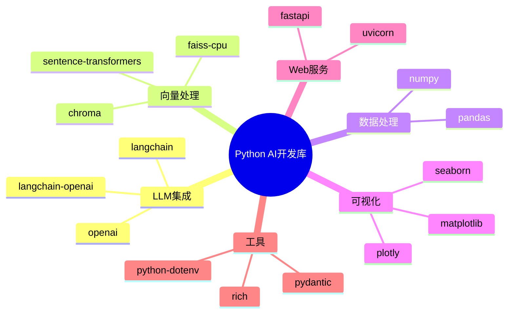
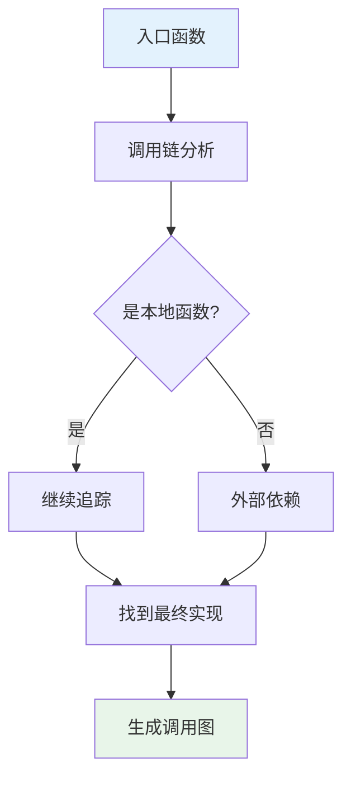
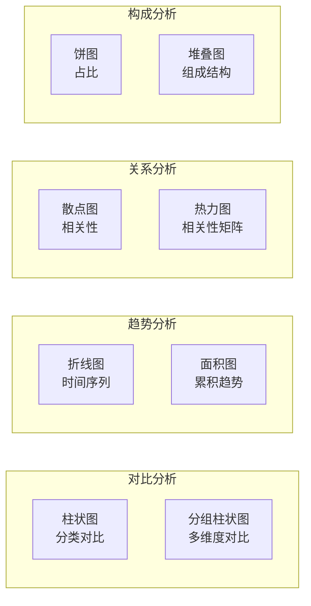

# 09 — AI 开发实战案例

> 从Python基础到API集成，从代码分析到数据可视化
> 目标：通过实战案例打通理论与实践，掌握AI开发的核心技能

---

## 一、Python AI开发基础

### 1.1 环境准备

```bash
# 创建虚拟环境
python -m venv ai-env
source ai-env/bin/activate  # Linux/Mac
# ai-env\Scripts\activate   # Windows

# 安装核心依赖
pip install langchain langchain-openai chromadb sentence-transformers
pip install pandas numpy matplotlib seaborn
pip install fastapi uvicorn requests
pip install pydantic python-dotenv
```

### 1.2 核心库速查



---

## 二、API调用实战

### 2.1 多模型API统一封装

```python
# api/client.py
import os
from typing import Dict, Any, Optional
from dotenv import load_dotenv

load_dotenv()

class AIModelClient:
    """统一AI模型客户端"""
    
    def __init__(self):
        self.models = {
            'gpt4': {'base_url': 'https://api.openai.com/v1', 'api_key': os.getenv('OPENAI_API_KEY')},
            'deepseek': {'base_url': 'https://api.deepseek.com/v1', 'api_key': os.getenv('DEEPSEEK_API_KEY')},
            'qwen': {'base_url': 'https://dashscope.aliyuncs.com/compatible-mode/v1', 'api_key': os.getenv('DASHSCOPE_API_KEY')},
        }
    
    def chat(self, model: str = 'deepseek', messages: list, **kwargs) -> str:
        """统一聊天接口"""
        config = self.models[model]
        # 实际调用对应API...
        return f"这是{model}的回复"
    
    def embed(self, texts: list, model: str = 'text-embedding-ada-002') -> list:
        """统一嵌入接口"""
        # 实际调用对应API...
        return [[0.1] * 1536 for _ in texts]

client = AIModelClient()
```

### 2.2 带缓存的API调用

```python
# api/cached_client.py
import redis
import json
from functools import wraps

class CachedAIClient:
    def __init__(self):
        self.redis = redis.Redis(host='localhost', port=6379, db=0)
        self.base_client = AIModelClient()
    
    def chat_with_cache(self, model: str, messages: list, cache_ttl: int = 3600) -> str:
        """带缓存的聊天调用"""
        # 生成缓存键
        cache_key = f"ai:chat:{hash(json.dumps(messages, sort_keys=True))}"
        
        # 检查缓存
        cached = self.redis.get(cache_key)
        if cached:
            return json.loads(cached)
        
        # 调用API
        result = self.base_client.chat(model, messages)
        
        # 写入缓存
        self.redis.setex(cache_key, cache_ttl, json.dumps(result))
        
        return result

cached_client = CachedAIClient()
```

---

## 三、代码阅读与分析

### 3.1 AI辅助代码理解

```python
# 使用AI分析代码结构
def analyze_code_with_ai(code: str, language: str) -> dict:
    """使用AI分析代码"""
    prompt = f"""分析以下{language}代码，输出：
1. 代码功能概述
2. 主要类/函数列表
3. 调用关系
4. 潜在问题

代码：
```{language}
{code}
```"""
    
    response = client.chat('deepseek', [
        {'role': 'system', 'content': '你是一位代码分析专家'},
        {'role': 'user', 'content': prompt}
    ])
    return response
```

### 3.2 逻辑链追踪



---

## 四、数据处理实战

### 4.1 Pandas AI增强分析

```python
import pandas as pd
import numpy as np

# 读取数据
df = pd.read_csv('sales_data.csv')

# AI辅助数据分析
analysis_prompt = f"""分析以下销售数据：
{df.head(20).to_string()}

请回答：
1. 销售额最高的产品类别
2. 月度销售趋势
3. 异常值识别
4. 业务建议"""

# 调用AI分析
analysis_result = client.chat('deepseek', [
    {'role': 'system', 'content': '你是一位数据分析师'},
    {'role': 'user', 'content': analysis_prompt}
])
print(analysis_result)
```

### 4.2 智能数据清洗

```python
def smart_clean(df: pd.DataFrame) -> pd.DataFrame:
    """AI辅助数据清洗"""
    # 检测数据问题
    issues = {
        'null_count': df.isnull().sum().sum(),
        'duplicate_count': df.duplicated().sum(),
        'type_issues': df.apply(lambda x: x.apply(lambda y: type(y).__name__).value_counts())
    }
    
    # AI辅助制定清洗策略
    prompt = f"""数据问题：{issues}
请建议清洗策略，包括：
1. 缺失值处理方式
2. 重复值处理方式
3. 异常值处理方式"""
    
    strategy = client.chat('deepseek', [
        {'role': 'user', 'content': prompt}
    ])
    print(f"清洗策略：{strategy}")
    
    # 执行清洗
    df_clean = df.dropna().drop_duplicates()
    return df_clean
```

---

## 五、数据可视化实战

### 5.1 AI生成图表代码

```python
def generate_chart_code(data: pd.DataFrame, chart_type: str, question: str) -> str:
    """使用AI生成可视化代码"""
    prompt = f"""基于以下数据生成{chart_type}图表代码：
数据：
{data.head(10).to_string()}

问题：{question}

请生成完整的matplotlib/seaborn代码，要求：
1. 图表标题清晰
2. 配色美观
3. 包含中文支持
4. 标注关键数据点"""
    
    return client.chat('deepseek', [
        {'role': 'system', 'content': '你是一位数据可视化专家'},
        {'role': 'user', 'content': prompt}
    ])
```

### 5.2 常用图表模板



---

## 六、端到端实战项目

### 6.1 项目：智能知识问答系统

```
项目结构：
knowledge_qa/
├── config/
│   └── settings.py
├── data/
│   └── documents/
├── services/
│   ├── rag_service.py
│   └── embedding_service.py
├── api/
│   └── main.py
├── tests/
│   └── test_rag.py
└── requirements.txt
```

### 6.2 核心代码实现

```python
# services/rag_service.py
from langchain.chains import RetrievalQA
from langchain.embeddings import OpenAIEmbeddings
from langchain.vectorstores import Chroma
from langchain.text_splitter import CharacterTextSplitter
from langchain.document_loaders import TextLoader

class KnowledgeQA:
    def __init__(self, docs_dir: str):
        self.embeddings = OpenAIEmbeddings()
        self.vector_store = Chroma(
            collection_name="knowledge",
            embedding_function=self.embeddings,
            persist_directory="./chroma_db"
        )
        self.llm = OpenAI(temperature=0.1)
    
    def add_document(self, file_path: str):
        """添加文档到知识库"""
        loader = TextLoader(file_path)
        documents = loader.load()
        
        text_splitter = CharacterTextSplitter(
            chunk_size=800,
            chunk_overlap=150
        )
        chunks = text_splitter.split_documents(documents)
        self.vector_store.add_documents(chunks)
        self.vector_store.persist()
    
    def query(self, question: str, top_k: int = 3) -> dict:
        """查询知识库"""
        retriever = self.vector_store.as_retriever(
            search_type="similarity",
            search_kwargs={"k": top_k}
        )
        
        qa_chain = RetrievalQA.from_chain_type(
            llm=self.llm,
            chain_type="stuff",
            retriever=retriever,
            return_source_documents=True
        )
        
        result = qa_chain({"query": question})
        return {
            "answer": result["result"],
            "sources": [doc.page_content[:200] for doc in result["source_documents"]]
        }
```

### 6.3 API接口

```python
# api/main.py
from fastapi import FastAPI, UploadFile, File
from services.rag_service import KnowledgeQA

app = FastAPI(title="Knowledge QA API")
qa = KnowledgeQA(docs_dir="./data/documents")

@app.post("/upload")
async def upload_document(file: UploadFile = File(...)):
    """上传文档到知识库"""
    content = await file.read()
    file_path = f"./data/documents/{file.filename}"
    with open(file_path, "wb") as f:
        f.write(content)
    qa.add_document(file_path)
    return {"status": "success", "filename": file.filename}

@app.post("/query")
async def query_knowledge(question: str, top_k: int = 3):
    """查询知识库"""
    result = qa.query(question, top_k)
    return result

@app.get("/stats")
async def get_stats():
    """获取知识库统计"""
    count = qa.vector_store._collection.count()
    return {"document_count": count}
```

---

## 七、本章总结

> **核心结论：** AI开发的本质是"数据 + 模型 + 工程"。掌握Python基础 → 理解API调用 → 实践数据处理 → 构建完整系统，是快速入门AI开发的有效路径。

---

## 延伸阅读

- [03 RAG检索增强生成系统](./03-RAG检索增强生成系统.md) — RAG系统架构详解
- [04 Agent智能代理架构](./04-Agent智能代理架构.md) — Agent实现与协作
- [06 AI工程化实践](./06-AI工程化实践.md) — 生产环境部署
