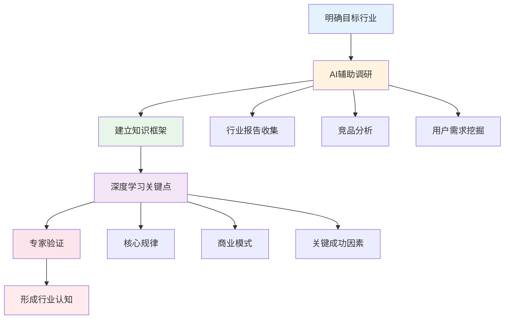
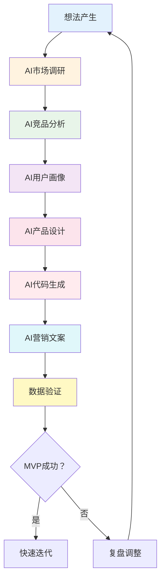
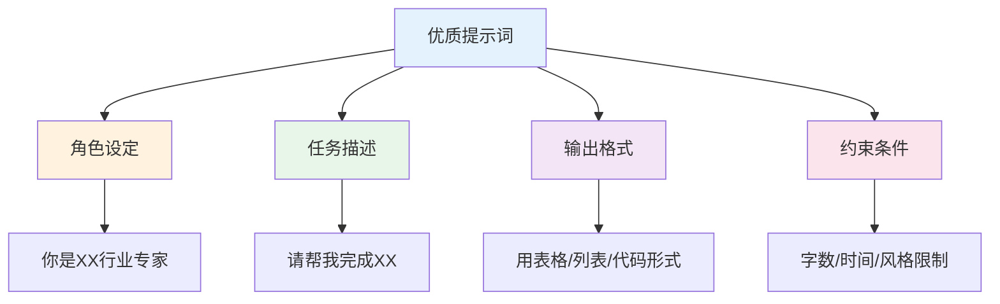
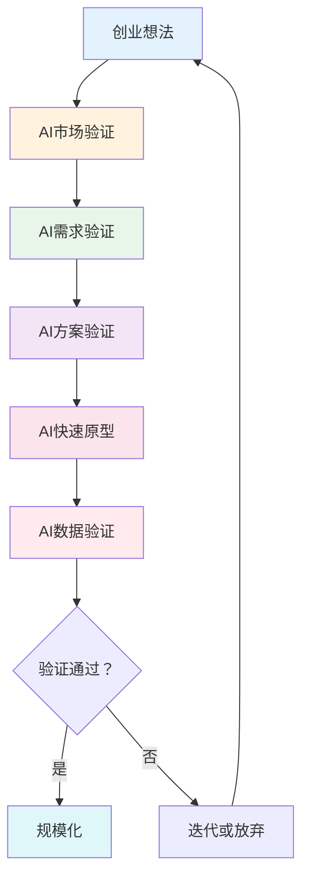
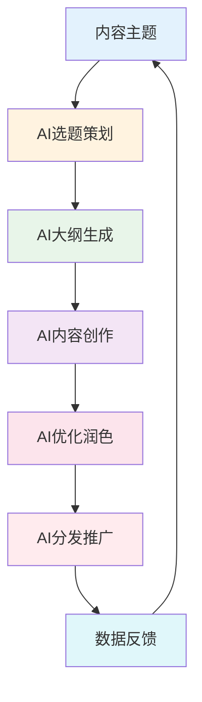
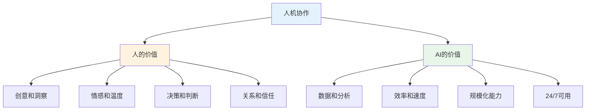

# AI赋能新行业 — 快速熟悉并验证产品的思考路径

> AI时代，掌握AI工具可以10倍速学习新行业、验证新产品
> 目标：用AI快速建立行业认知、做出MVP、验证产品可行性

---

## 一、AI赋能学习新行业

### 1.1 快速学习框架



### 1.2 AI调研提示词模板

| 阶段 | 提示词示例 | 预期输出 |
|------|------------|----------|
| 行业概况 | "请介绍XX行业的市场规模、增长趋势、主要玩家" | 行业全景图 |
| 商业模式 | "XX行业的主流商业模式有哪些？各有什么优劣？" | 商业模式对比 |
| 用户痛点 | "XX行业的用户最常遇到的问题是什么？" | 痛点清单 |
| 竞品分析 | "请分析XX行业TOP3竞品的优劣势" | 竞品矩阵 |
| 入局策略 | "如果要进入XX行业，最小可行路径是什么？" | 入局策略 |

---

## 二、AI辅助产品验证

### 2.1 MVP验证流程



### 2.2 AI工具链推荐

| 环节 | 工具类型 | 推荐工具 |
|------|----------|----------|
| 调研 | AI搜索 | Perplexity、ChatGPT |
| 设计 | AI设计 | Midjourney、Figma AI |
| 开发 | AI编程 | Cursor、GitHub Copilot |
| 文案 | AI写作 | ChatGPT、Claude |
| 营销 | AI营销 | AdCreative、Jasper |
| 数据 | AI分析 | Julius、ChatGPT Code Interpreter |

---

## 三、AI提示词工程

### 3.1 提示词框架



### 3.2 常用提示词模板

**行业调研：**
```
你是一位资深的[行业]分析师，请用专业但易懂的语言介绍：
1. [行业]的市场规模和发展趋势
2. 主要玩家和竞争格局
3. 核心商业模式和盈利方式
4. 用户群体和核心需求
5. 行业进入门槛和关键成功因素

请用表格形式呈现，并给出你的判断和建议。
```

**竞品分析：**
```
请帮我分析以下竞品：
- 竞品A：[名称]
- 竞品B：[名称]
- 竞品C：[名称]

分析维度：
1. 产品定位和目标用户
2. 核心功能和差异化
3. 商业模式和定价策略
4. 优劣势对比
5. 市场机会点

请用对比表格呈现，并给出差异化建议。
```

**用户需求：**
```
请帮我分析[目标用户群体]的核心需求：
1. 他们最常遇到的问题是什么？
2. 现有解决方案有哪些不足？
3. 他们愿意为什么付费？
4. 如何触达这些用户？

请用用户故事格式呈现，并给出产品建议。
```

---

## 四、AI辅助创业验证

### 4.1 创业验证框架



### 4.2 验证检查清单

**市场验证：**
- [ ] AI调研：市场规模是否足够？
- [ ] AI分析：增长趋势是否正向？
- [ ] AI竞品：竞争格局如何？
- [ ] AI用户：目标用户是否明确？

**需求验证：**
- [ ] AI访谈：用户痛点是否真实？
- [ ] AI问卷：需求是否普遍？
- [ ] AI分析：现有方案不足在哪？
- [ ] AI预测：付费意愿如何？

**方案验证：**
- [ ] AI设计：解决方案是否可行？
- [ ] AI评估：技术实现是否复杂？
- [ ] AI测算：成本结构是否合理？
- [ ] AI规划：落地路径是否清晰？

---

## 五、AI辅助内容创作

### 5.1 内容创作流程



### 5.2 内容创作提示词

**选题策划：**
```
请帮我策划[领域]的内容选题：
1. 目标受众是谁？
2. 他们最关心什么问题？
3. 竞品在做什么内容？
4. 哪些话题有搜索量？
5. 如何差异化？

请给出10个选题建议，并说明每个选题的价值。
```

**文章创作：**
```
请帮我写一篇关于[主题]的文章：
- 目标读者：[用户画像]
- 文章目的：[教育/转化/品牌]
- 文章长度：[字数]
- 写作风格：[专业/轻松/故事化]
- 关键词：[SEO关键词]

请先给出大纲，确认后再写全文。
```

---

## 六、AI使用最佳实践

### 6.1 人机协作分工



### 6.2 AI使用原则

| 原则 | 说明 | 注意事项 |
|------|------|----------|
| 明确目标 | 先想清楚要什么 | 避免盲目使用 |
| 提供上下文 | 给AI足够信息 | 背景+约束+示例 |
| 迭代优化 | 多轮对话完善 | 不期望一次完美 |
| 人工审核 | AI输出需验证 | 避免错误传播 |
| 保护隐私 | 敏感信息不上传 | 企业机密注意 |

---

## 七、落地清单

### 学习新行业

- [ ] 明确学习目标和时间限制
- [ ] 使用AI进行行业调研
- [ ] 建立知识框架
- [ ] 深入学习关键点
- [ ] 找专家验证认知

### 验证新产品

- [ ] 明确产品假设
- [ ] 使用AI进行市场调研
- [ ] 快速制作原型
- [ ] 小范围测试验证
- [ ] 数据驱动决策

---

## 八、推荐阅读

- 《AI赋能：人工智能时代的商业转型》— AI商业应用
- 《精益创业》— MVP方法论
- 《增长黑客》— 数据驱动增长
- 《提示工程指南》— AI使用技巧
- 《从0到1》— 创新思维
