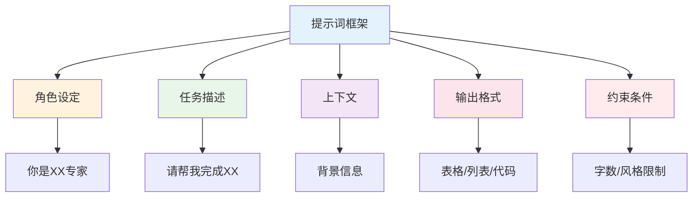

# 提示词工程实战 — 让AI更好为你工作

> 90%的人不会写提示词，导致AI输出质量差

---

## 一、提示词核心原则

### 1.1 提示词公式

```
优质提示词 = 角色 + 任务 + 上下文 + 格式 + 约束
```

### 1.2 提示词框架



---

## 二、提示词模板库

### 2.1 行业调研

```
你是一位资深的[行业]分析师，请用专业但易懂的语言介绍：
1. [行业]的市场规模和发展趋势
2. 主要玩家和竞争格局
3. 核心商业模式和盈利方式
4. 用户群体和核心需求
5. 行业进入门槛和关键成功因素

请用表格形式呈现，并给出你的判断和建议。
```

### 2.2 竞品分析

```
请帮我分析以下竞品：
- 竞品A：[名称]
- 竞品B：[名称]
- 竞品C：[名称]

分析维度：
1. 产品定位和目标用户
2. 核心功能和差异化
3. 商业模式和定价策略
4. 优劣势对比
5. 市场机会点

请用对比表格呈现，并给出差异化建议。
```

### 2.3 内容创作

```
请帮我写一篇关于[主题]的文章：
- 目标读者：[用户画像]
- 文章目的：[教育/转化/品牌]
- 文章长度：[字数]
- 写作风格：[专业/轻松/故事化]
- 关键词：[SEO关键词]

请先给出大纲，确认后再写全文。
```

### 2.4 代码开发

```
请帮我用[语言]写一个[功能]的代码：
- 输入：[输入格式]
- 输出：[输出格式]
- 特殊要求：[性能/安全/可读性]

请写出完整代码，并添加注释说明。
```

---

## 三、提示词优化技巧

### 3.1 常见问题

| 问题 | 原因 | 优化方法 |
|------|------|----------|
| 输出太笼统 | 任务描述不清 | 具体化任务 |
| 输出不符合要求 | 格式不明确 | 明确输出格式 |
| 输出质量差 | 角色不清晰 | 明确角色设定 |
| 输出太长/太短 | 长度不限制 | 限制字数 |

### 3.2 优化案例

**优化前：**
```
帮我写一篇文章
```

**优化后：**
```
你是一位资深的营销专家，请写一篇关于"如何用AI提升营销效率"的文章。
目标读者：中小企业营销人员
文章目的：提供实用的AI营销方法
文章长度：1500字左右
写作风格：专业但易懂
请先给出大纲。
```

---

## 四、案例复盘

### 4.1 成功案例：市场调研

**提示词：**
```
你是一位资深的电商行业分析师，请分析2024年中国电商市场趋势。
要求：
1. 市场规模和增长
2. 主要玩家格局
3. 新兴趋势
4. 机会和挑战
请用表格形式呈现。
```

**输出质量：** 结构清晰，数据准确，建议实用

### 4.2 失败案例：代码生成

**提示词：**
```
帮我写一个网站
```

**问题：** 输出太泛，无法使用

**优化后：**
```
请用React写一个Todo List组件：
- 支持添加、删除、完成
- 使用useState管理状态
- 样式简洁美观
- 添加适当注释
```

---

## 五、行动清单

### 学习提示词

- [ ] 了解提示词框架
- [ ] 收集优质提示词模板
- [ ] 在实际工作中应用
- [ ] 持续优化迭代

### 应用提示词

- [ ] 明确任务目标
- [ ] 设定清晰角色
- [ ] 提供充足上下文
- [ ] 明确输出格式
- [ ] 添加约束条件

---

> **记住：提示词的质量决定AI输出的质量。多写、多试、多优化。**
