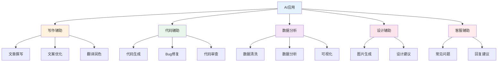
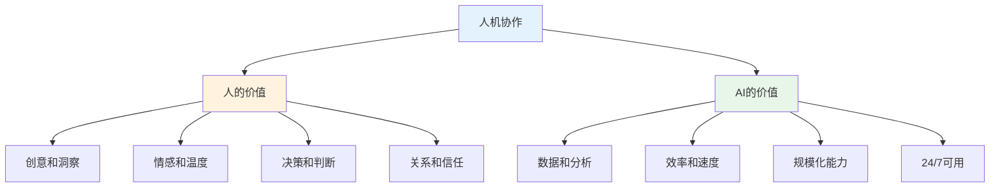

# AI应用场景实战 — AI能做什么

> AI不是万能的，但用对场景可以10倍提效

---

## 一、AI应用场景矩阵

---

## 二、写作辅助

### 2.1 应用场景

| 场景 | 效率提升 | 质量提升 |
|------|----------|----------|
| 文章撰写 | 5-10倍 | 中等 |
| 文案优化 | 3-5倍 | 高 |
| 翻译润色 | 10-20倍 | 高 |
| 报告生成 | 5-10倍 | 中等 |

### 2.2 案例：产品文案

**传统方式：** 1小时写5条文案
**AI方式：** 10分钟生成50条文案，筛选5条优化

---

## 三、代码辅助

### 3.1 应用场景

| 场景 | 效率提升 | 质量提升 |
|------|----------|----------|
| 代码生成 | 3-5倍 | 中等 |
| Bug修复 | 5-10倍 | 高 |
| 代码审查 | 2-3倍 | 高 |
| 文档生成 | 10倍 | 中等 |

### 3.2 案例：React组件

**传统方式：** 1小时写一个组件
**AI方式：** 10分钟生成，20分钟优化调整

---

## 四、数据分析

### 4.1 应用场景

| 场景 | 效率提升 | 质量提升 |
|------|----------|----------|
| 数据清洗 | 5-10倍 | 高 |
| 数据分析 | 3-5倍 | 中等 |
| 可视化 | 5-10倍 | 中等 |
| 报告生成 | 10倍 | 中等 |

### 4.2 案例：销售数据分析

**传统方式：** 半天写分析报告
**AI方式：** 30分钟生成初稿，30分钟优化

---

## 五、设计辅助

### 5.1 应用场景

| 场景 | 效率提升 | 质量提升 |
|------|----------|----------|
| 图片生成 | 10-20倍 | 中等 |
| 设计建议 | 2-3倍 | 高 |
| 原型设计 | 3-5倍 | 中等 |

### 5.2 案例：营销海报

**传统方式：** 设计师2小时出图
**AI方式：** 30分钟生成5个方案，选择优化

---

## 六、AI使用原则

### 6.1 人机协作分工

### 6.2 使用原则

| 原则 | 说明 |
|------|------|
| 明确目标 | 先想清楚要什么 |
| 提供上下文 | 给AI足够信息 |
| 迭代优化 | 多轮对话完善 |
| 人工审核 | AI输出需验证 |
| 保护隐私 | 敏感信息不上传 |

---

## 七、行动清单

### 选择场景

- [ ] 分析自己的工作场景
- [ ] 找出重复性高的任务
- [ ] 评估AI提效可能性
- [ ] 选择1-2个场景开始

### 应用AI

- [ ] 学习相关AI工具
- [ ] 编写提示词模板
- [ ] 小范围测试验证
- [ ] 持续优化迭代

### 评估效果

- [ ] 对比效率提升
- [ ] 评估质量变化
- [ ] 计算投入产出
- [ ] 扩大应用范围

---

> **记住：AI是工具，用对场景才能发挥价值。**
