# 05 — AI 工作流搭建

> 将AI能力集成到业务流程中，实现自动化与智能化
> 目标：掌握工作流引擎选型、编排设计和监控优化方法

---

## 一、工作流基础概念

### 1.1 什么是AI工作流？

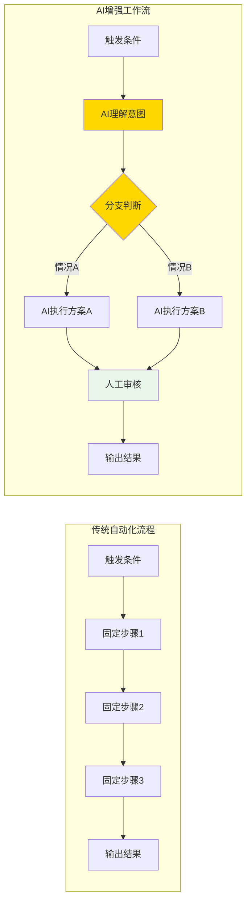

**核心差异：** AI工作流 = **固定流程** + **AI动态决策** + **人机协作**

### 1.2 工作流核心要素

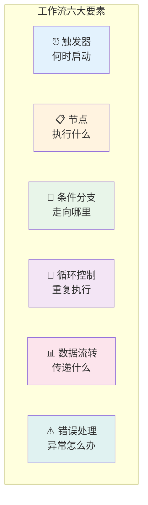

---

## 二、工作流引擎选型

### 2.1 主流引擎对比

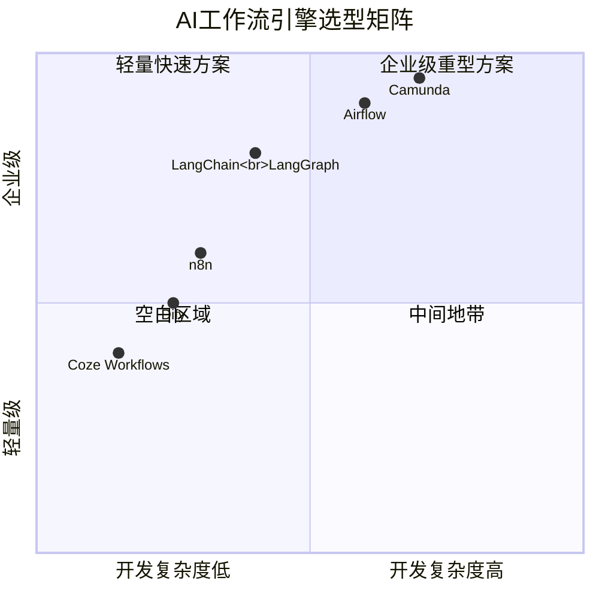

| 引擎 | 类型 | 特点 | 适用场景 |
|------|------|------|----------|
| **LangChain/LangGraph** | LLM原生 | 专为AI设计，支持Agent | AI应用开发 |
| **n8n** | 可视化 | 拖拽式设计，无需编码 | 业务自动化 |
| **Dify** | LLM原生 | 低代码平台，中文友好 | 快速原型 |
| **Airflow** | 数据流 | 强大的调度监控 | 数据管道 |
| **Camunda** | BPMN | 企业级流程引擎 | 复杂业务流程 |

### 2.2 选型决策树

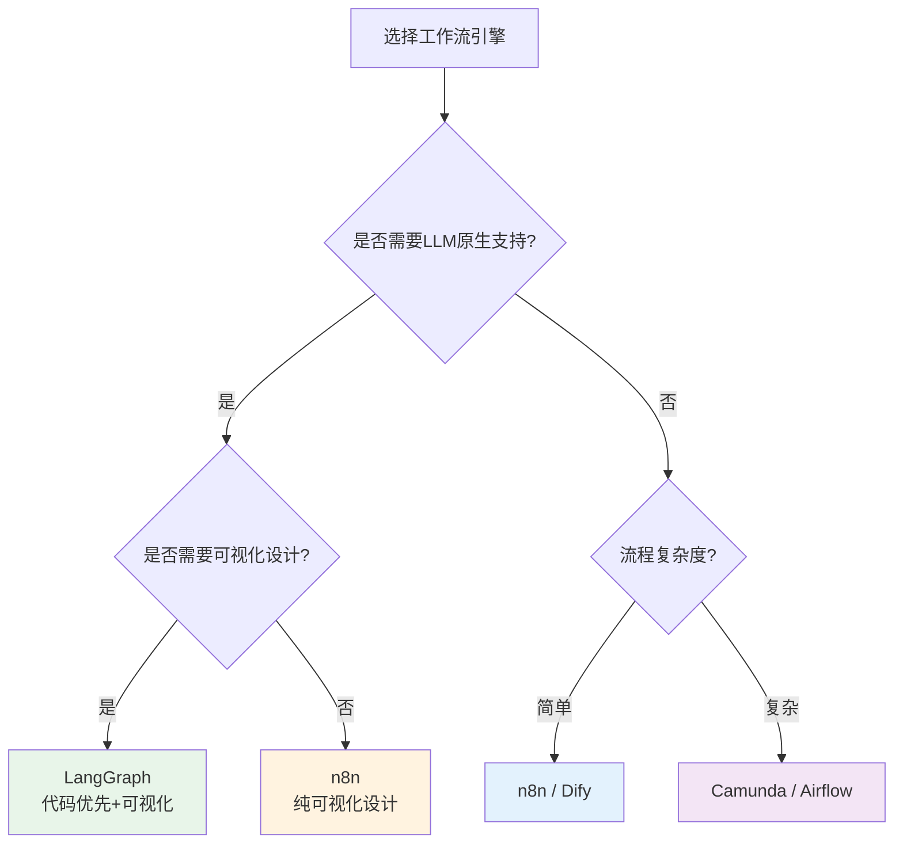

---

## 三、工作流设计原则

### 3.1 设计原则

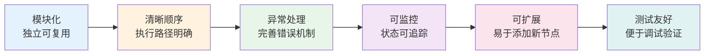

### 3.2 典型工作流模式

#### 模式一：串行流水线

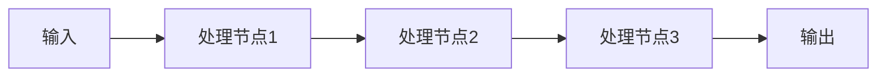

#### 模式二：条件分支

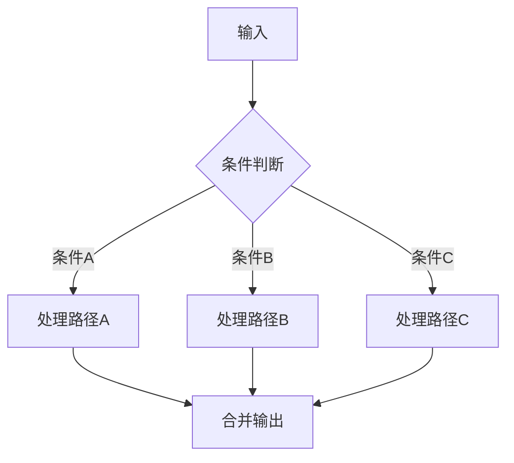

#### 模式三：循环处理

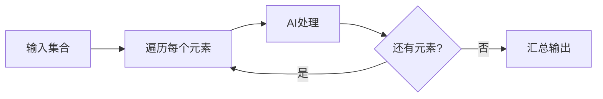

#### 模式四：并行编排

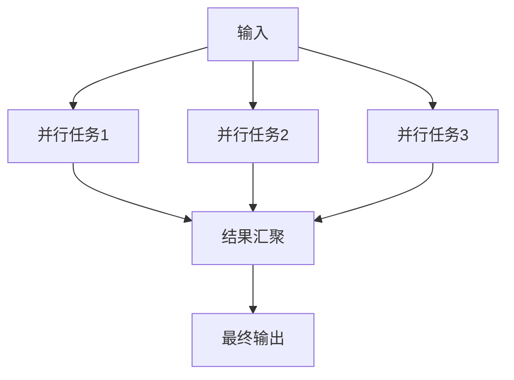

---

## 四、工作流编排实践

### 4.1 LangChain 工作流示例

```python
# workflow.py
from langchain.prompts import PromptTemplate
from langchain.llms import OpenAI
from langchain.chains import LLMChain, SequentialChain
from langchain.tools import Tool

# 定义链1：意图识别
intent_prompt = PromptTemplate(
    input_variables=["text"],
    template="""分析以下文本的意图：
{text}
请用以下格式输出：
意图：[搜索/计算/翻译/其他]
关键词：[关键词列表]"""
)
intent_chain = LLMChain(llm=OpenAI(), prompt=intent_prompt, output_key="intent")

# 定义链2：内容生成
generate_prompt = PromptTemplate(
    input_variables=["intent", "keywords"],
    template="""基于意图【{intent}】和关键词【{keywords}】，
生成一段简洁的回答。"""
)
generate_chain = LLMChain(llm=OpenAI(), prompt=generate_prompt, output_key="answer")

# 组合工作流
workflow = SequentialChain(
    chains=[intent_chain, generate_chain],
    input_variables=["text"],
    output_variables=["intent", "answer"],
    verbose=True
)

# 运行工作流
result = workflow({"text": "北京今天天气怎么样？"})
print(result["answer"])
```

### 4.2 带条件的智能工作流

```python
# intelligent_workflow.py
from langchain.agents import AgentExecutor, create_tool_calling_agent
from langchain.tools import tool

# 定义工具
@tool
def search_weather(city: str) -> str:
    """查询城市天气"""
    return f"{city}今天晴朗，气温25°C"

@tool
def calculate_math(expression: str) -> str:
    """数学计算"""
    return f"结果是: {eval(expression)}"

@tool
def translate_text(text: str, target_lang: str) -> str:
    """翻译文本"""
    return f"翻译结果: {text} -> [{target_lang}]"

# 创建智能Agent工作流
agent = create_tool_calling_agent(llm, [search_weather, calculate_math, translate_text], prompt)
agent_executor = AgentExecutor(agent=agent, tools=[search_weather, calculate_math, translate_text], verbose=True)

# 工作流执行
result = agent_executor.invoke({
    "input": "帮我查一下上海的天气，然后计算100*200"
})
```

### 4.3 带记忆的工作流

```python
# memory_workflow.py
from langchain.memory import ConversationBufferWindowMemory

memory = ConversationBufferWindowMemory(
    k=5,  # 保留最近5轮对话
    memory_key="chat_history",
    return_messages=True
)

# 工作流中使用记忆
workflow_with_memory = SequentialChain(
    chains=[intent_chain, generate_chain],
    input_variables=["text"],
    output_variables=["intent", "answer"],
    memory=memory,  # 注入记忆
    verbose=True
)
```

---

## 五、工作流监控与优化

### 5.1 监控指标

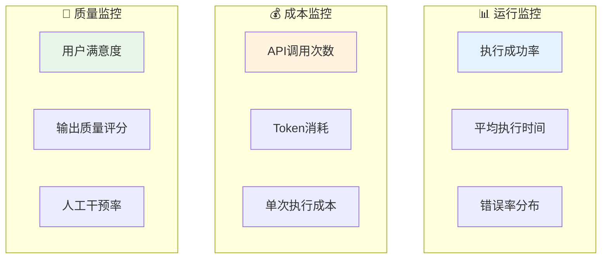

### 5.2 优化策略

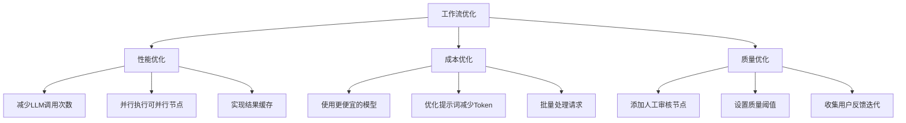

### 5.3 错误处理机制

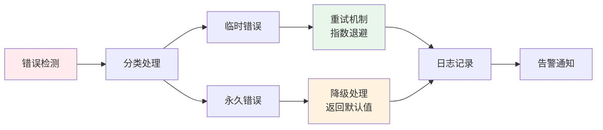

---

## 六、实战案例：AI内容生产工作流

### 6.1 工作流设计

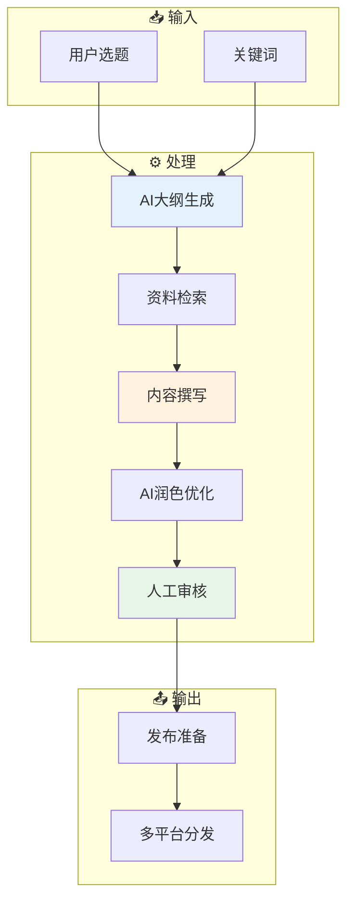

### 6.2 各节点实现

```python
# content_workflow.py
from langchain.chains import SequentialChain, LLMChain
from langchain.prompts import PromptTemplate
from langchain.llms import OpenAI

# 节点1：大纲生成
outline_prompt = PromptTemplate(
    input_variables=["topic"],
    template="请为'{topic}'生成文章大纲，包含3-5个主要章节"
)

# 节点2：资料检索（调用搜索工具）
research_prompt = PromptTemplate(
    input_variables=["outline"],
    template="基于以下大纲，列出需要搜索的关键点：\n{outline}"
)

# 节点3：内容撰写
writing_prompt = PromptTemplate(
    input_variables=["outline", "research"],
    template="根据大纲和资料，撰写完整文章：\n大纲：{outline}\n资料：{research}"
)

# 节点4：AI润色
polish_prompt = PromptTemplate(
    input_variables=["content"],
    template="请润色以下文章，使其更生动有趣：\n{content}"
)

# 组装工作流
content_workflow = SequentialChain(
    chains=[
        LLMChain(llm=llm, prompt=outline_prompt, output_key="outline"),
        LLMChain(llm=llm, prompt=research_prompt, output_key="research"),
        LLMChain(llm=llm, prompt=writing_prompt, output_key="draft"),
        LLMChain(llm=llm, prompt=polish_prompt, output_key="final_content"),
    ],
    input_variables=["topic"],
    output_variables=["final_content"],
    verbose=True
)

# 执行
result = content_workflow({"topic": "AI对教育行业的影响"})
```

---

## 七、本章总结

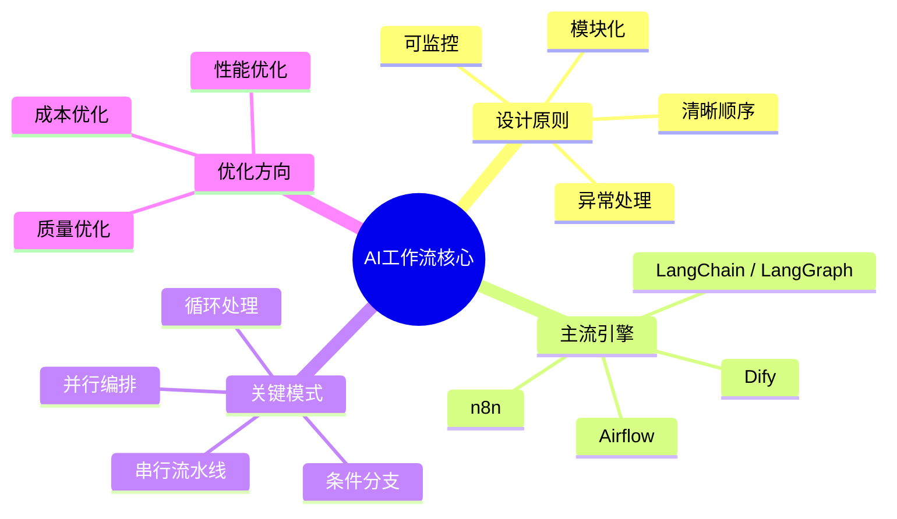

> **核心结论：** 好的工作流 = 清晰的结构 + 灵活的编排 + 完善的监控。将AI能力嵌入到标准化流程中，才能实现可持续的智能化升级。

---

## 延伸阅读

- [06 AI工程化实践](./06-AI工程化实践.md) — 工作流的部署与运维
- [07 AI辅助软件开发体系](./07-AI辅助软件开发体系.md) — 工作流在开发中的实际应用
