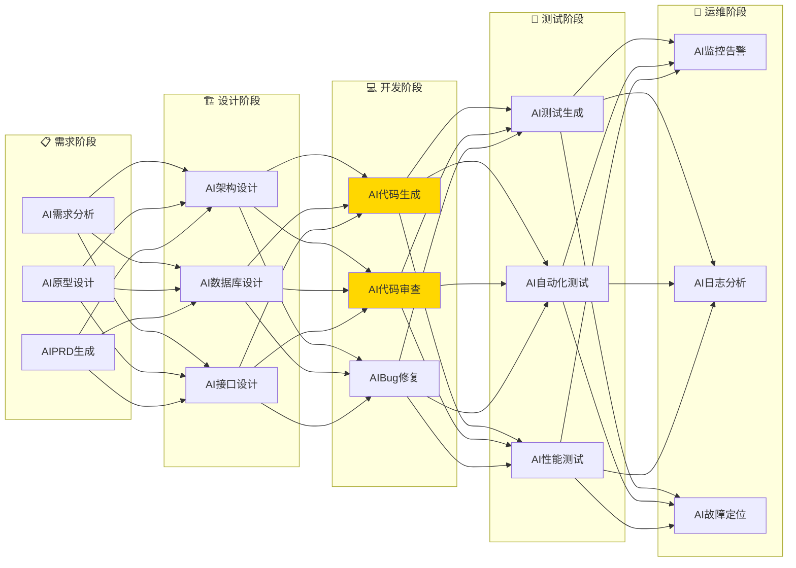
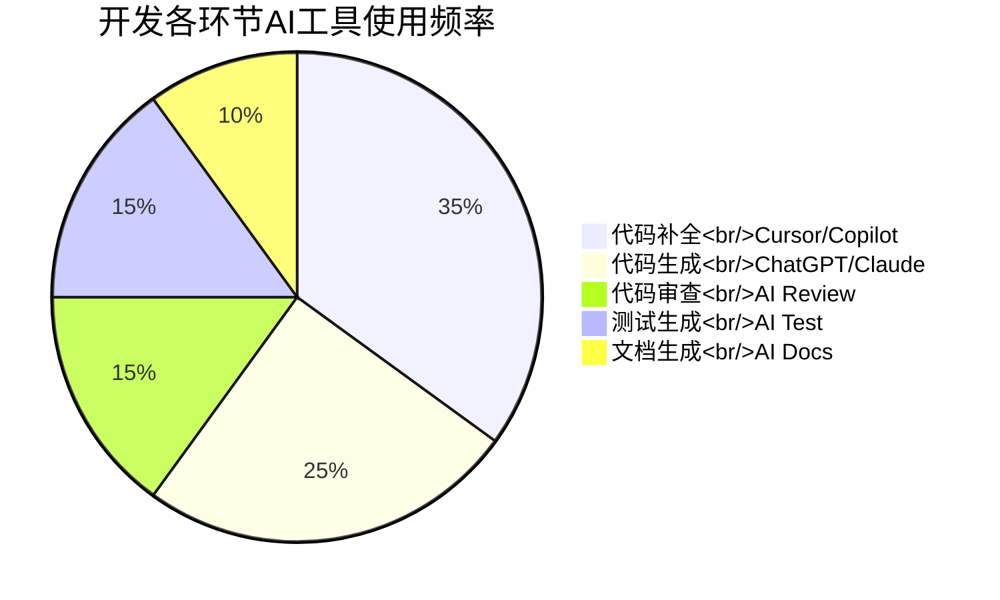
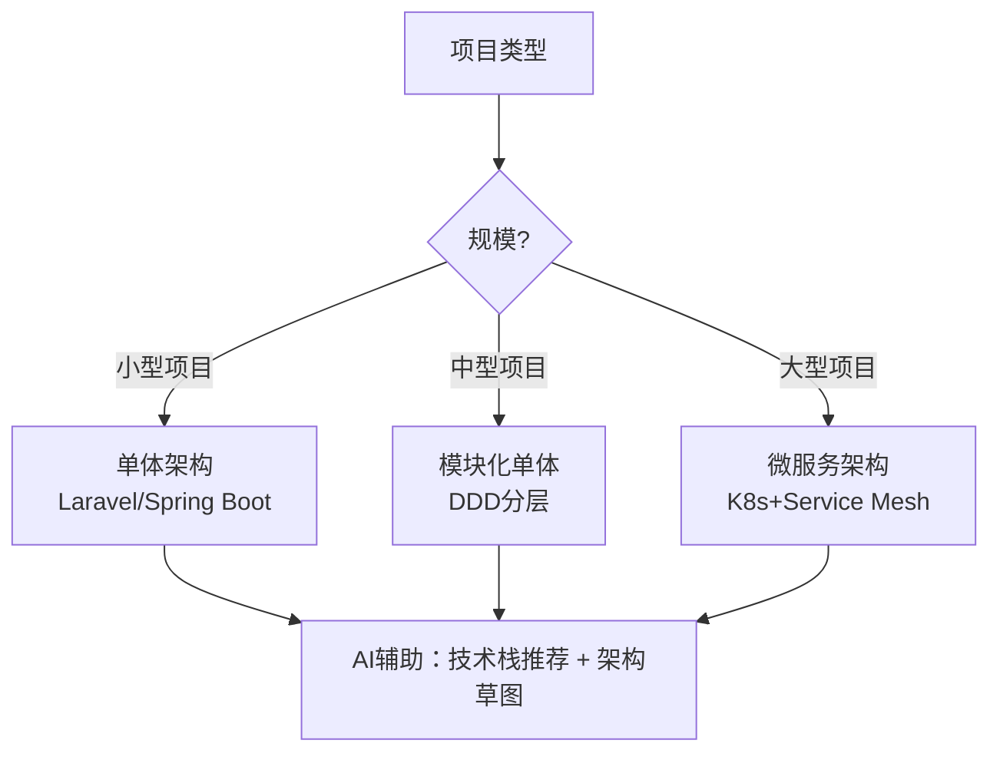
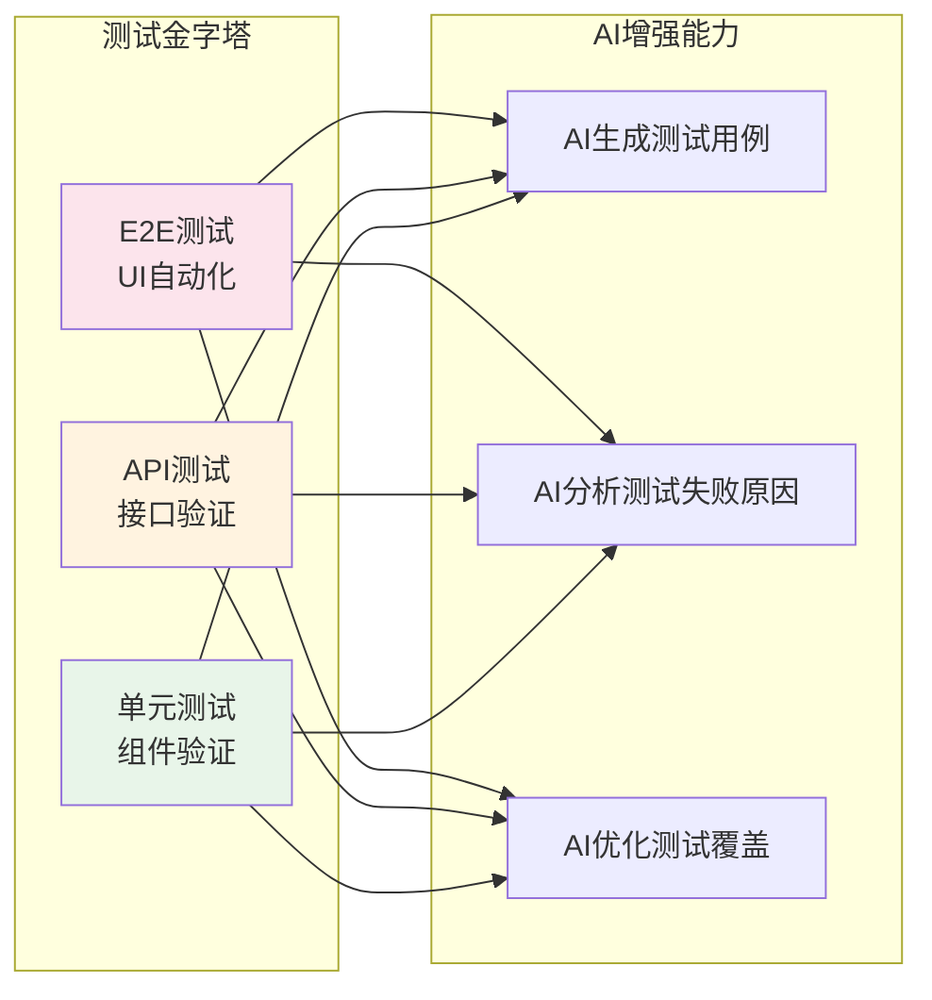
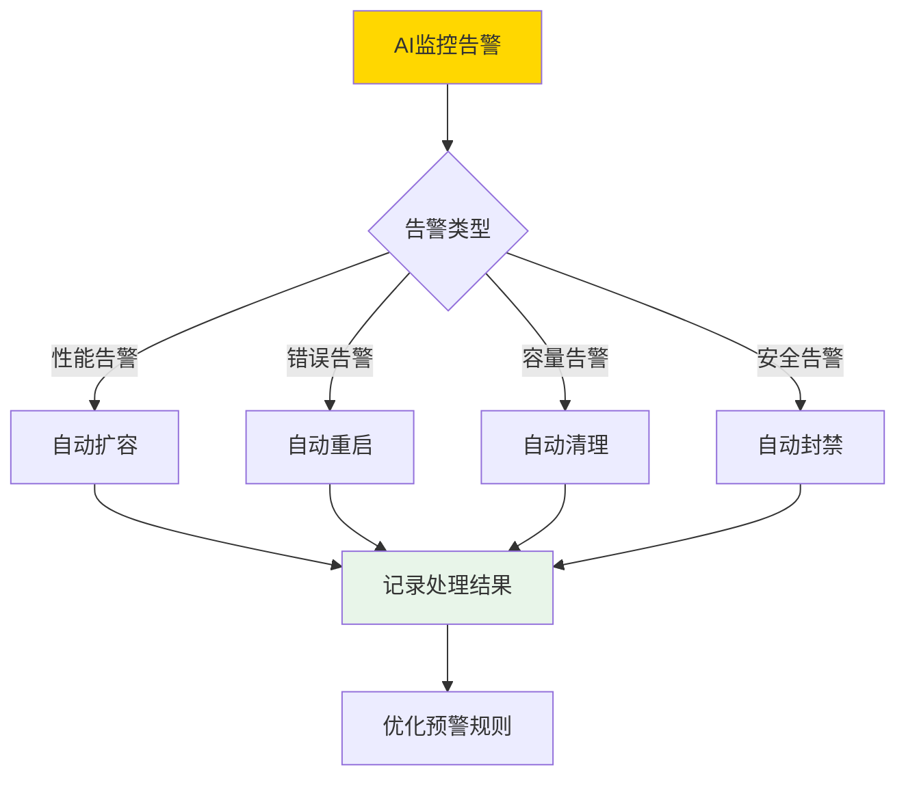
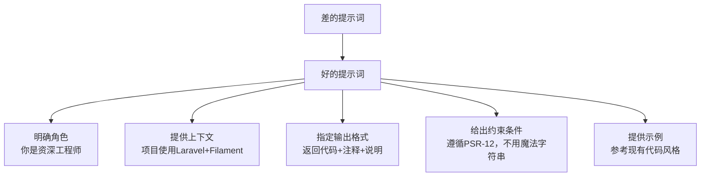
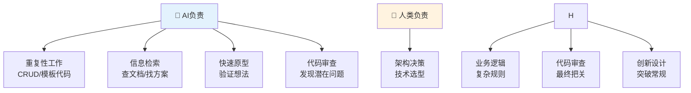

# 07 — AI 辅助软件开发体系

> 用AI重构软件开发全流程：从需求分析到部署运维
> 目标：掌握AI辅助开发的完整工作流，提升开发效率5-10倍

---

## 一、AI辅助开发全景图

### 1.1 开发全流程AI赋能



### 1.2 工具链总览



---

## 二、AI辅助需求分析

### 2.1 需求理解与拆解

```
【提示词模板】需求分析助手

你是一个资深产品经理，请帮我分析以下需求：
需求描述：[粘贴需求]

请输出：
1. 核心功能点列表
2. 用户故事（As a... I want to... So that...）
3. 优先级排序（P0/P1/P2）
4. 技术可行性评估
5. 潜在风险点
```

### 2.2 AI辅助PRD撰写

```
【提示词模板】PRD生成

请基于以下需求，生成一份完整的PRD文档：
- 产品名称：[名称]
- 目标用户：[用户描述]
- 核心功能：[功能列表]
- 约束条件：[技术/时间/预算约束]

输出格式：
## 1. 项目背景
## 2. 目标用户
## 3. 功能需求（含优先级）
## 4. 非功能需求
## 5. 数据指标
## 6. 里程碑计划
```

---

## 三、AI辅助架构设计

### 3.1 技术选型建议



### 3.2 AI辅助数据库设计

```
【提示词模板】数据库设计

请为以下业务设计数据库表结构：
业务场景：[描述]
实体关系：[实体列表及关系]

要求：
1. 使用规范化设计（3NF）
2. 包含必要的索引
3. 考虑软删除和审计字段
4. 输出SQL创建语句
5. 说明设计理由
```

---

## 四、AI辅助编码实战

### 4.1 代码生成模板

#### 后端 CRUD

```
【提示词模板】Laravel CRUD生成

请为一个电商平台生成商品管理的完整CRUD代码：
- 框架：Laravel 11
- 表名：products
- 字段：id, name, sku, price, category_id, status, is_active, created_at, updated_at
- 需要：Model、Migration、Controller、Resource、Factory、Seeder
- 遵循PSR-12规范，包含完整注释
```

#### 前端组件

```
【提示词模板】React组件生成

请生成一个用户列表组件：
- 框架：React + TypeScript + Tailwind CSS
- 功能：列表展示、搜索过滤、分页
- 使用shadcn/ui组件库
- 包含完整的类型定义
- 支持暗色模式
```

### 4.2 代码审查AI助手

```
【提示词模板】代码审查

请审查以下代码，指出问题和改进建议：
语言：[PHP/Python/Go/...]
框架：[Laravel/FastAPI/Gin/...]
代码：
\`\`\`[language]
[代码内容]
\`\`\`

审查要点：
1. 代码质量和可读性
2. 性能优化建议
3. 安全漏洞检查
4. 最佳实践遵循
5. 潜在Bug
```

### 4.3 AI辅助Bug排查

```
【提示词模板】Bug分析

我遇到以下问题，请帮我分析：
错误信息：[粘贴完整错误]
相关代码：[粘贴代码片段]
环境：[版本信息]
已尝试的方法：[列出已尝试的解决方式]

请提供：
1. 问题原因分析
2. 详细解决步骤
3. 预防措施
```

---

## 五、AI辅助测试

### 5.1 测试用例生成

```
【提示词模板】测试用例生成

请为以下函数生成完整的测试用例：
语言：Python
函数：[粘贴函数代码]

要求：
1. 使用pytest框架
2. 覆盖正常场景和异常场景
3. 包含边界条件测试
4. 使用fixture管理测试数据
5. 测试命名清晰规范
```

### 5.2 AI驱动测试策略



---

## 六、AI辅助运维

### 6.1 智能监控

```
【提示词模板】日志分析

分析以下应用日志，找出潜在问题：
日志内容：[粘贴日志]
服务：[服务名称]

请输出：
1. 错误分类统计
2. 异常模式识别
3. 根因分析
4. 修复建议
```

### 6.2 自动化运维



---

## 七、效率提升数据

### 7.1 各环节效率提升

```mermaid
bar
    title AI辅助各开发环节效率提升比例
    x-axis "环节" ["需求<br/>分析" "架构<br/>设计" "编码<br/>实现" "代码<br/>审查" "测试<br/>编写" "文档<br/>撰写"]
    y-axis "效率提升" [30, 40, 60, 50, 70, 80]
    max 100
```

| 环节 | 传统耗时 | AI辅助后 | 效率提升 |
|------|----------|----------|:--------:|
| 需求分析 | 2天 | 0.5天 | 75% |
| 架构设计 | 1天 | 0.3天 | 70% |
| 编码实现 | 5天 | 2天 | 60% |
| 代码审查 | 1天 | 0.3天 | 70% |
| 测试编写 | 3天 | 1天 | 67% |
| 文档撰写 | 2天 | 0.3天 | 85% |

---

## 八、AI辅助开发最佳实践

### 8.1 提示词优化技巧



### 8.2 人机协作原则



---

## 九、本章总结

> **核心结论：** AI不是替代开发者，而是放大开发者的能力。将AI定位为"超级助手"——处理重复劳动、加速信息获取、提高代码质量，让开发者专注于更有价值的架构设计和业务创新。

---

## 延伸阅读

- [09 AI开发实战案例](./05-ai-development-case-studies.md) — Python实战与代码分析
- [11 AI工具链与平台推荐](./07-ai-tools-platforms.md) — 查看推荐开发工具
