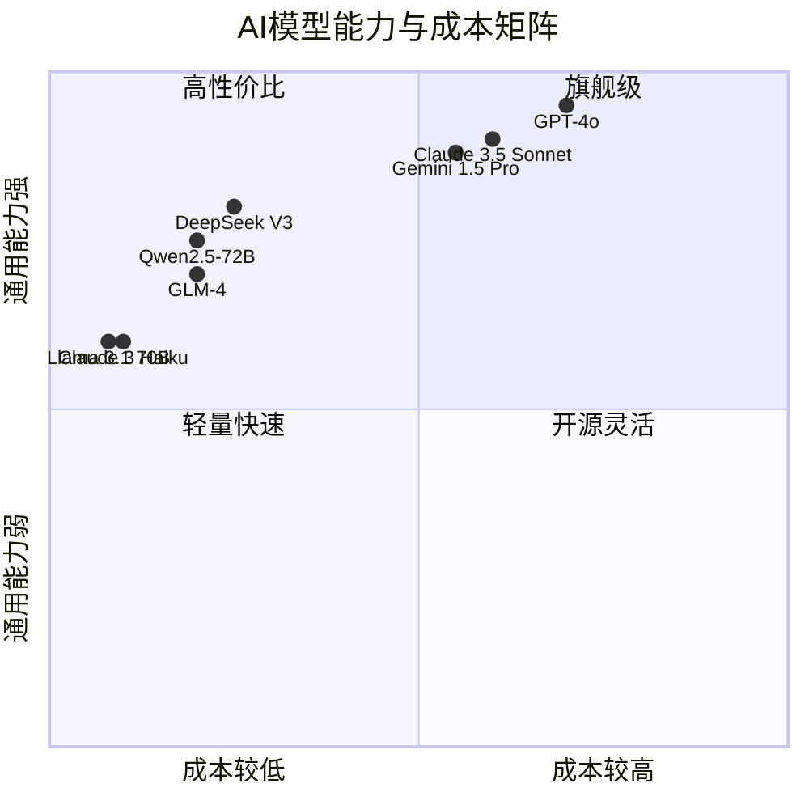
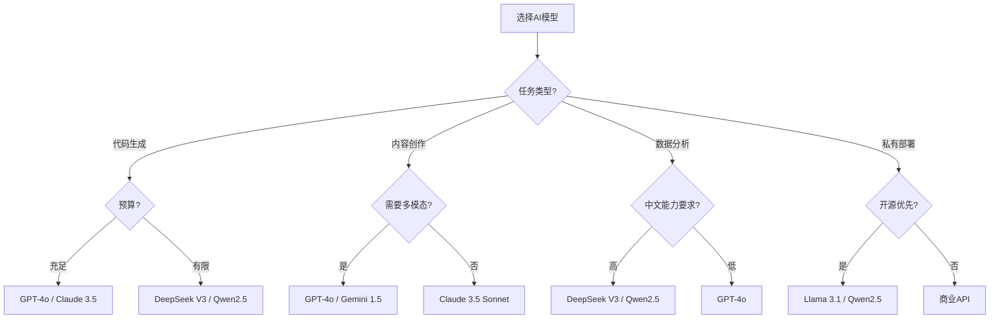
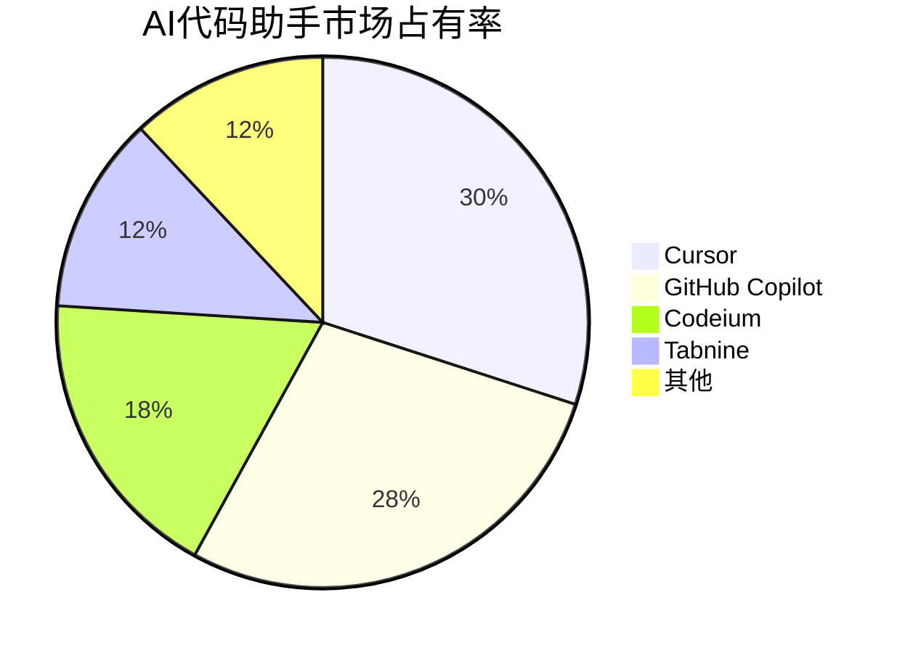
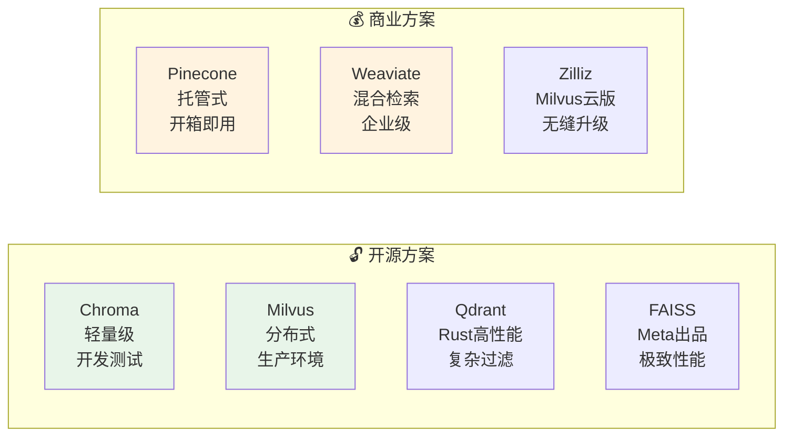
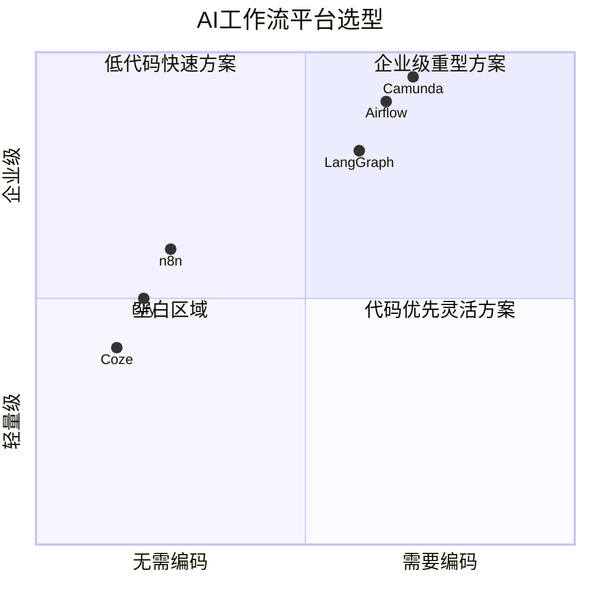
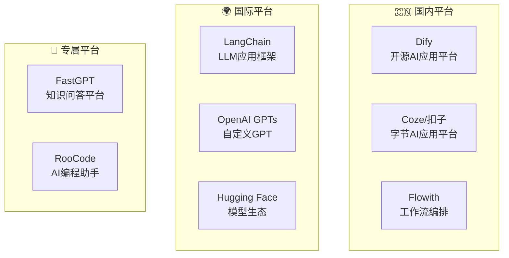

# 11 — AI 工具链与平台推荐

> 精选AI开发、应用和管理工具
> 目标：根据场景快速选择最合适的工具组合

---

## 一、模型平台选型

### 1.1 主流模型对比



### 1.2 模型选型决策树



---

## 二、开发工具推荐

### 2.1 IDE与代码助手



| 工具 | 类型 | 费用 | 特点 |
|------|------|------|------|
| **Cursor** | IDE | 免费+$20/月 | 最佳AI编码体验，支持多模型 |
| **GitHub Copilot** | 插件 | $10/月 | 生态完善，VS Code原生 |
| **Codeium** | 插件 | 免费 | 免费额度充足，多语言支持 |
| **Trae** | IDE | 免费 | 字节出品，国内可用 |
| **Windsurf** | IDE | 免费+$20/月 | 深度上下文理解 |

### 2.2 Prompt管理工具

| 工具 | 类型 | 特点 |
|------|------|------|
| **PromptHero** | 社区 | 海量优质Prompt模板 |
| **PromptLayer** | 平台 | Prompt版本管理与分析 |
| **LangSmith** | 平台 | LangChain调试和观测 |
| **Promptfoo** | CLI | Prompt自动化测试 |

---

## 三、向量数据库推荐

### 3.1 选型对比



### 3.2 选型建议

| 场景 | 推荐 | 理由 |
|------|------|------|
| **本地开发/原型** | Chroma | 零配置，Python原生 |
| **小规模生产** | Qdrant | 性能好，维护简单 |
| **大规模生产** | Milvus | 分布式，高可用 |
| **快速上线** | Pinecone | 托管服务，零运维 |
| **极致性能** | FAISS | Meta出品，检索最快 |

---

## 四、工作流平台推荐

### 4.1 平台对比



| 平台 | 特点 | 适用场景 |
|------|------|----------|
| **Dify** | 低代码，中文友好 | 快速构建AI应用 |
| **Coze** | 字节出品，无代码 | 个人/小团队 |
| **LangGraph** | 代码优先，灵活 | 复杂Agent系统 |
| **n8n** | 可视化，开源 | 业务流程自动化 |
| **Camunda** | BPMN标准 | 企业级流程 |

---

## 五、AI应用平台

### 5.1 快速构建平台



### 5.2 平台功能对比

| 平台 | 核心能力 | 收费模式 | 上手难度 |
|------|----------|----------|:--------:|
| **Dify** | RAG/Agent/工作流 | 开源免费/云服务付费 | ⭐⭐ |
| **Coze** | Bot构建/插件生态 | 免费 | ⭐ |
| **LangChain** | 框架组件/灵活性 | 开源免费 | ⭐⭐⭐ |
| **GPTs** | 自定义GPT | ChatGPT订阅 | ⭐⭐ |
| **FastGPT** | 知识库问答 | 开源/云服务 | ⭐⭐ |

---

## 六、开发辅助工具

### 6.1 调试与观测

| 工具 | 用途 | 推荐度 |
|------|------|:------:|
| **LangSmith** | LangChain调试观测 | ⭐⭐⭐⭐⭐ |
| **Phoenix** | LLM追踪分析 | ⭐⭐⭐⭐ |
| **Weights & Biases** | 实验追踪 | ⭐⭐⭐⭐ |
| **Prometheus+Grafana** | 监控告警 | ⭐⭐⭐⭐ |

### 6.2 测试与评估

| 工具 | 用途 | 推荐度 |
|------|------|:------:|
| **RAGAS** | RAG质量评估 | ⭐⭐⭐⭐⭐ |
| **DeepEval** | LLM测试框架 | ⭐⭐⭐⭐ |
| **Promptfoo** | Prompt测试 | ⭐⭐⭐⭐ |
| **LangChain Evals** | 链评估 | ⭐⭐⭐ |

---

## 七、工具组合推荐

### 7.1 新手快速入门组合

```
🚀 最小可行组合：
├── 模型：DeepSeek V3（性价比高）
├── IDE：Cursor（免费额度够用）
├── 向量库：Chroma（本地运行）
├── 框架：LangChain
└── 部署：Dify（低代码平台）
```

### 7.2 企业级生产组合

```
🏢 企业级组合：
├── 模型：GPT-4o + DeepSeek混合部署
├── IDE：Cursor + GitHub Copilot
├── 向量库：Milvus（分布式）
├── 框架：LangGraph（复杂Agent）
├── 平台：Dify Enterprise
├── 监控：LangSmith + Prometheus
├── 测试：RAGAS + DeepEval
└── 部署：Kubernetes + CI/CD
```

### 7.3 个人创作者组合

```
🎨 创作者组合：
├── 模型：Claude 3.5 Sonnet（写作强）
├── 平台：Coze（零代码构建Bot）
├── 设计：Midjourney（配图）
├── 音频：ElevenLabs（配音）
└── 视频：Runway/Pika（动效）
```

---

## 八、本章总结

> **核心结论：** 工具选择没有标准答案，关键是匹配场景。新手从"最小可行组合"开始，随着需求增长逐步升级到"企业级组合"。永远记住：工具服务于目标，不要为了工具而工具。

---

## 延伸阅读

- [02 LLM与提示词工程](../theory/02-llm-prompt-engineering.md) — 模型选择策略
- [06 AI工程化实践](./02-ai-engineering-practice.md) — 生产环境工具部署
