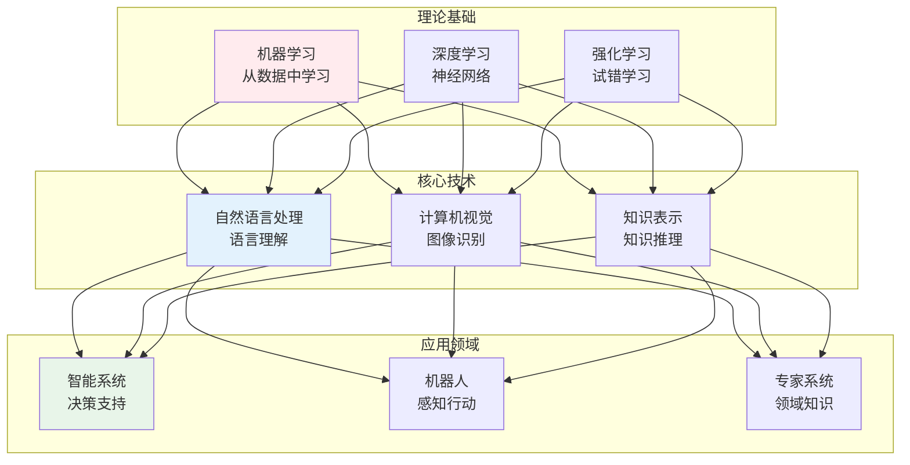
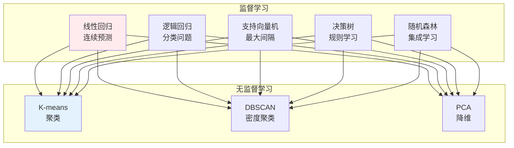
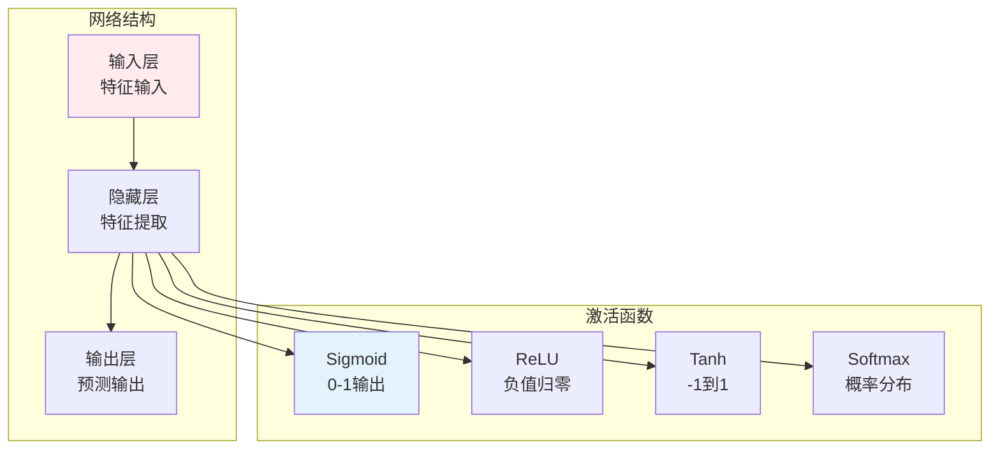
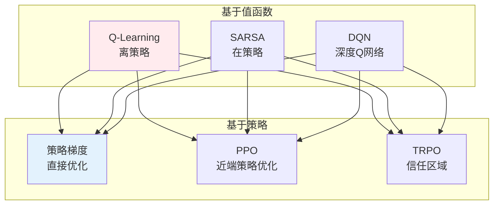
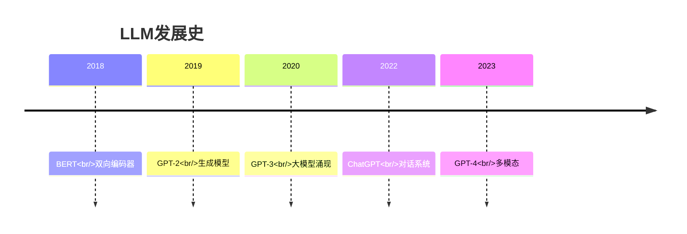

# AI核心知识

## 🗂️ 内容导航

| 名称 | 说明 | 链接 |
|------|------|------|
| AI工程应用 | AI赋能、工程化落地、辅助开发与办公提效 | [进入](engineering/index.md) |
| AI动手实践 | 从提示词到Agent，AI应用落地的完整实战指南 | [进入](practice/index.md) |
| AI核心知识体系 | 从智能的本质出发，构建AI的完整知识体系 | [进入](theory/index.md) |

---


> **核心观点**：人工智能是研究如何使计算机模拟人类智能的学科，是计算机科学的前沿领域。

---

## 📊 AI知识体系



---

## 🤖 机器学习

### 学习类型

| 类型 | 数据特点 | 目标 | 例子 |
|------|----------|------|------|
| 监督学习 | 有标签 | 预测 | 分类、回归 |
| 无监督学习 | 无标签 | 发现 | 聚类、降维 |
| 半监督学习 | 少量标签 | 利用无标签 | 标签传播 |
| 强化学习 | 环境反馈 | 最大化奖励 | 游戏、机器人 |

### 核心算法



### 模型评估

| 指标 | 适用场景 | 计算方法 |
|------|----------|----------|
| 准确率 | 分类 | 正确样本/总样本 |
| 精确率 | 分类 | TP/(TP+FP) |
| 召回率 | 分类 | TP/(TP+FN) |
| F1分数 | 分类 | 精确率和召回率调和 |
| MSE | 回归 | 均方误差 |

---

## 🧠 深度学习

### 神经网络基础



### 主流架构

| 架构 | 核心思想 | 应用领域 | 代表模型 |
|------|----------|----------|----------|
| CNN | 局部感受野、权值共享 | 计算机视觉 | ResNet、EfficientNet |
| RNN | 序列建模、记忆机制 | 自然语言处理 | LSTM、GRU |
| Transformer | 自注意力机制 | 多模态 | BERT、GPT、ViT |
| GAN | 对抗训练 | 图像生成 | StyleGAN、CycleGAN |
| 扩散模型 | 去噪过程 | 图像生成 | Stable Diffusion |

### 训练技巧

```
深度学习训练技巧：
1. 数据增强：扩充训练数据
2. 正则化：防止过拟合
3. 学习率调度：动态调整
4. 批归一化：稳定训练
5. 迁移学习：利用预训练模型
```

---

## 🎮 强化学习

### 核心概念

| 概念 | 内涵 | 作用 |
|------|------|------|
| 智能体 | 决策主体 | 行动选择 |
| 环境 | 外部世界 | 状态转移 |
| 状态 | 环境描述 | 信息输入 |
| 动作 | 智能体行为 | 状态影响 |
| 奖励 | 即时反馈 | 目标引导 |

### 算法分类



---

## 💡 大语言模型

### 发展历程



### 核心技术

| 技术 | 内容 | 作用 |
|------|------|------|
| 预训练 | 大规模语料学习 | 语言理解 |
| 指令微调 | 指令数据训练 | 任务适应 |
| RLHF | 人类反馈对齐 | 价值观对齐 |
| 上下文学习 | 少样本学习 | 灵活适应 |

### 能力涌现

```
LLM的涌现能力：
1. 少样本学习：In-context Learning
2. 推理能力：Chain-of-Thought
3. 工具使用：Function Calling
4. 多语言能力：跨语言理解
5. 代码生成：编程辅助
```

---

## 🎯 核心结论

### AI的基本原理

1. **数据驱动**：从数据中学习规律
2. **模型拟合**：构建数学模型
3. **优化求解**：最小化损失函数
4. **泛化能力**：对新数据的预测
5. **可解释性**：理解模型决策

### AI的发展趋势

```
AI未来发展方向：
1. 通用人工智能：更接近人类智能
2. 多模态融合：视觉、语言、语音
3. 可解释AI：透明化决策
4. 边缘计算：本地化推理
5. 伦理AI：负责任的发展
```

---

## 📚 参考文献

1. 《机器学习》- 周志华
2. 《深度学习》- Ian Goodfellow
3. 《统计学习方法》- 李航
4. 《人工智能：一种现代方法》- Stuart Russell
5. 《强化学习》- Richard Sutton
6. 《自然语言处理综论》- Daniel Jurafsky
7. 《计算机视觉》- Richard Szeliski
8. 《动手学深度学习》- 李沐