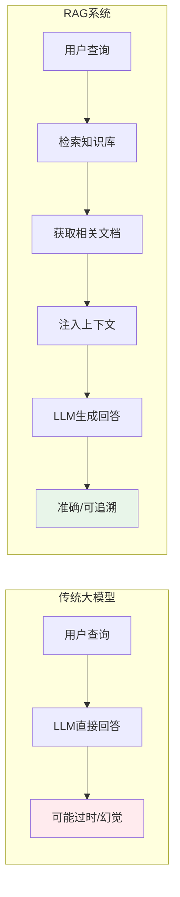
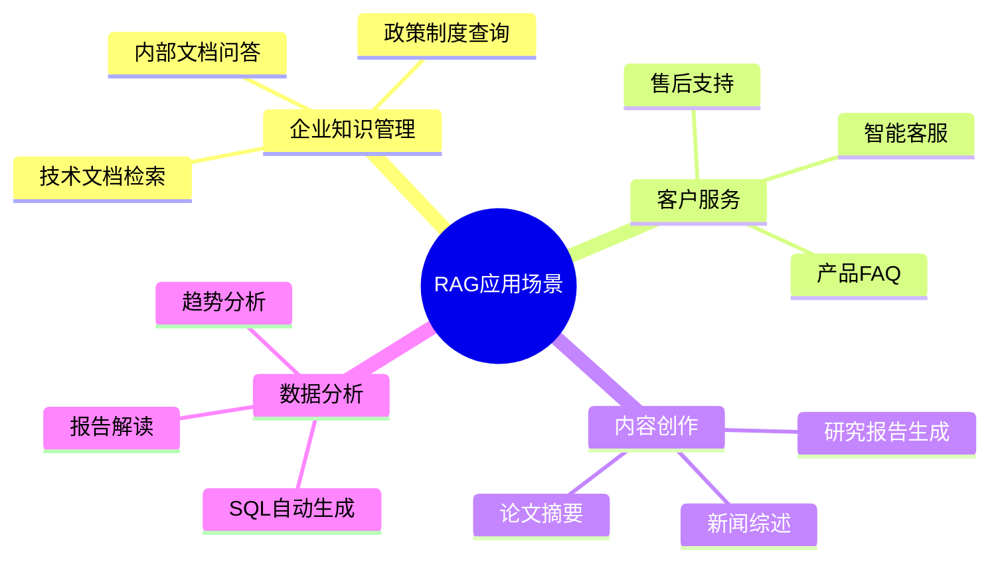
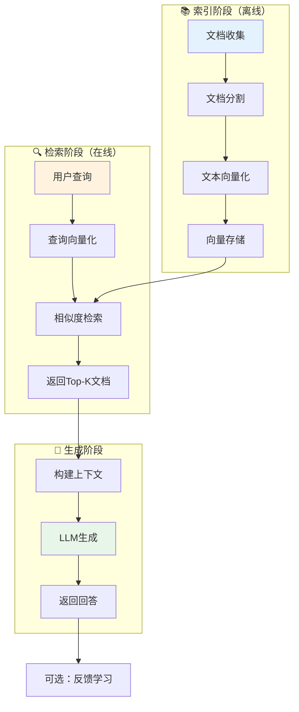
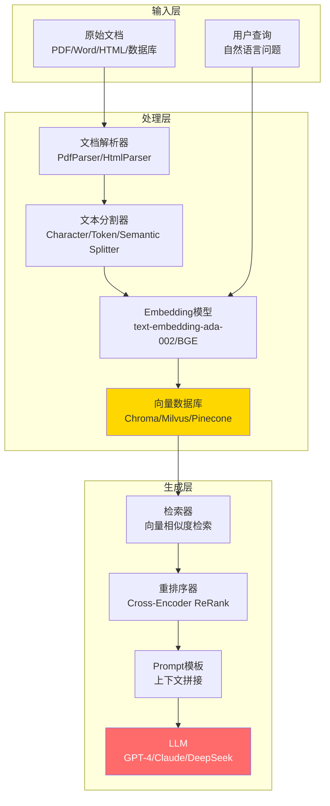
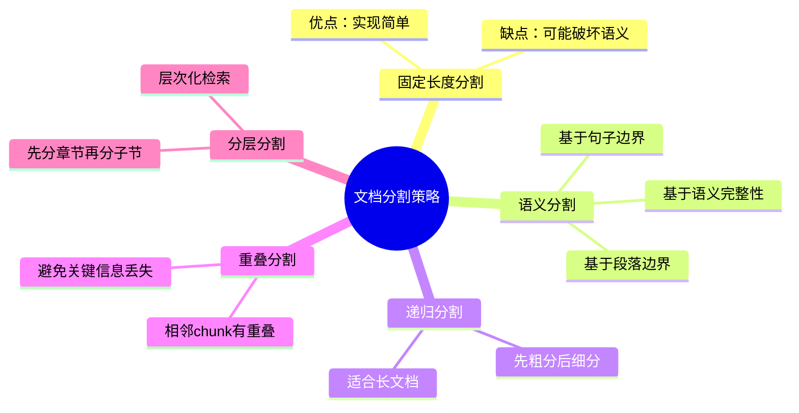
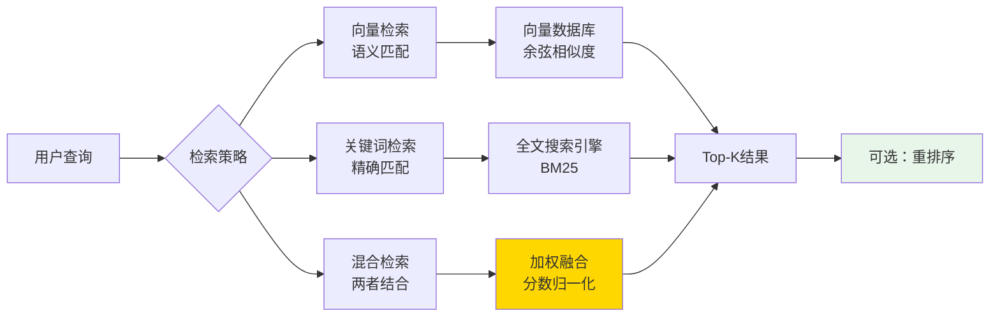
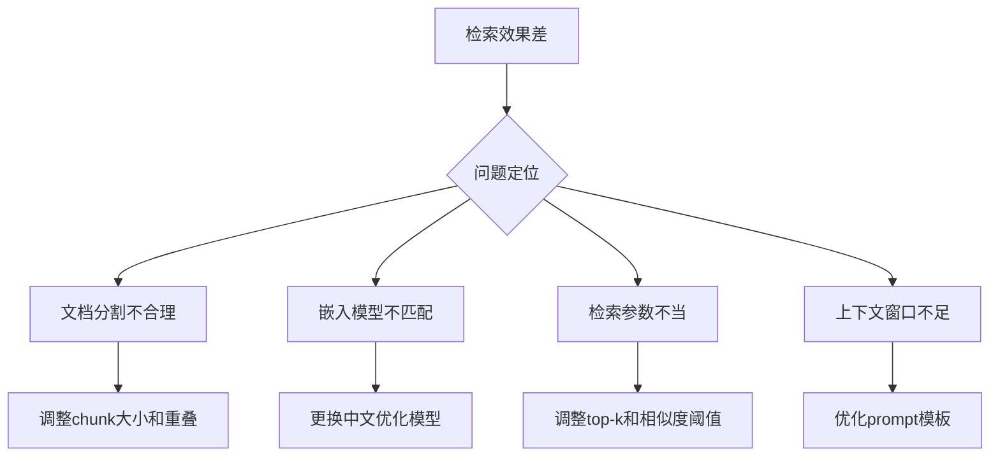
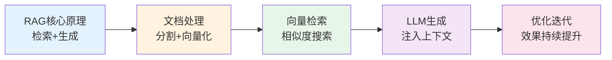

# 03 — RAG 检索增强生成系统

> 企业AI应用的核心技术：让大模型拥有实时、准确的知识
> 目标：掌握RAG系统的设计、实现与优化方法

---

## 一、RAG 核心概念

### 1.1 什么是 RAG？

检索增强生成（Retrieval-Augmented Generation，RAG）是一种将**外部知识检索**与**大模型生成**相结合的技术架构。



### 1.2 RAG vs Fine-tuning 对比

| 维度 | RAG | Fine-tuning |
|------|-----|-------------|
| **知识更新** | 实时，添加新文档即可 | 需重新训练模型 |
| **计算成本** | 低，主要是向量检索 | 高，需要大量算力 |
| **幻觉风险** | 低，基于检索内容生成 | 高，依赖模型记忆 |
| **专业适配** | 容易，添加专业文档 | 困难，需高质量训练数据 |
| **可解释性** | 强，可追溯引用来源 | 弱，黑盒生成 |
| **适用场景** | 知识问答、文档检索 | 风格迁移、特定任务 |

### 1.3 RAG 应用场景



---

## 二、RAG 系统架构

### 2.1 核心流程



### 2.2 关键技术组件



---

## 三、文档处理

### 3.1 文档分割策略



### 3.2 分割参数建议

| 参数 | 推荐值 | 说明 |
|------|--------|------|
| **Chunk Size** | 500-1000 tokens | 每个文档片段的长度 |
| **Chunk Overlap** | 100-200 tokens | 相邻片段的重叠部分 |
| **Separator** | `\n\n` (段落) | 优先在段落边界分割 |
| **Min Chunk Size** | 100 tokens | 小于此值的片段丢弃 |

---

## 四、向量检索优化

### 4.1 检索策略



### 4.2 重排序（Re-ranking）

```
原始检索结果 → 相关性打分 → 重新排序 → 更准确的Top-K

示例：
检索返回：文档A(0.85), 文档B(0.82), 文档C(0.78)
重排序后：文档B(0.92), 文档A(0.88), 文档C(0.75)
```

### 4.3 嵌入模型选择

| 模型 | 维度 | 特点 | 推荐场景 |
|------|------|------|----------|
| **text-embedding-ada-002** | 1536 | OpenAI官方，通用性强 | 通用RAG系统 |
| **all-MiniLM-L6-v2** | 384 | 轻量级，本地部署友好 | 资源受限场景 |
| **BGE-large-zh** | 1024 | 中文表现优秀 | 中文RAG系统 |
| **E5-large** | 1024 | 专为检索优化 | 高精度检索 |

---

## 五、RAG 系统完整搭建指南（PHP+Vue+UniApp）

> 针对PHP+Vue+UniApp技术栈团队的完整搭建方案

### 5.1 项目结构

```
rag-system/
├── backend/              # PHP后端（Laravel）
│   ├── app/
│   │   ├── Services/
│   │   │   ├── DocumentService.php     # 文档处理服务
│   │   │   ├── RetrievalService.php    # 检索服务
│   │   │   └── RAGService.php          # RAG主服务
│   │   ├── Models/
│   │   │   └── Document.php            # 文档模型
│   │   └── Http/
│   │       ├── Controllers/
│   │       │   ├── DocumentController.php
│   │       │   └── RagController.php
│   │       └── Routes/
│   │           └── api.php
│   ├── config/
│   │   └── rag.php                 # RAG配置
│   └── routes/
│       └── api.php
├── frontend/             # Vue前端管理后台
│   ├── src/
│   │   ├── views/
│   │   │   ├── DocumentManage.vue  # 文档管理
│   │   │   └── RagQuery.vue        # RAG查询
│   │   ├── components/
│   │   │   └── ChatBox.vue         # 聊天组件
│   │   └── api/
│   │       └── rag.js              # API调用
│   └── package.json
├── uniapp/               # UniApp移动端
│   └── pages/
│       └── index.vue           # 查询页面
├── vector-service/       # Python向量服务
│   ├── app.py                  # FastAPI服务
│   ├── embeddings.py           # 嵌入模型
│   └── requirements.txt
└── docker-compose.yml
```

### 5.2 核心代码实现

#### PHP后端 - 文档处理

```php
<?php

namespace App\Services;

use App\Models\Document;
use Illuminate\Support\Facades\Http;
use Illuminate\Support\Facades\Storage;

class DocumentService
{
    protected $embeddingsApiKey;
    protected $vectorHost;
    
    public function __construct()
    {
        $this->embeddingsApiKey = config('rag.embeddings_api_key');
        $this->vectorHost = config('rag.vector_host');
    }
    
    /**
     * 上传并处理文档
     */
    public function uploadDocument($file): array
    {
        // 1. 保存文件
        $path = $file->store('documents');
        
        // 2. 解析文档内容
        $content = $this->parseDocument($path);
        
        // 3. 分割文档
        $chunks = $this->chunkText($content, 800, 150);
        
        // 4. 向量化并存储
        $document = Document::create([
            'original_path' => $path,
            'content' => $content,
            'chunk_count' => count($chunks),
            'status' => 'processing',
        ]);
        
        // 5. 异步处理向量化
        dispatch(function () use ($document, $chunks) {
            $this->vectorizeChunks($document, $chunks);
        });
        
        return [
            'id' => $document->id,
            'chunk_count' => count($chunks),
            'status' => 'processing',
        ];
    }
    
    /**
     * 文本分割
     */
    protected function chunkText(string $text, int $chunkSize = 800, int $overlap = 150): array
    {
        $chunks = [];
        $length = mb_strlen($text);
        
        for ($i = 0; $i < $length; $i += ($chunkSize - $overlap)) {
            $chunk = mb_substr($text, $i, $chunkSize);
            if (mb_strlen($chunk) > 50) { // 过滤过短的片段
                $chunks[] = $chunk;
            }
            if ($i + $chunkSize >= $length) {
                break;
            }
        }
        
        return $chunks;
    }
    
    /**
     * 向量化处理
     */
    protected function vectorizeChunks(Document $document, array $chunks): void
    {
        foreach ($chunks as $index => $chunk) {
            // 调用向量服务
            $response = Http::withHeaders([
                'Authorization' => 'Bearer ' . $this->embeddingsApiKey,
            ])->post($this->vectorHost . '/embed', [
                'model' => 'text-embedding-ada-002',
                'input' => $chunk,
            ]);
            
            if ($response->successful()) {
                $embedding = $response->json()['data'][0]['embedding'];
                
                // 存储到向量数据库
                Http::post($this->vectorHost . '/collections/rag_documents/upsert', [
                    'ids' => ["doc_{$document->id}_chunk_$index"],
                    'embeddings' => [$embedding],
                    'metadatas' => [[
                        'document_id' => $document->id,
                        'chunk_index' => $index,
                        'content' => $chunk,
                    ]],
                ]);
            }
        }
        
        $document->update(['status' => 'processed']);
    }
}
```

#### PHP后端 - RAG查询

```php
<?php

namespace App\Services;

use Illuminate\Support\Facades\Http;

class RagService
{
    protected $vectorHost;
    protected $llmApiKey;
    protected $llmModel;
    
    public function query(string $question, int $topK = 3): array
    {
        // 1. 查询向量化
        $embeddingResponse = Http::withHeaders([
            'Authorization' => 'Bearer ' . $this->llmApiKey,
        ])->post($this->vectorHost . '/embed', [
            'model' => 'text-embedding-ada-002',
            'input' => $question,
        ]);
        
        $queryEmbedding = $embeddingResponse->json()['data'][0]['embedding'];
        
        // 2. 向量检索
        $searchResponse = Http::post($this->vectorHost . '/collections/rag_documents/query', [
            'query_embedding' => $queryEmbedding,
            'top_k' => $topK,
            'include_metadata' => true,
        ]);
        
        $results = $searchResponse->json()['results'] ?? [];
        
        // 3. 构建上下文
        $context = $this->buildContext($results);
        
        // 4. LLM生成回答
        $answer = $this->generateAnswer($question, $context);
        
        return [
            'question' => $question,
            'answer' => $answer,
            'sources' => array_map(fn($r) => [
                'content' => $r['metadata']['content'] ?? '',
                'score' => $r['distance'] ?? 0,
            ], $results),
        ];
    }
    
    protected function buildContext(array $results): string
    {
        $context = "";
        foreach ($results as $i => $result) {
            $context .= "[参考文档" . ($i + 1) . "]\n";
            $context .= ($result['metadata']['content'] ?? '') . "\n\n";
        }
        return $context;
    }
    
    protected function generateAnswer(string $question, string $context): string
    {
        $prompt = "请根据以下参考资料回答问题。如果资料中没有相关信息，请说明无法回答。\n\n"
                . "参考资料：\n{$context}\n\n"
                . "问题：{$question}\n\n"
                . "回答：";
        
        $response = Http::withHeaders([
            'Authorization' => 'Bearer ' . $this->llmApiKey,
            'Content-Type' => 'application/json',
        ])->post('https://api.openai.com/v1/chat/completions', [
            'model' => $this->llmModel,
            'messages' => [['role' => 'user', 'content' => $prompt]],
            'temperature' => 0.1,
            'max_tokens' => 1000,
        ]);
        
        return $response->json()['choices'][0]['message']['content'] ?? '暂无回答';
    }
}
```

### 5.3 Python向量服务

```python
# vector-service/app.py
from fastapi import FastAPI, HTTPException
from pydantic import BaseModel
from sentence_transformers import SentenceTransformer
import chromadb
from chromadb.config import Settings

app = FastAPI(title="RAG Vector Service")

# 加载嵌入模型
model = SentenceTransformer('all-MiniLM-L6-v2')

# 初始化向量数据库
client = chromadb.Client(Settings(
    chroma_db_impl="duckdb+parquet",
    persist_directory="./chroma_db"
))
collection = client.get_or_create_collection("rag_documents")

class EmbedRequest(BaseModel):
    model: str
    input: str

class QueryRequest(BaseModel):
    query_embedding: list
    top_k: int = 3
    include_metadata: bool = True

@app.post("/embed")
async def embed(request: EmbedRequest):
    embedding = model.encode([request.input]).tolist()
    return {"data": [{"embedding": embedding[0]}]}

@app.post("/collections/rag_documents/query")
async def query(request: QueryRequest):
    results = collection.query(
        query_embeddings=[request.query_embedding],
        n_results=request.top_k,
        include=["metadatas", "distances"]
    )
    return {"results": results}

@app.post("/collections/rag_documents/upsert")
async def upsert(request: dict):
    collection.upsert(
        ids=request["ids"],
        embeddings=request["embeddings"],
        metadatas=request["metadatas"]
    )
    return {"status": "success"}
```

### 5.4 Docker Compose 部署

```yaml
# docker-compose.yml
version: '3.8'

services:
  php-app:
    build: ./backend
    ports:
      - "8080:80"
    depends_on:
      - vector-service
      - redis
    environment:
      - VECTOR_HOST=http://vector-service:8000
      - EMBEDDINGS_API_KEY=${EMBEDDINGS_API_KEY}
      - OPENAI_API_KEY=${OPENAI_API_KEY}
  
  vector-service:
    build: ./vector-service
    ports:
      - "8000:8000"
    volumes:
      - vector_data:/app/chroma_db
  
  redis:
    image: redis:7-alpine
    ports:
      - "6379:6379"
  
  frontend:
    build: ./frontend
    ports:
      - "3000:80"
    depends_on:
      - php-app

volumes:
  vector_data:
```

---

## 六、常见问题与优化

### 6.1 检索效果不佳



### 6.2 性能优化技巧

| 优化点 | 方法 | 预期效果 |
|--------|------|----------|
| **向量缓存** | Redis缓存高频查询的向量 | 减少90%嵌入计算 |
| **批量处理** | 批量上传文档，减少API调用 | 提升5倍处理速度 |
| **异步检索** | 检索与生成并行处理 | 降低首屏延迟 |
| **分片检索** | 大库分片，缩小检索范围 | 提升检索速度 |

### 6.3 降低幻觉

| 方法 | 实现 |
|------|------|
| **增加检索数量** | 从Top-3增加到Top-5 |
| **优化提示词** | 明确要求"仅基于检索内容回答" |
| **引用溯源** | 返回时附带来源文档 |
| **置信度评分** | 低置信度时提示"无法确定" |

---

## 七、本章总结



> **核心结论：** RAG = 把"死知识"变成"活答案"。通过检索增强，让LLM获得最新、最准确的领域知识，同时保持生成的灵活性和自然性。

---

## 延伸阅读

- [04 Agent智能代理架构](./04-agent-intelligent-agent-architecture.md) — RAG如何与Agent结合
- [05 AI工作流搭建](./05-ai-workflow-construction.md) — RAG系统的自动化编排
- [06 AI工程化实践](../engineering/02-ai-engineering-practice.md) — 生产环境部署与监控
