# 04 — Agent 智能代理架构

> 让AI从"问答工具"进化为"自主执行者"
> 目标：掌握Agent设计模式，构建能自主决策和执行的AI系统

---

## 一、Agent 核心概念

### 1.1 什么是 Agent？

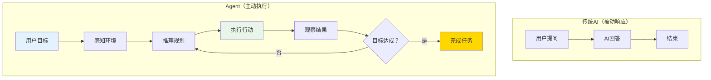

**核心区别：**
- 传统AI：**你问 → 我答**（被动响应）
- Agent：**给你目标 → 我自主完成**（主动执行）

### 1.2 Agent 五大核心能力

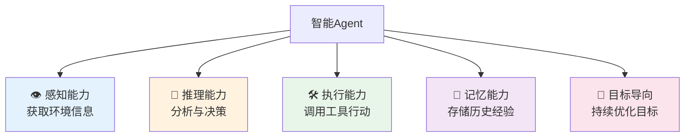

---

## 二、Agent 架构设计

### 2.1 经典架构

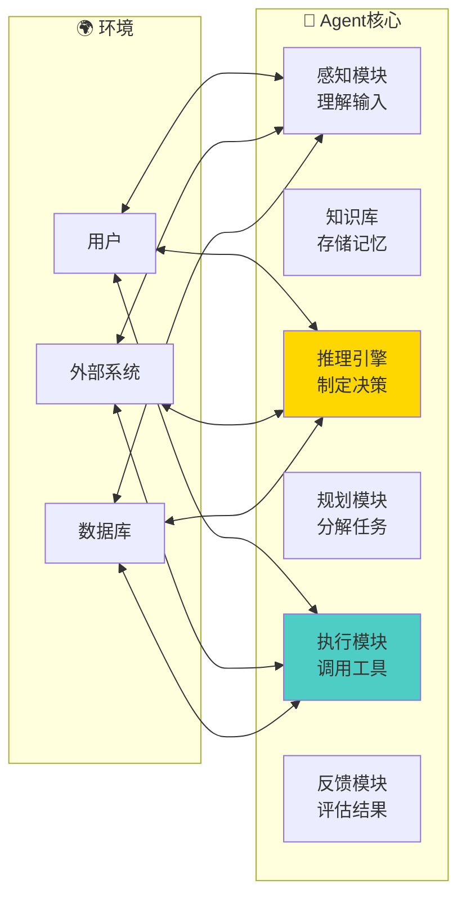

### 2.2 LLM驱动的现代Agent架构

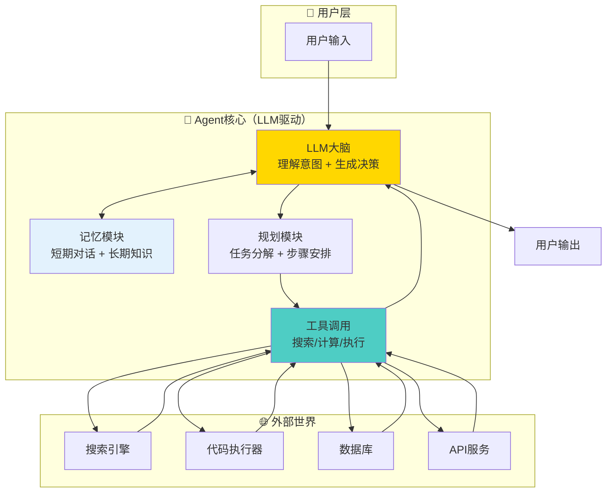

### 2.3 核心组件详解

#### 记忆模块

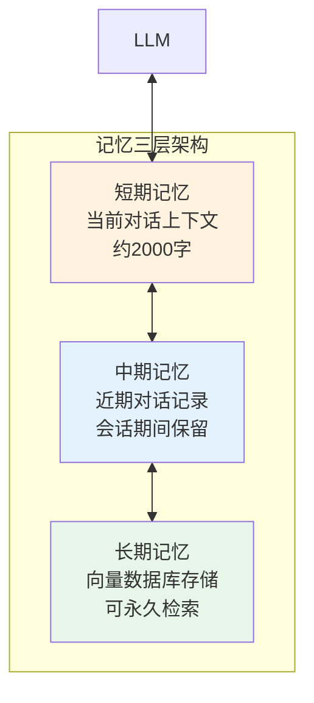

| 记忆类型 | 存储方式 | 访问方式 | 生命周期 |
|----------|----------|----------|----------|
| **短期记忆** | LLM Context Window | 直接读取 | 当前会话 |
| **中期记忆** | Redis/内存 | 按时间检索 | 数小时~数天 |
| **长期记忆** | 向量数据库 | 语义相似度检索 | 永久 |

#### 工具模块

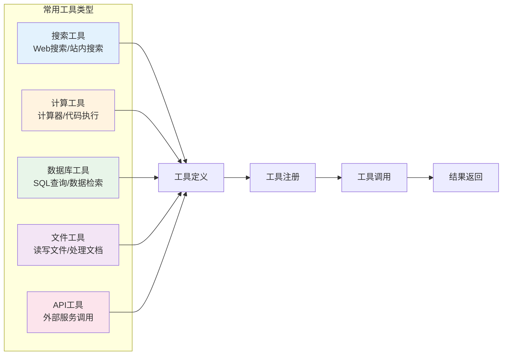

---

## 三、多Agent协作系统

### 3.1 协作模式

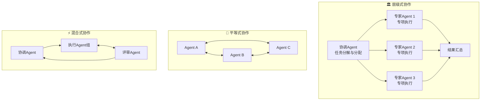

### 3.2 典型多Agent架构

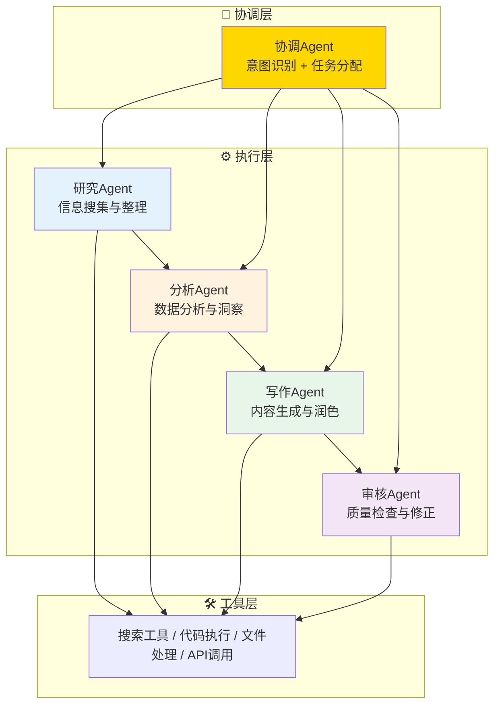

---

## 四、ReAct 模式详解

### 4.1 推理-行动循环

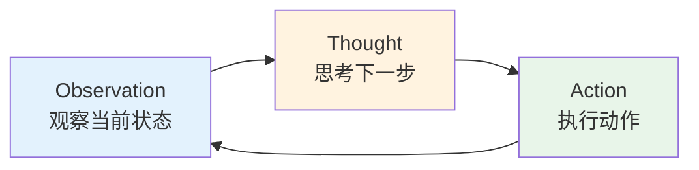

### 4.2 ReAct 示例

```
用户：北京的天气怎么样？如果超过25度，帮我订一张去青岛的高铁票

Agent思考过程：
Thought: 我需要先查询北京今天的天气情况
Action: search_weather(city="北京")
Observation: 北京今天气温32°C，晴天

Thought: 天气超过25度，需要帮用户订高铁票
Action: search_trains(departure="北京", destination="青岛", date="今天")
Observation: 找到G101次列车，10:00发车，二等座548元

Thought: 需要确认用户是否要预订
Action: ask_confirmation(train="G101", price=548, time="10:00")
User: 好的，帮我预订
Action: book_train(train_id="G101", seat="2F")
Observation: 预订成功！订单号：CN20260816001
Thought: 任务完成，向用户报告结果
Final Answer: 已为您预订G101次高铁，10:00从北京出发，12:30抵达青岛，二等座548元，订单号CN20260816001
```

---

## 五、Agent 实现代码

### 5.1 基础Agent实现

```python
# agent.py
from langchain.agents import initialize_agent, AgentType
from langchain.tools import Tool
from langchain.llms import OpenAI

# 定义工具
def search_web(query: str) -> str:
    """搜索网页，返回相关信息"""
    # 实际调用搜索引擎API
    return f"搜索结果: {query}"

def calculate(expression: str) -> str:
    """数学计算器"""
    try:
        result = eval(expression)
        return f"计算结果: {result}"
    except:
        return "计算失败"

# 初始化Agent
llm = OpenAI(temperature=0)
tools = [
    Tool(
        name="Search",
        func=search_web,
        description="搜索网页信息"
    ),
    Tool(
        name="Calculator",
        func=calculate,
        description="执行数学计算"
    )
]

agent = initialize_agent(
    tools,
    llm,
    agent=AgentType.ZERO_SHOT_REACT_DESCRIPTION,
    verbose=True
)

# 运行Agent
result = agent.run("北京今天天气如何？如果超过30度，计算100+200的结果")
print(result)
```

### 5.2 带记忆的Agent

```python
# memory_agent.py
from langchain.memory import ConversationBufferMemory
from langchain.chains import ConversationChain

# 带记忆的对话Agent
memory = ConversationBufferMemory(
    memory_key="chat_history",
    return_messages=True
)

conversation = ConversationChain(
    llm=llm,
    memory=memory,
    verbose=True
)

# 多轮对话，Agent会记住之前的内容
conversation.predict(input="我叫小明，我喜欢打篮球")
conversation.predict(input="我刚才说什么爱好？")
# Agent会回答："你喜欢打篮球"
```

### 5.3 多Agent协作示例

```python
# multi_agent.py
from langchain.agents import AgentExecutor, create_react_agent
from langchain import hub

class ResearchAgent:
    """研究Agent：负责信息搜集"""
    def __init__(self, llm, tools):
        self.llm = llm
        self.tools = tools
        self.prompt = hub.pull("hwchase17/react")
        self.agent = create_react_agent(llm, tools, self.prompt)
        self.executor = AgentExecutor(
            agent=self.agent, 
            tools=tools, 
            verbose=True
        )
    
    def research(self, topic: str) -> str:
        return self.executor.invoke({"input": f"研究主题：{topic}"})

class WritingAgent:
    """写作Agent：负责内容生成"""
    def __init__(self, llm):
        self.llm = llm
    
    def write(self, research: str, style: str) -> str:
        prompt = f"请基于以下研究内容，写一篇{style}风格的文章：\n{research}"
        return self.llm.invoke(prompt)

class CoordinatorAgent:
    """协调Agent：负责任务分配"""
    def __init__(self, llm, research_agent, writing_agent):
        self.llm = llm
        self.research = research_agent
        self.writing = writing_agent
    
    def run(self, topic: str, style: str) -> str:
        # 1. 研究
        research_result = self.research.research(topic)
        # 2. 写作
        article = self.writing.write(research_result, style)
        return article
```

---

## 六、Agent 评估与优化

### 6.1 评估指标

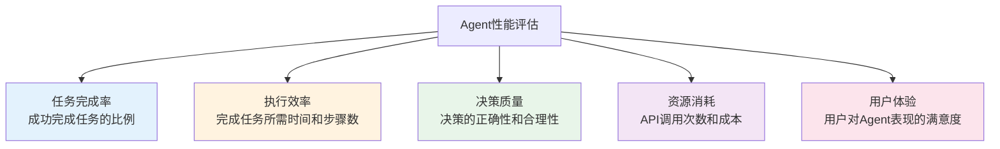

### 6.2 常见问题与解决

| 问题 | 原因 | 解决方案 |
|------|------|----------|
| Agent循环执行 | 工具调用失败但未处理 | 添加最大步数限制 |
| 工具选择错误 | 工具描述不够清晰 | 优化工具描述和示例 |
| 记忆丢失 | 上下文窗口溢出 | 实现记忆压缩和摘要 |
| 响应缓慢 | 每步都调用LLM | 批处理 + 缓存机制 |
| 幻觉严重 | 缺乏事实核查 | 添加验证步骤 |

---

## 七、本章总结

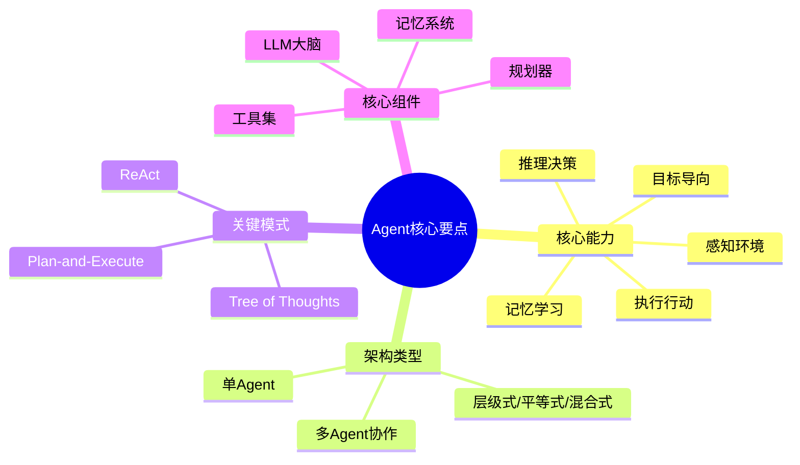

> **核心结论：** Agent的本质是让AI从"问答者"变为"执行者"。关键在于赋予AI感知、推理、执行、记忆的完整闭环能力。

---

## 延伸阅读

- [03 RAG检索增强生成系统](./03-rag-retrieval-augmented-generation.md) — Agent的知识来源
- [05 AI工作流搭建](./05-ai-workflow-construction.md) — 多Agent协作的工作流编排
- [07 AI辅助软件开发体系](../engineering/03-ai-assisted-software-development.md) — Agent在实际开发中的应用
