# 01 — AI 基础知识与概念

> 建立AI认知框架：从历史到原理，从模型到工具
> 目标：理解AI系统的核心概念，为后续学习打下基础

---

## 一、AI 发展历程

### 1.1 发展阶段

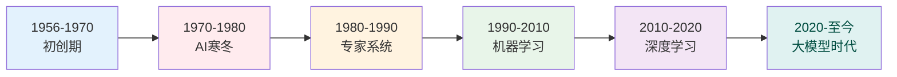

| 阶段 | 时间 | 标志性事件 | 核心特点 |
|------|------|-----------|----------|
| **初创期** | 1956 | 达特茅斯会议，AI概念诞生 | 符号主义，逻辑推理 |
| **寒冬期** | 1970s | 计算能力不足，预期落空 | 研究资金减少 |
| **专家系统** | 1980s | MYCIN等知识系统 | 基于规则的推理 |
| **机器学习** | 1990s | 统计学习方法兴起 | 从数据中学习 |
| **深度学习** | 2010s | AlexNet、ImageNet突破 | 神经网络革命 |
| **大模型时代** | 2020s | GPT-3/4、Claude发布 | 通用语言智能 |

### 1.2 关键技术里程碑

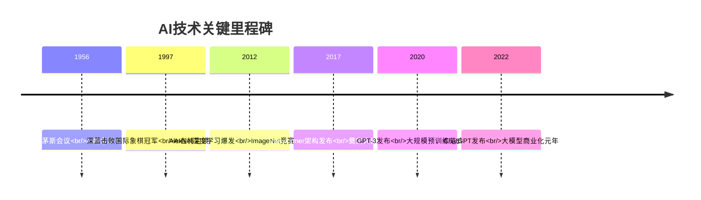

---

## 二、大语言模型（LLM）基础

### 2.1 核心概念

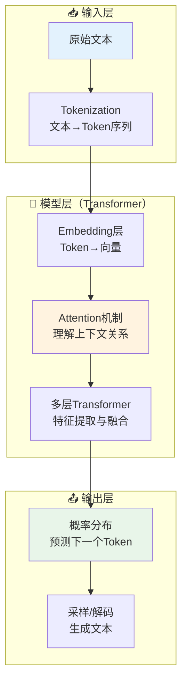

### 2.2 关键术语

| 术语 | 解释 | 重要性 |
|------|------|:------:|
| **Token** | 文本的最小处理单位，一个词或子词 | ⭐⭐⭐ |
| **Embedding** | 将文本转换为高维向量表示 | ⭐⭐⭐ |
| **Attention** | 模型关注输入不同部分的机制 | ⭐⭐⭐ |
| **Transformer** | 现代大模型的基础架构 | ⭐⭐⭐ |
| **Context Window** | 模型能同时处理的文本长度 | ⭐⭐ |
| **Temperature** | 控制生成结果的随机性（0-1） | ⭐⭐ |
| **Top-k / Top-p** | 控制采样策略的参数 | ⭐ |
| **Fine-tuning** | 在特定数据上继续训练模型 | ⭐⭐⭐ |

### 2.3 主流模型对比

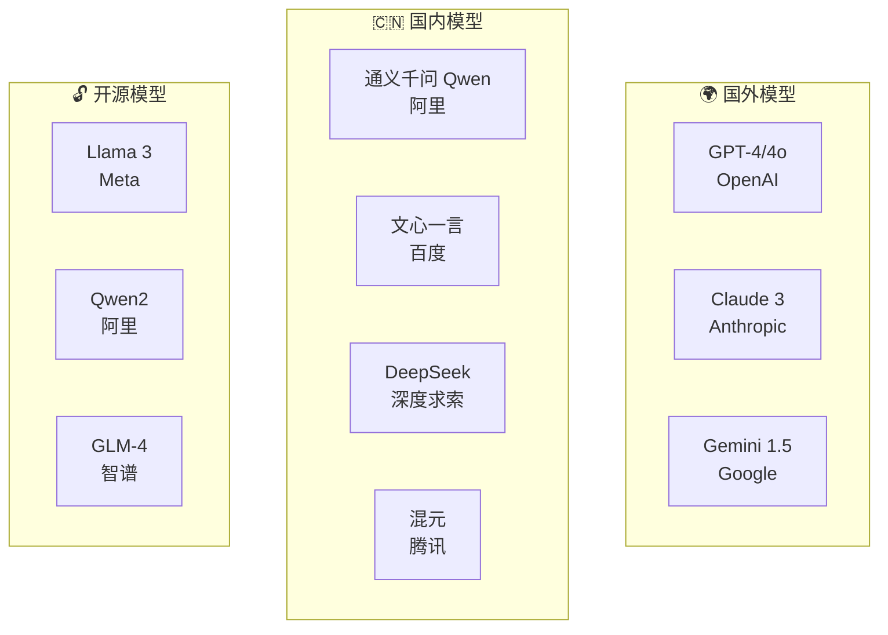

| 模型 | 特点 | 适用场景 |
|------|------|----------|
| **GPT-4/4o** | 综合能力最强，多模态 | 通用任务、复杂推理 |
| **Claude 3** | 长上下文，写作质量高 | 长文档处理、内容创作 |
| **DeepSeek** | 性价比高，代码能力强 | 软件开发、成本敏感场景 |
| **通义千问** | 中文能力强，生态丰富 | 中文内容、企业应用 |
| **文心一言** | 中文理解好，百度生态 | 国内企业应用 |
| **Llama 3** | 开源可私有部署 | 数据敏感场景 |

---

## 三、Transformer 架构详解

### 3.1 核心机制

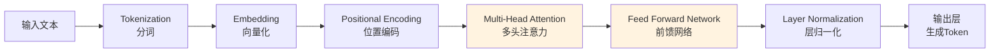

### 3.2 注意力机制

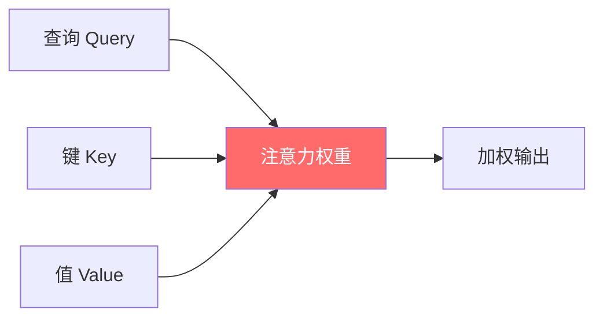

> **核心思想：** 在处理每个词时，模型会"关注"句子中所有其他词，并决定关注程度。这使模型能够理解词与词之间的关系。

---

## 四、自然语言处理（NLP）基础

### 4.1 核心任务

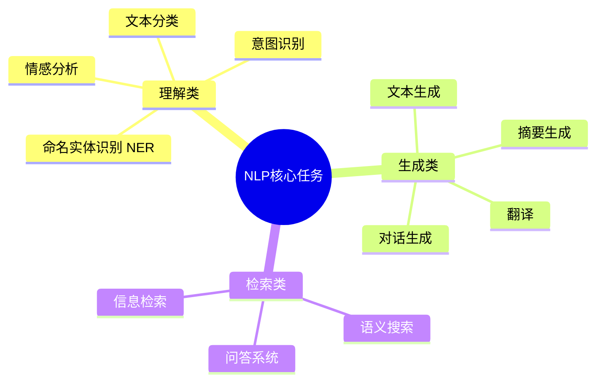

### 4.2 典型应用场景

| 场景 | 技术 | 应用 |
|------|------|------|
| 智能客服 | 对话系统 + RAG | 自动回答用户问题 |
| 内容审核 | 文本分类 + 情感分析 | 识别违规内容 |
| 知识检索 | 向量检索 + LLM | 精准回答专业问题 |
| 代码生成 | LLM + Code Interpreter | 辅助编程开发 |
| 数据分析 | NL2SQL + Agent | 自然语言查询数据 |

---

## 五、向量数据库原理

### 5.1 什么是向量？

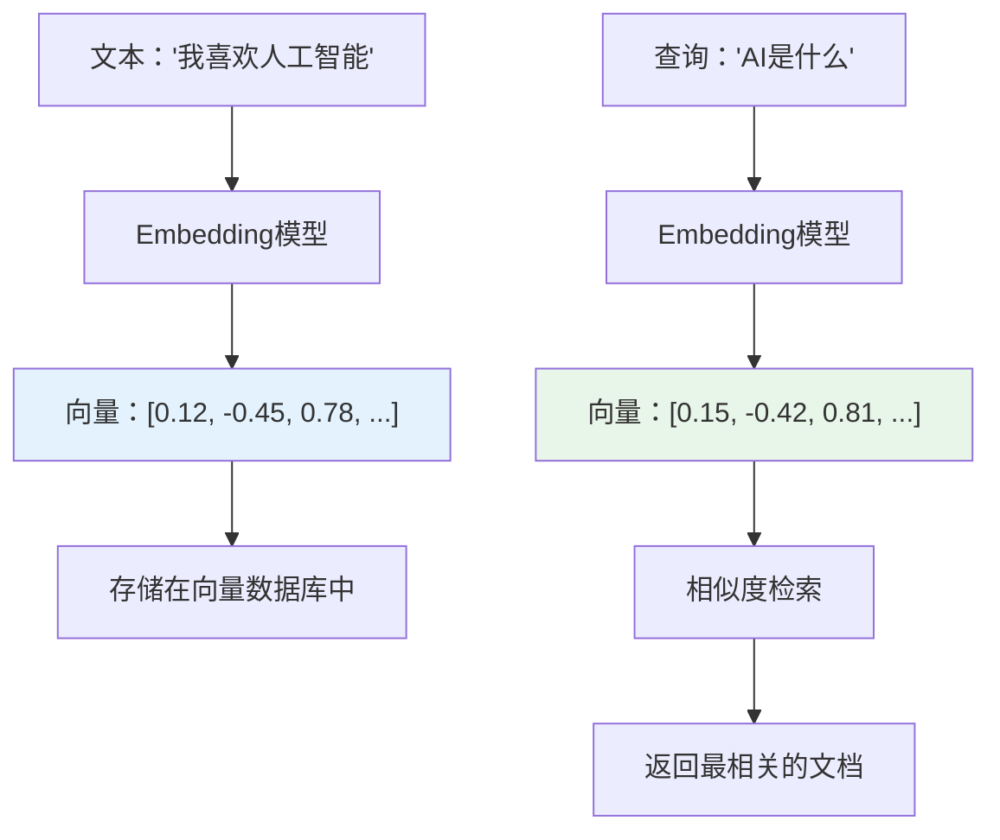

### 5.2 向量数据库选型

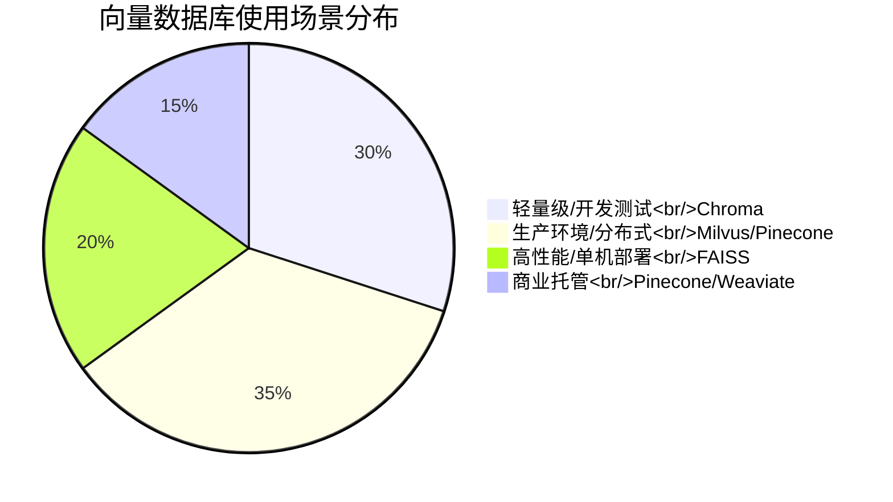

| 数据库 | 类型 | 特点 | 推荐场景 |
|--------|------|------|----------|
| **Chroma** | 开源 | 轻量，Python友好 | 开发测试、小项目 |
| **Milvus** | 开源 | 分布式，高性能 | 大规模生产环境 |
| **Pinecone** | 商业 | 托管式，易用 | 快速上线、商业项目 |
| **FAISS** | 开源 | Meta出品，极高性能 | 单机高性能场景 |
| **Qdrant** | 开源 | Rust编写，过滤强 | 需要复杂过滤的场景 |

### 5.3 相似度计算方法

| 方法 | 公式 | 特点 | 适用场景 |
|------|------|------|----------|
| **余弦相似度** | cos(θ) = A·B / (\|A\|\|B\|) | 最常用，适合高维 | 文本语义检索 |
| **欧氏距离** | √Σ(Ai-Bi)² | 简单直观 | 低维向量 |
| **点积** | A·B | 计算效率高 | 推荐系统 |

---

## 六、AI 技术栈总览

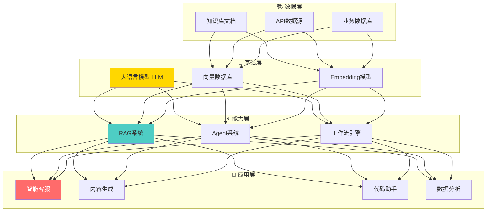

---

## 七、本章总结

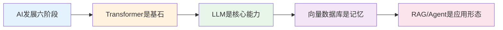

> **核心结论：** AI系统 = **LLM（大脑）+ 向量数据库（记忆）+ Agent（手脚）+ 工作流（神经系统）**。理解这四大组件的关系，就理解了AI系统的本质。

---

## 延伸阅读

- [02 LLM与提示词工程](./02-llm-prompt-engineering.md) — 深入理解如何与AI有效交互
- [03 RAG检索增强生成系统](../practice/03-rag-retrieval-augmented-generation.md) — AI系统的核心记忆机制
- [12 AI术语表](./03-ai-glossary.md) — 快速查阅专业术语
