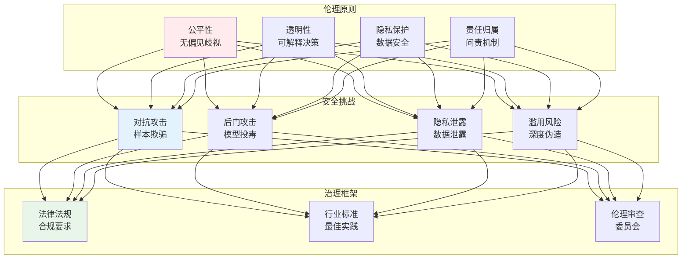
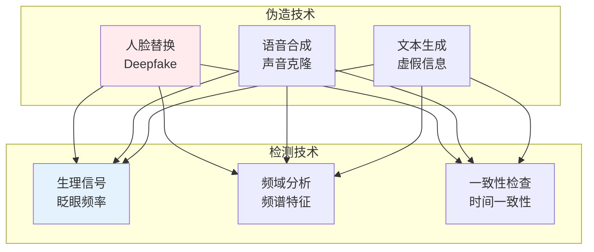
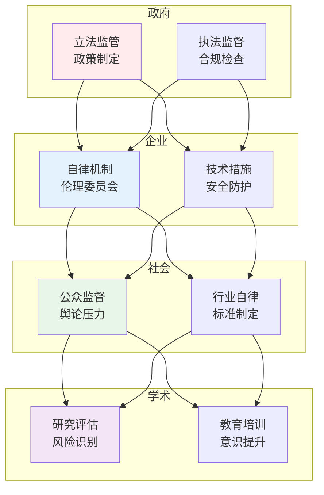

# AI伦理与安全

## 🗂️ 内容导航

| 名称 | 说明 | 链接 |
|------|------|------|
| 可解释性 | 让AI决策过程透明可理解 | [进入](explainable-ai/index.md) |
| 公平性 | AI系统的公平性评估与偏见消除 | [进入](fairness/index.md) |
| 隐私保护 | AI时代的数据隐私保护技术与合规 | [进入](privacy/index.md) |
| 安全性 | AI系统的鲁棒性与对抗防御 | [进入](safety/index.md) |

---


> **核心观点**：AI技术的发展必须考虑伦理和社会影响，安全可靠的AI是负责任的发展方向。

---

## 📊 AI伦理框架



---

## ⚖️ 伦理问题

### 算法偏见

| 偏见类型 | 来源 | 影响 |
|----------|------|------|
| 数据偏见 | 训练数据不均衡 | 歧视特定群体 |
| 标注偏见 | 人工标注主观性 | 标签不准确 |
| 采样偏见 | 样本代表性差 | 结果偏差 |
| 测量偏见 | 特征选择不当 | 评估失真 |

### 可解释性

```
可解释性的重要性：
1. 建立信任：用户理解决策
2. 问题诊断：发现模型问题
3. 合规要求：法律监管需要
4. 责任归属：明确责任主体
```

### 隐私保护

| 技术 | 原理 | 应用 |
|------|------|------|
| 差分隐私 | 添加噪声 | 数据发布 |
| 联邦学习 | 分布式训练 | 多方协作 |
| 同态加密 | 密文计算 | 隐私保护 |
| 安全多方计算 | 分布式计算 | 协作分析 |

---

## 🔒 安全挑战

### 对抗攻击

| 攻击类型 | 描述 | 防御方法 |
|----------|------|----------|
| 对抗样本 | 微小扰动误导 | 对抗训练 |
| 后门攻击 | 植入恶意触发 | 后门检测 |
| 模型窃取 | 提取模型参数 | 访问控制 |
| 数据投毒 | 污染训练数据 | 数据清洗 |

### 深度伪造



---

## 📜 法规与标准

### 国际法规

| 法规 | 地区 | 核心内容 |
|------|------|----------|
| GDPR | 欧盟 | 数据保护 |
| CCPA | 美国加州 | 隐私权利 |
| AI法案 | 欧盟 | 风险分级 |

### 行业标准

```
AI伦理标准：
1. 公平性：无歧视
2. 透明性：可解释
3. 隐私保护：数据安全
4. 安全性：鲁棒可靠
5. 问责性：责任明确
```

---

## 🏛️ 治理框架

### 多方治理



### 伦理审查

| 审查内容 | 重点 | 方法 |
|----------|------|------|
| 数据审查 | 数据来源合规 | 合规检查 |
| 算法审查 | 公平性评估 | 偏见测试 |
| 应用审查 | 社会影响 | 风险评估 |

---

## 🎯 核心结论

### AI伦理原则

1. **公平性**：避免歧视偏见
2. **透明性**：可解释决策
3. **隐私保护**：数据安全
4. **安全性**：鲁棒可靠
5. **问责性**：责任明确

### 负责任的AI

```
负责任AI的实践：
1. 设计阶段：考虑伦理影响
2. 开发阶段：实施安全措施
3. 部署阶段：持续监控
4. 使用阶段：用户教育
5. 退役阶段：妥善处理
```

---

## 📚 参考文献

1. 《人工智能伦理》
2. 《算法霸权》- 凯西·奥尼尔
3. 《技术与文明》- 蒂姆·乔丹
4. 《AI超级大国》- 李开复
5. 《深度学习革命》- 凯德·梅茨
6. 《AI伦理指南》
7. 《负责任的AI》
8. 《机器学习公平性》