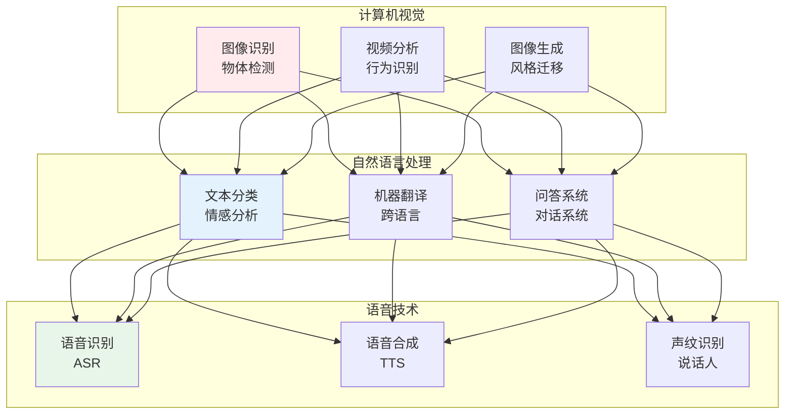
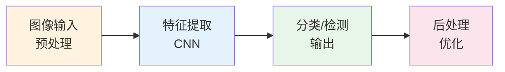
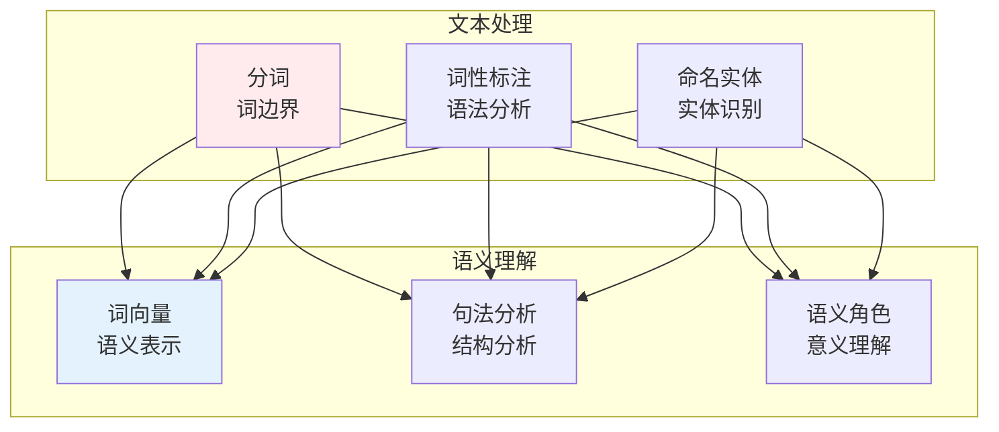
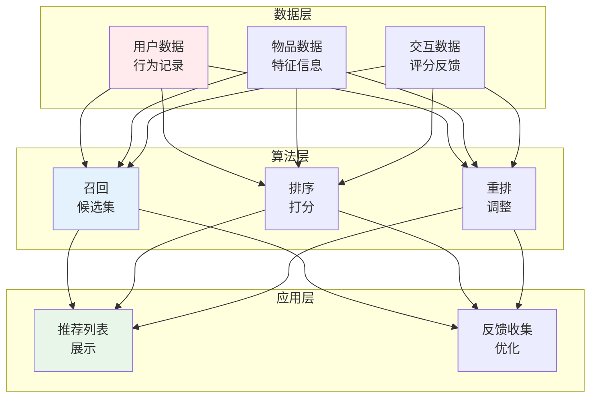

# AI应用

## 🗂️ 内容导航

| 名称 | 说明 | 链接 |
|------|------|------|
| 计算机视觉 | 让机器看懂图像和视频 | [进入](computer-vision/index.md) |
| 智能系统 | AI技术在复杂现实场景中的系统化应用 | [进入](intelligent-systems/index.md) |
| 机器学习 | 让机器从数据中学习规律并做出预测 | [进入](machine-learning/index.md) |
| 自然语言处理 | 让机器理解、生成和处理人类语言 | [进入](nlp/index.md) |

---


> **核心观点**：AI技术正在改变各行各业，理解应用场景是落地AI项目的关键。

---

## 📊 AI应用领域



---

## 👁️ 计算机视觉

### 应用场景

| 应用 | 描述 | 技术 |
|------|------|------|
| 人脸识别 | 身份验证 | 特征提取、比对 |
| 目标检测 | 物体定位 | YOLO、Faster R-CNN |
| 图像分割 | 像素级分类 | U-Net、Mask R-CNN |
| OCR | 文字识别 | 文字检测、识别 |
| 自动驾驶 | 环境感知 | 多传感器融合 |

### 技术流程



---

## 💬 自然语言处理

### 应用场景

| 应用 | 描述 | 技术 |
|------|------|------|
| 情感分析 | 情绪判断 | 文本分类 |
| 机器翻译 | 语言转换 | Seq2Seq、Transformer |
| 问答系统 | 问题回答 | 信息检索、生成 |
| 文本摘要 | 内容压缩 | 抽取式、生成式 |
| 对话系统 | 人机对话 | 意图识别、槽位填充 |

### 技术架构



---

## 🎯 推荐系统

### 推荐算法

| 算法 | 原理 | 优点 | 缺点 |
|------|------|------|------|
| 协同过滤 | 用户相似性 | 简单有效 | 冷启动问题 |
| 内容推荐 | 特征匹配 | 解决冷启动 | 特征工程 |
| 深度学习 | 神经网络 | 效果好 | 计算成本高 |
| 混合推荐 | 多种算法 | 综合优势 | 复杂度高 |

### 系统架构



---

## 🏥 行业应用

### 医疗健康

| 应用 | 描述 | 价值 |
|------|------|------|
| 医学影像 | 病灶检测 | 辅助诊断 |
| 病历分析 | 结构化提取 | 效率提升 |
| 药物研发 | 分子设计 | 加速研发 |
| 健康管理 | 风险预测 | 预防医学 |

### 金融科技

| 应用 | 描述 | 价值 |
|------|------|------|
| 风险控制 | 信用评估 | 降低风险 |
| 智能投顾 | 资产配置 | 个性化服务 |
| 反欺诈 | 异常检测 | 安全保障 |
| 客服机器人 | 自动问答 | 降低成本 |

### 智能制造

| 应用 | 描述 | 价值 |
|------|------|------|
| 质量检测 | 缺陷识别 | 提高质量 |
| 预测维护 | 故障预警 | 减少停机 |
| 供应链优化 | 需求预测 | 降低成本 |
| 生产调度 | 资源优化 | 提高效率 |

---

## 🎯 核心结论

### AI应用成功要素

1. **数据质量**：高质量数据是基础
2. **问题定义**：明确业务目标
3. **技术选型**：合适的技术方案
4. **工程实现**：可靠的系统架构
5. **持续迭代**：不断优化改进

### AI应用挑战

```
AI应用四大挑战：
1. 数据孤岛：数据难以获取
2. 模型泛化：跨场景适应
3. 可解释性：决策透明度
4. 伦理问题：公平性、隐私
```

---

## 📚 参考文献

1. 《计算机视觉：算法与应用》
2. 《自然语言处理入门》
3. 《推荐系统实践》
4. 《机器学习实战》
5. 《深度学习：原理及应用》
6. 《人工智能应用》
7. 《智能系统：设计与实现》
8. 《AI赋能产业》