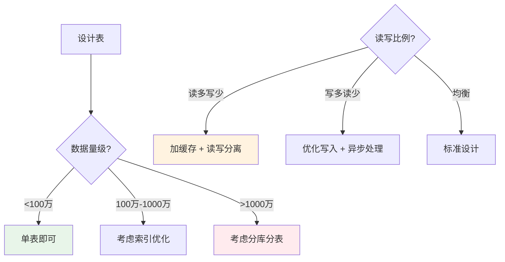
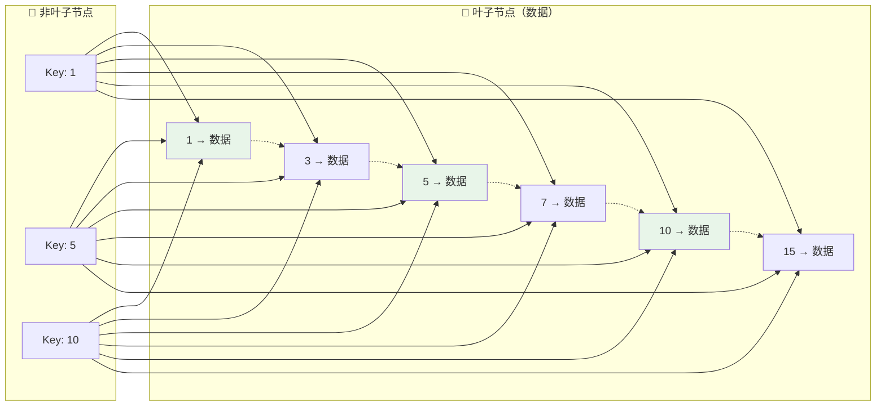
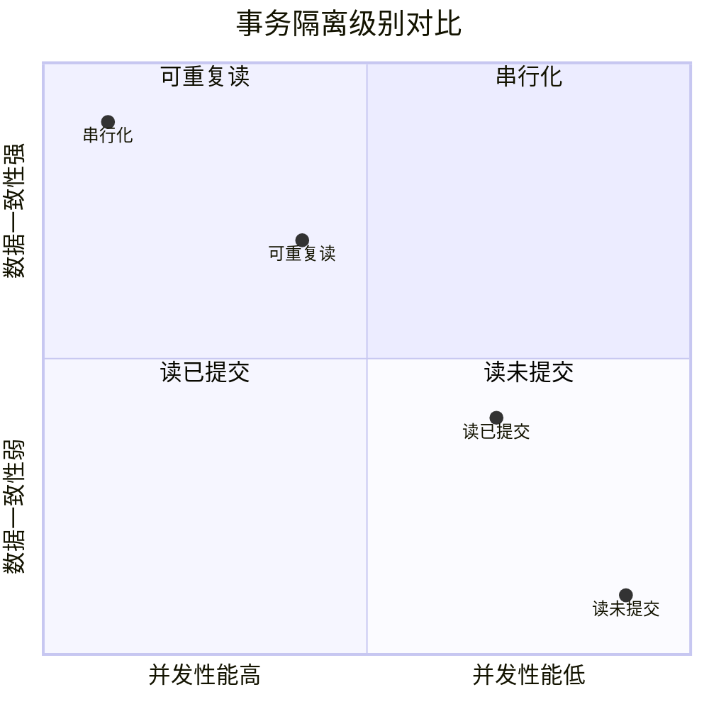
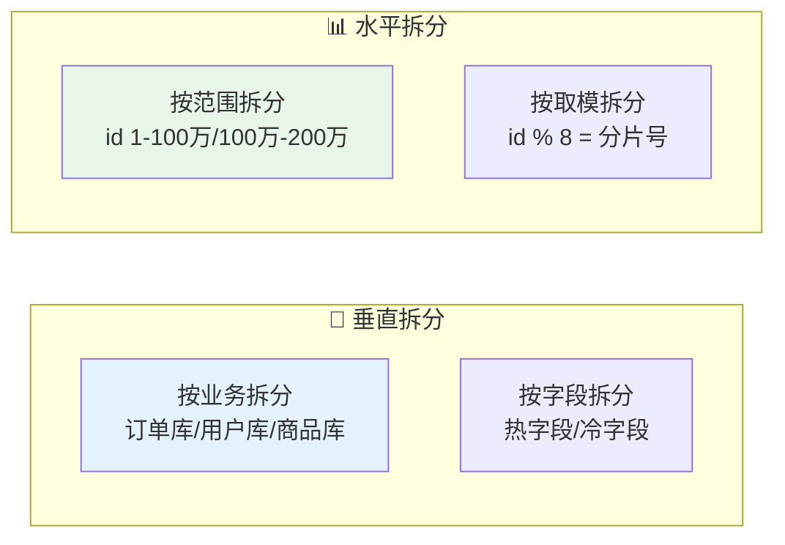

# 09 — 数据库设计

> 核心规律：索引是速度的代价，事务是一致性的保障
> 一句话：好的表设计让查询自然快速，坏的表设计让优化举步维艰

---

## 一、核心规律

### 1.1 数据库设计三范式

```
1NF：原子性 — 每列不可再分
2NF：消除部分依赖 — 非主键字段完全依赖主键
3NF：消除传递依赖 — 非主键字段不依赖其他非主键字段

实际开发：适度反范式
├── 冗余字段提升查询性能
├── 宽表减少JOIN
└── 但要保持数据一致性
```

### 1.2 设计决策树



---

## 二、索引原理

### 2.1 B+树结构



**关键特性：**
- 非叶子节点只存Key，不存数据 → 一页能存更多Key → 树更矮 → 查询更快
- 叶子节点用链表连接 → 范围查询高效

### 2.2 索引类型对比

| 类型 | 结构 | 适用场景 | 特点 |
|------|------|---------|------|
| **聚簇索引** | B+树（主键） | 主键查询 | 数据按主键有序存储 |
| **二级索引** | B+树（普通字段） | 范围查询/排序 | 回表查询 |
| **全文索引** | Inverted Index | 文本搜索 | 支持MATCH...AGAINST |
| **哈希索引** | Hash Table | 等值查询 | O(1)但无法范围查询 |

### 2.3 索引设计原则

```
✅ 应该建索引：
├── WHERE条件频繁使用的字段
├── JOIN关联字段
├── ORDER BY排序字段
├── GROUP BY分组字段
└── 高区分度的字段（唯一值多）

❌ 不应该建索引：
├── 频繁更新的字段（维护成本高）
├── 低区分度字段（如性别）
├── LIKE '%keyword'（前导通配符）
└── 字段过短（如单字符）
```

---

## 三、事务与锁

### 3.1 ACID特性

```
A - 原子性：事务要么全部成功，要么全部失败
C - 一致性：事务前后数据保持一致
I - 隔离性：并发事务互不干扰
D - 持久性：提交后永久保存
```

### 3.2 隔离级别



| 级别 | 脏读 | 不可重复读 | 幻读 | MySQL默认 |
|------|:----:|:----------:|:----:|:---------:|
| 读未提交 | ❌ | ❌ | ❌ | — |
| 读已提交 | ✅ | ❌ | ❌ | PostgreSQL默认 |
| 可重复读 | ✅ | ✅ | ❌（部分） | **MySQL默认** |
| 串行化 | ✅ | ✅ | ✅ | 最高级别 |

### 3.3 锁机制

```
行锁（InnoDB）：
├── 自动加锁：WHERE条件匹配的行
├── 显式加锁：SELECT ... FOR UPDATE
└── 高并发友好

间隙锁：
├── 防止幻读
├── 锁定索引记录之间的间隙
└── Next-Key Lock = 记录锁 + 间隙锁
```

---

## 四、分库分表

### 4.1 拆分策略



### 4.2 核心挑战

| 挑战 | 解决方案 |
|------|----------|
| 跨分片查询 | 避免跨库JOIN，应用层组装 |
| 全局ID生成 | 雪花算法 / 号段模式 |
| 分布式事务 | Seata / TCC / 本地消息表 |
| 数据迁移 | 双写 + 灰度切换 |
| 分页查询 | 游标分页替代OFFSET |

---

## 五、慢查询优化

### 5.1 EXPLAIN分析

```sql
EXPLAIN SELECT * FROM orders WHERE user_id = 123;

-- 关注字段：
-- type: ALL(全表扫描) → index → range → ref → const
-- key: 实际使用的索引
-- rows: 预估扫描行数
-- Extra: Using filesort(需优化), Using temporary(需优化)
```

### 5.2 优化 checklist

```
□ 避免SELECT *，指定需要的字段
□ 合理使用索引（最左前缀原则）
□ 避免在索引列上用函数
□ 大结果集分页用游标替代OFFSET
□ 批量操作用chunk()分批处理
□ 定期分析慢查询日志
□ 监控索引使用情况（废弃索引删除）
```

---

## 六、本章总结

> **核心规律：索引是速度的代价。每个索引都有写入和维护成本，要在查询性能和写入性能之间权衡。**

### 关键记忆点
- ✅ B+树是非叶子节点只存Key，叶子节点存数据+链表
- ✅ MySQL默认可重复读隔离级别，部分解决幻读
- ✅ 分库分表解决单表瓶颈，但引入分布式复杂性
- ✅ EXPLAIN是查询优化的第一步

---

## 延伸阅读
- [08 性能优化方法论](../fundamentals/software/06-performance-optimization.md) — 数据库性能优化深入
