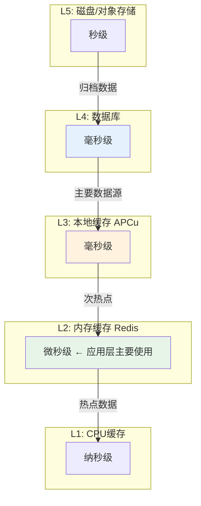
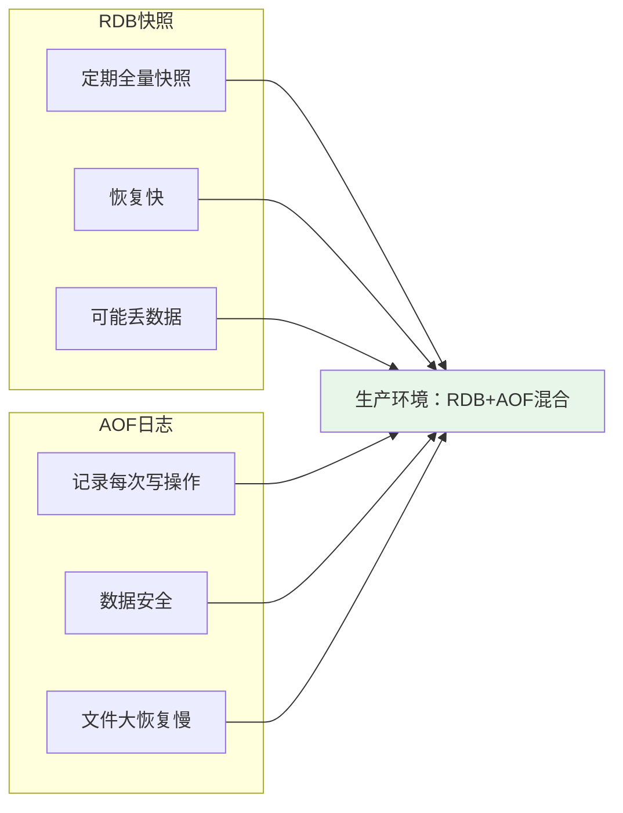
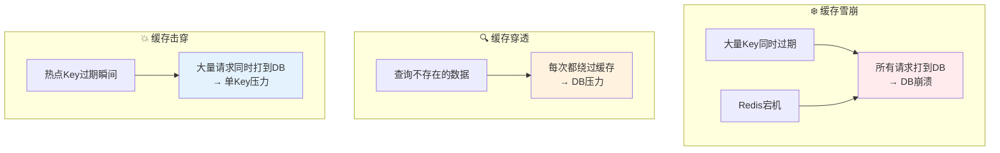

# 10 — 缓存系统设计

> 核心规律：缓存是空间的换时间，一致性vs性能永远在权衡
> 一句话：没有缓存的系统是脆弱的，只有缓存的系统是不可靠的

---

## 一、核心规律

### 1.1 缓存三定律

```
1. 所有缓存都会失效 — 提前设计失效策略
2. 缓存命中不是100% — 接受Miss的存在
3. 缓存可能不一致 — 最终一致性优于强一致
```

### 1.2 缓存架构层次



---

## 二、Redis核心

### 2.1 数据结构与场景

| 结构 | 命令 | 应用场景 |
|------|------|---------|
| **String** | SET/GET/INCR | 缓存、计数、分布式锁 |
| **Hash** | HSET/HGET | 对象存储（用户信息） |
| **List** | LPUSH/RPOP | 消息队列、时间线 |
| **Set** | SADD/SISMEMBER | 标签、去重、抽奖 |
| **ZSet** | ZADD/ZRANGE | 排行榜、延时队列 |
| **Bitmap** | SETBIT/GETBIT | 用户签到、活跃统计 |
| **HyperLogLog** | PFADD/PFCOUNT | UV计数 |
| **Geo** | GEOADD/GEODIST | 附近的人 |

### 2.2 持久化机制



**推荐配置：**
```ini
save 900 1      # 15分钟至少1个key变化，做快照
save 300 10     # 5分钟至少10个key变化，做快照
save 60 10000   # 1分钟至少10000个key变化，做快照
appendonly yes  # 开启AOF
appendfsync everysec  # 每秒刷盘
```

---

## 三、缓存三大问题

### 3.1 问题对比



### 3.2 解决方案

| 问题 | 原因 | 解决方案 |
|------|------|----------|
| **雪崩** | Key集中过期/Redis宕机 | 随机TTL + 集群部署 + 限流降级 |
| **穿透** | 查询不存在的数据 | 布隆过滤器 + 缓存空值 |
| **击穿** | 热点Key过期瞬间 | 互斥锁 + 永不过期 |

### 3.3 代码示例

```php
// 缓存空值防穿透
public function getUser(int $id): ?User
{
    $cacheKey = "user:{$id}";
    $data = Cache::get($cacheKey);
    
    if ($data === null) {
        $user = $this->repo->find($id);
        // 即使为null也缓存，设置较短TTL
        $ttl = $user ? 3600 : 60;
        Cache::put($cacheKey, $user?->toArray(), $ttl);
        return $user;
    }
    
    return $data ? (object) $data : null;
}

// 互斥锁防击穿
public function getHotProduct(int $id): Product
{
    $cacheKey = "product:hot:{$id}";
    
    return Cache::remember($cacheKey, 3600, function() use ($id) {
        return $this->repo->find($id)?->toArray();
    });
}
```

---

## 四、缓存策略

### 4.1 常见模式

| 模式 | 说明 | 一致性 | 复杂度 |
|------|------|:------:|:------:|
| **Cache-Aside** | 先查缓存，miss则查DB并写入 | 最终一致 | 低 |
| **Read-Through** | 缓存代理，应用只调缓存 | 强一致 | 中 |
| **Write-Through** | 写缓存同时写DB | 强一致 | 中 |
| **Write-Behind** | 写缓存，异步写DB | 最终一致 | 高 |

### 4.2 缓存失效策略

```
失效时机选择：
├── TTL（时间过期）：最简单，可能过期过早或过晚
├── 主动删除：写入时删除缓存，保证一致性
├── 延迟双删：先删后写再删，解决并发问题
└── 逻辑过期：不删缓存，后台异步刷新
```

---

## 五、缓存设计最佳实践

### 5.1 Key设计规范

```
格式：{业务名}:{实体}:{ID}:{字段}

示例：
  user:profile:123:name        # 用户基本信息
  order:list:status:paid       # 已支付订单列表
  product:hot:top10            # 热销商品TOP10

禁止：
  ❌ key = 'user_123'          # 无业务前缀
  ❌ key = 'a'                 # 过于简短
```

### 5.2 缓存设计 Checklist

```
□ 设置合理的TTL（避免永久缓存）
□ 缓存Key包含业务前缀（便于管理和清理）
□ 关键数据考虑缓存失效策略
□ 热点数据考虑永不过期+后台刷新
□ 监控缓存命中率和内存使用
□ 设计缓存降级方案（Redis挂了怎么办）
```

---

## 六、本章总结

> **核心规律：缓存是性能的加速器，也是复杂性的来源。用好缓存的关键是理解一致性与性能的二律背反。**

### 关键记忆点
- ✅ Redis八大数据结构，各有所长
- ✅ RDB适合备份，AOF适合恢复
- ✅ 穿透→布隆过滤器+空值缓存，击穿→互斥锁，雪崩→随机TTL
- ✅ Cache-Aside是最常用的缓存模式

---

## 延伸阅读
- [08 性能优化方法论](../fundamentals/software/06-performance-optimization.md) — 缓存优化深入
