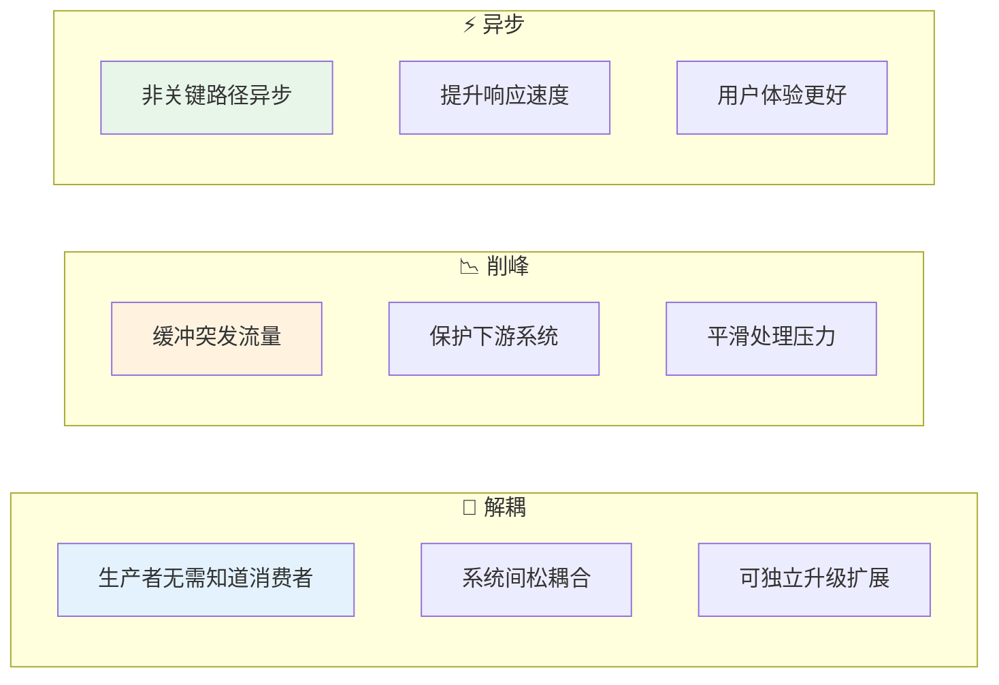
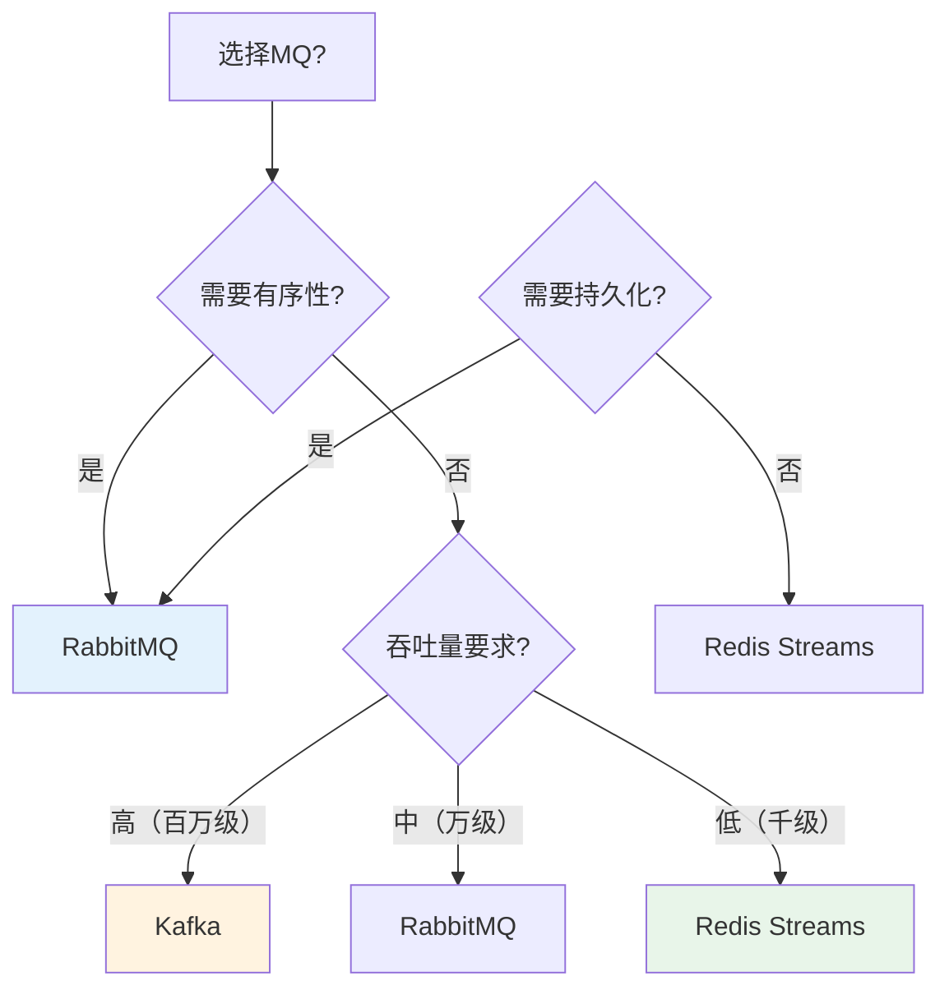
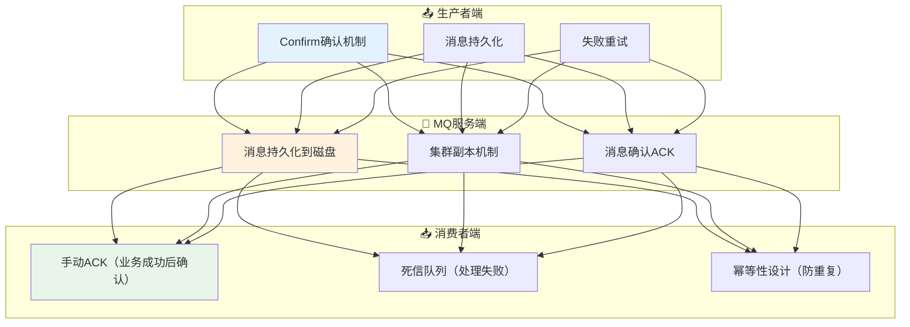

# 11 — 消息队列

> 核心规律：解耦+削峰+异步，可靠投递三层保障
> 一句话：MQ是系统间通信的血管，通畅则系统健康，堵塞则系统崩溃

---

## 一、核心规律

### 1.1 MQ三大价值



### 1.2 选型决策树



---

## 二、RabbitMQ vs Kafka

### 2.1 核心对比

| 特性 | RabbitMQ | Kafka |
|------|----------|-------|
| **协议** | AMQP | 自定义协议 |
| **消息模型** | 队列（点对点） | Topic（发布订阅） |
| **吞吐量** | 万级/秒 | 百万级/秒 |
| **延迟** | 毫秒级 | 毫秒级 |
| **可靠性** | 高（事务+确认） | 高（副本+刷盘） |
| **消息保留** | 消费后删除 | 可保留多天 |
| **适用场景** | 企业级业务消息 | 大数据日志/流处理 |

### 2.2 典型应用场景

| 场景 | 推荐MQ | 理由 |
|------|--------|------|
| 订单状态通知 | RabbitMQ | 需要可靠投递、顺序保证 |
| 日志收集 | Kafka | 高吞吐、持久化 |
| 实时推荐 | Kafka | 流处理、高吞吐 |
| 异步邮件发送 | RabbitMQ/Redis | 简单任务、低延迟 |
| 用户行为埋点 | Kafka | 海量数据、持久化 |

---

## 三、可靠投递保障

### 3.1 三层保障模型



### 3.2 关键实现

```php
// 生产者：Confirm模式
$channel->confirm_select();
$channel->basic_publish($msg, '', 'order_queue');
if (!$channel->wait_for_acks()) {
    // 重试或记录日志
}

// 消费者：手动ACK
$channel->basic_consume('order_queue', '', false, false, false, false, function($msg) {
    try {
        // 处理业务逻辑
        processOrder($msg->body);
        $msg->ack();  // 成功后确认
    } catch (Exception $e) {
        $msg->nack(false, true);  // 失败重新入队
    }
});
```

---

## 四、消息顺序性与幂等性

### 4.1 顺序性保证

```
顺序性挑战：
├── 并发消费导致乱序
├── 消息重发导致重复
└── 分区消费导致局部有序

解决方案：
├── 单Consumer消费单一Queue（牺牲性能）
├── 消息带序号，消费者排序后处理
└── 按业务Key哈希到固定Queue
```

### 4.2 幂等性设计

```
幂等性 = 同一消息处理多次 = 相同结果

实现方式：
├── 唯一业务ID（数据库唯一索引）
├── 状态机（只有特定状态才能处理）
├── 去重表（记录已处理的消息ID）
└── Redis SETNX（原子操作）
```

```php
// 幂等性示例：唯一业务ID
public function handleOrder(string $businessId, array $data): void
{
    // 尝试插入，唯一索引保证幂等
    try {
        ProcessedMessage::create([
            'business_id' => $businessId,
            'status' => 'processing',
        ]);
    } catch (UniqueConstraintViolationException $e) {
        // 已处理，忽略
        return;
    }
    
    // 处理业务逻辑...
}
```

---

## 五、本章总结

> **核心规律：MQ的核心价值是解耦、削峰、异步。可靠投递需要生产者、MQ服务端、消费者三层共同保障。**

### 关键记忆点
- ✅ RabbitMQ适合企业级业务消息，Kafka适合大数据流处理
- ✅ 可靠投递 = Confirm + 持久化 + 手动ACK + 幂等
- ✅ 幂等性是MQ消费方的必备设计
- ✅ 顺序性需要额外保证，不是MQ的默认特性

---

## 延伸阅读

- [middleware/06~10](./middleware/) — 现有MQ专题内容
- [10 缓存系统设计](./10-缓存系统设计.md) — 缓存与MQ的配合使用
