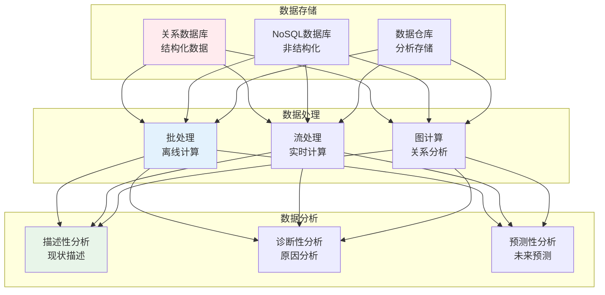
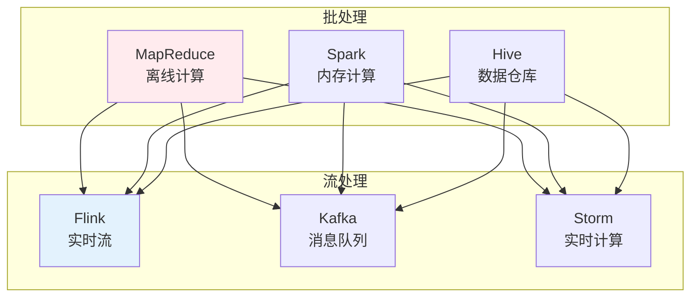

# 数据基础

## 🗂️ 内容导航

| 名称 | 说明 | 链接 |
|------|------|------|
| 09 — 数据库设计 |  | [进入](01-database-design.md) |
| 10 — 缓存系统设计 |  | [进入](02-cache-system-design.md) |
| 11 — 消息队列 |  | [进入](03-message-queues.md) |

---


> **核心观点**：数据是AI的燃料，理解数据处理是构建智能系统的基础。

---

## 📊 数据体系



---

## 🗄️ 数据库

### 关系数据库

| 概念 | 内涵 | 例子 |
|------|------|------|
| 表 | 数据集合 | 用户表 |
| 行 | 数据记录 | 一条用户 |
| 列 | 数据字段 | 用户名 |
| 主键 | 唯一标识 | 用户ID |
| 外键 | 表间关联 | 订单用户ID |

### SQL语言

```sql
-- 基本操作
SELECT * FROM users WHERE age > 18;
INSERT INTO users (name, age) VALUES ('张三', 25);
UPDATE users SET age = 26 WHERE name = '张三';
DELETE FROM users WHERE name = '张三';
```

### NoSQL数据库

| 类型 | 特点 | 例子 |
|------|------|------|
| 键值存储 | 简单高效 | Redis |
| 文档存储 | 灵活模式 | MongoDB |
| 列存储 | 高压缩率 | HBase |
| 图数据库 | 关系分析 | Neo4j |

---

## 📈 数据处理

### 大数据处理



### 数据清洗

| 任务 | 描述 | 方法 |
|------|------|------|
| 缺失值处理 | 补全缺失数据 | 均值、中位数、插值 |
| 异常值检测 | 识别异常数据 | 3σ原则、IQR |
| 重复值处理 | 删除重复记录 | 去重 |
| 格式标准化 | 统一数据格式 | 类型转换 |

### 特征工程

```
特征工程方法：
1. 特征选择：选择重要特征
2. 特征提取：从原始数据提取
3. 特征构造：组合现有特征
4. 特征缩放：标准化、归一化
```

---

## 📊 数据可视化

### 可视化类型

| 类型 | 适用场景 | 工具 |
|------|----------|------|
| 折线图 | 趋势变化 | Matplotlib |
| 柱状图 | 对比分析 | Seaborn |
| 散点图 | 相关分析 | Plotly |
| 热力图 | 矩阵数据 | Bokeh |

### 可视化原则

```
数据可视化四原则：
1. 准确性：真实反映数据
2. 简洁性：去除无关元素
3. 有效性：传达核心信息
4. 美观性：视觉吸引力
```

---

## 🎯 核心结论

### 数据处理原则

1. **数据质量**：垃圾进垃圾出
2. **数据安全**：隐私保护
3. **数据治理**：规范管理
4. **数据价值**：挖掘洞察
5. **数据共享**：开放协作

### 数据发展趋势

```
数据发展四大趋势：
1. 数据湖：统一存储
2. 数据编织：智能集成
3. 数据网格：去中心化
4. 数据民主化：人人可用
```

---

## 📚 参考文献

1. 《数据库系统概论》- 王珊
2. 《数据密集型应用系统设计》
3. 《Python数据分析》
4. 《大数据技术原理与应用》
5. 《数据可视化》
6. 《数据治理》
7. 《机器学习实战》
8. 《SQL必知必会》