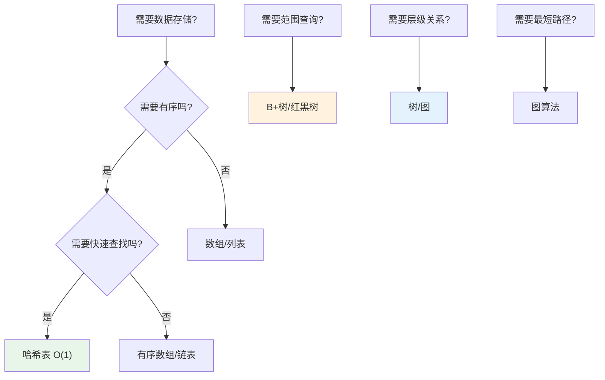
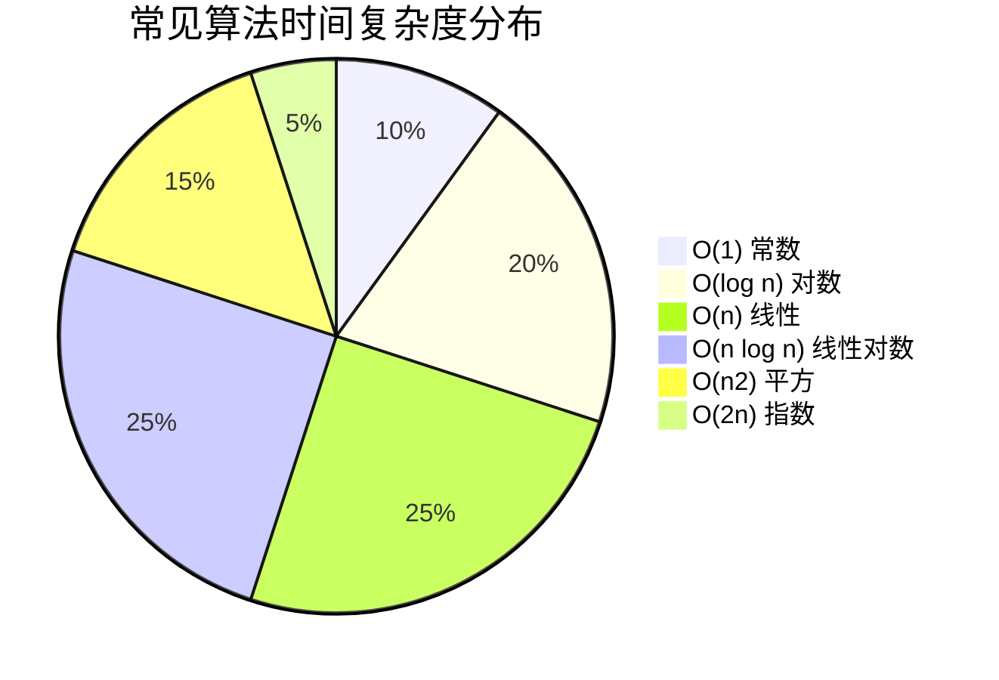
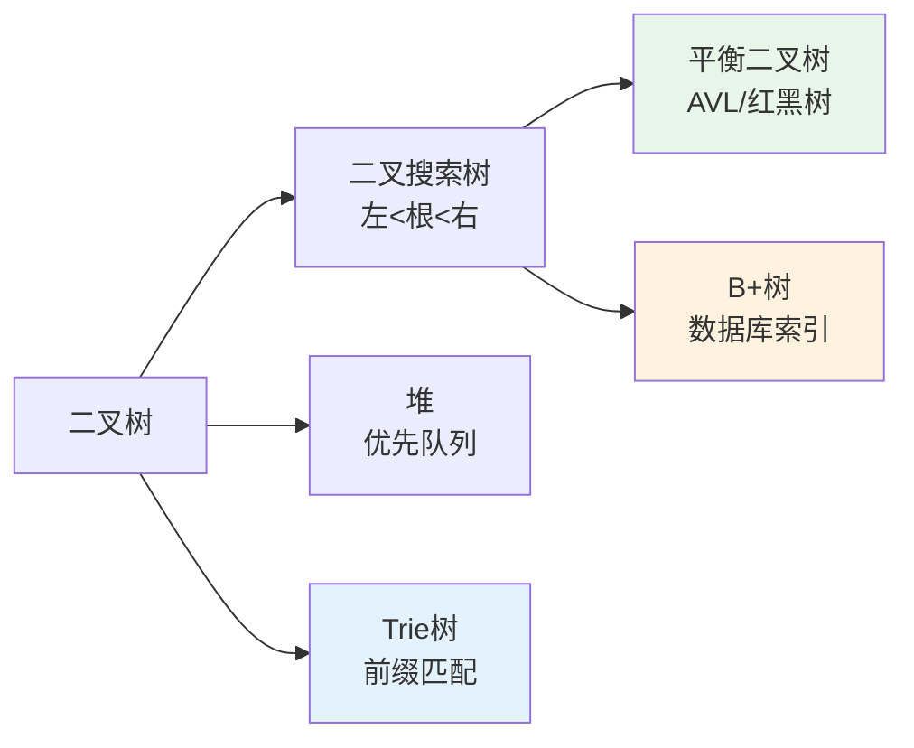

# 04 — 算法与数据结构

> 核心规律：选择合适的结构，是性能和可维护性的基础
> 一句话：没有最好的数据结构，只有最适合场景的数据结构

---

## 一、核心规律

### 1.1 数据结构选择决策树



### 1.2 时间复杂度速查



| 复杂度 | 名称 | 典型算法 |
|--------|------|---------|
| O(1) | 常数 | 哈希查找、数组索引 |
| O(log n) | 对数 | 二分查找 |
| O(n) | 线性 | 线性查找、遍历 |
| O(n log n) | 线性对数 | 快速排序、归并排序 |
| O(n²) | 平方 | 冒泡排序、双重循环 |

---

## 二、常用数据结构

### 2.1 数组与链表

| 特性 | 数组 | 链表 |
|------|------|------|
| **内存** | 连续 | 离散 |
| **随机访问** | O(1) ✅ | O(n) ❌ |
| **插入删除** | O(n) ❌ | O(1) ✅ |
| **PHP实现** | `array` | SPL `SplDoublyLinkedList` |

### 2.2 哈希表

```
哈希表 = 数组 + 哈希函数

Key → 哈希函数 → 索引 → 值

冲突解决：
├── 链地址法：每个桶挂链表
└── 开放寻址：找下一个空位
```

**PHP中的哈希表：** PHP的`array`底层就是哈希表

### 2.3 栈与队列

| 结构 | 特点 | 应用场景 |
|------|------|---------|
| **栈** | 后进先出（LIFO） | 函数调用栈、括号匹配 |
| **队列** | 先进先出（FIFO） | 消息队列、广度优先搜索 |
| **双端队列** | 两端都可进出 | 滑动窗口、回文判断 |

### 2.4 树



---

## 三、核心算法

### 3.1 排序算法

| 算法 | 平均时间 | 空间 | 稳定 | 适用场景 |
|------|:--------:|:----:|:----:|---------|
| **快速排序** | O(n log n) | O(log n) | ❌ | 通用首选 |
| **归并排序** | O(n log n) | O(n) | ✅ | 链表/外部排序 |
| **堆排序** | O(n log n) | O(1) | ❌ | 内存受限 |
| **插入排序** | O(n²) | O(1) | ✅ | 小数据/近似有序 |

### 3.2 搜索算法

| 算法 | 时间复杂度 | 前提条件 |
|------|:----------:|---------|
| **线性搜索** | O(n) | 无要求 |
| **二分搜索** | O(log n) | 有序数组 |
| **哈希搜索** | O(1) | 有哈希表 |

### 3.3 动态规划入门

```
核心思想：把大问题拆成小问题，保存子问题结果避免重复计算

经典案例：爬楼梯
dp[i] = dp[i-1] + dp[i-2]
时间：O(n)，空间：O(1)（只保留前两个状态）
```

---

## 四、Web开发中的应用

| 场景 | 使用的数据结构/算法 |
|------|-------------------|
| 缓存Key设计 | 哈希表 |
| 数据库索引 | B+树 |
| 搜索结果联想 | Trie树 |
| 排行榜 | 堆/有序集合 |
| 路由匹配 | 前缀树/Trie |
| 去重 | 哈希集合 |
| 会话管理 | 栈（LRU淘汰） |

---

## 五、本章总结

> **核心规律：没有最好的数据结构，只有最适合场景的。选择时考虑：访问模式（读多写少 vs 写多读少）、数据规模、一致性要求。**

### 关键记忆点
- ✅ 数组：随机访问快，插入删除慢
- ✅ 链表：插入删除快，随机访问慢
- ✅ 哈希表：查找O(1)，但无序
- ✅ B+树：数据库索引的核心结构
- ✅ 动态规划：保存子问题结果，避免重复计算

---

## 延伸阅读

- [09 数据库设计](../../data-fundamentals/01-database-design.md) — B+树索引的深入理解
- [08 性能优化方法论](../software/06-performance-optimization.md) — 算法对性能的影响
