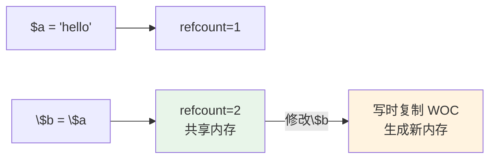

# 15 — PHP深度解析

> 核心规律：理解生命周期，才能优化性能
> 一句话：PHP不是"脚本语言"，现代PHP是工程级的生产语言

---

## 一、核心规律

### 1.1 PHP执行模型


### 1.2 关键记忆点

```
PHP执行流程：
源码 → Lexer词法分析 → Parser语法分析 → Zend引擎编译 → OPcode → 执行

OPcache作用：
避免重复编译，直接将编译后的OPcode加载到内存
```

---

## 二、PHP8核心特性

### 2.1 新特性速查

| 特性 | 版本 | 示例 | 价值 |
|------|------|------|------|
| **联合类型** | 8.0 | `function foo(int|string $x)` | 更精确的类型约束 |
| **命名参数** | 8.0 | `str_contains(haystack: $a, needle: $b)` | 可读性提升 |
| **match表达式** | 8.0 | `match($x) { 1 => 'a', default => 'b' }` | 更安全的多分支 |
| **构造器提升** | 8.0 | `class User(public string $name){}` | 减少样板代码 |
| **JIT编译器** | 8.0 | `opcache.jit=1255` | CPU密集型场景加速 |
| **Nullsafe操作符** | 8.0 | `$user?->address?->city` | 避免多层null判断 |
| **字符串函数** | 8.0 | `str_contains() / str_starts_with()` | 更直观的字符串操作 |

### 2.2 类型系统演进

```php
// PHP 7
function sum(array $numbers): float {
    return array_sum($numbers);
}

// PHP 8
function sum(iterable $numbers): float {
    return (float) array_sum(iterator_to_array($numbers));
}

// PHP 8.1 枚举
enum Status: string {
    case Draft = 'draft';
    case Active = 'active';
    case Inactive = 'inactive';
}

// PHP 8.2 禁用动态属性
#[\AllowDynamicProperties]
class OldClass {}
class NewClass { public string $name; }  // 未声明的属性会报错
```

---

## 三、魔术方法详解

### 3.1 常用魔术方法

| 方法 | 触发时机 | 典型用途 |
|------|----------|---------|
| `__construct()` | 对象创建 | 依赖注入 |
| `__destruct()` | 对象销毁 | 资源释放 |
| `__call($name, $args)` | 调用不存在方法 | API代理 |
| `__get/__set($name, $value)` | 访问/设置不存在属性 | 动态属性 |
| `__isset(__unset($name)` | isset/unset | 属性检测 |
| `__toString()` | 字符串转换 | 对象序列化 |
| `__invoke()` | 当作函数调用 | callable对象 |
| `__clone()` | clone对象 | 深拷贝控制 |

### 3.2 实战示例

```php
class Model {
    protected array $attributes = [];
    
    public function __get(string $name): mixed {
        return $this->attributes[$name] ?? null;
    }
    
    public function __set(string $name, mixed $value): void {
        $this->attributes[$name] = $value;
    }
    
    public function __call(string $name, array $arguments): mixed {
        // 动态查询作用域
        if (str_starts_with($name, 'scope')) {
            $scope = lcfirst(substr($name, 5));
            return $this->where($scope, ...$arguments);
        }
        throw new BadMethodCallException("Method {$name} does not exist");
    }
}

// 使用
$model->name = 'test';      // 触发 __set
echo $model->name;          // 触发 __get
$model->scopeActive();      // 触发 __call
```

---

## 四、Trait机制

### 4.1 基本用法

```php
trait Timestampable {
    public static function bootTimestampable(): void {
        static::creating(function ($model) {
            $model->created_at = now();
            $model->updated_at = now();
        });
    }
}

trait SoftDeletes {
    use DeletesAttributes;
}

class Product extends Model {
    use Timestampable, SoftDeletes;
}
```

### 4.2 Trait冲突解决

```php
trait A {
    public function hello() { echo 'A'; }
}

trait B {
    public function hello() { echo 'B'; }
}

class C {
    use A, B {
        B::hello insteadof A;  // 优先使用B
        A::hello as helloA;    // A的重命名为helloA
    }
}
```

---

## 五、内存管理

### 5.1 引用计数与写时复制



### 5.2 内存泄漏排查

```
常见泄漏场景：
├── 静态变量持有大对象
├── 长生命周期进程未释放（Swoole/Hyperf）
├── 全局变量未清理
└── 未关闭的资源（文件句柄/数据库连接）

排查工具：
├── xdebug_memory() — 当前内存使用
├── memory_get_usage() — 内存快照
└── Xdebug Profiler — 内存火焰图
```

---

## 六、本章总结

> **核心规律：PHP的性能瓶颈通常不在语言本身，而在代码质量和架构设计。理解生命周期和内存模型，是优化的前提。**

### 关键记忆点
- ✅ PHP8特性：联合类型、命名参数、match、构造器提升、JIT
- ✅ Trait是代码复用机制，解决PHP单继承限制
- ✅ 魔术方法让类行为更灵活
- ✅ OPcache是PHP性能的关键

---

## 延伸阅读

- [php/01~10](./php/) — 现有PHP专题内容
- [02 操作系统与进程模型](./02-操作系统与进程模型.md) — PHP-FPM进程模型
- [16 Go语言与高并发](./16-Go语言与高并发.md) — PHP与Go对比
