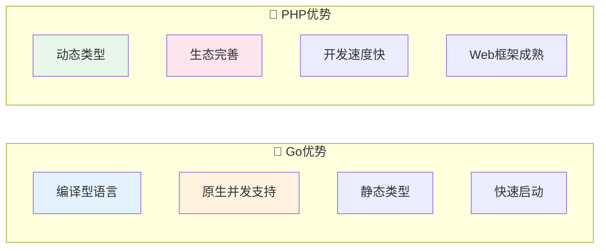

# 16 — Go语言与高并发

> 核心规律：goroutine轻量级，channel通信，适合高并发场景
> 一句话：Go用简单的语法实现了强大的并发能力

---

## 一、核心规律

### 1.1 Go vs PHP 对比



### 1.2 适用场景决策

| 场景 | 推荐语言 | 理由 |
|------|----------|------|
| 高并发网关 | Go | goroutine百万级 |
| 实时通信 | Go | WebSocket支持好 |
| 复杂业务 | PHP | Laravel生态成熟 |
| 快速原型 | PHP/Go均可 | 取决于团队熟悉度 |
| 数据处理 | Go | 并发处理能力强 |
| AI/ML | Python | 生态独占 |

---

## 二、Go核心语法

### 2.1 基础类型

```go
// 基础类型
var name string = "Go"
var count int = 42
var price float64 = 99.99
var isActive bool = true

// 复合类型
var nums []int = []int{1, 2, 3}       // 切片
var person map[string]interface{}     // 映射
type User struct { Name string; Age int }  // 结构体
```

### 2.2 函数与方法

```go
// 函数
func Add(a int, b int) int {
    return a + b
}

// 多返回值
func Divide(a, b float64) (float64, error) {
    if b == 0 {
        return 0, errors.New("division by zero")
    }
    return a / b, nil
}

// 方法（绑定到结构体）
type User struct { Name string }
func (u User) Greet() string {
    return "Hello, " + u.Name
}
```

---

## 三、并发编程

### 3.1 Goroutine

```go
// 启动goroutine
go func() {
    fmt.Println("运行在goroutine中")
}()

// 等待goroutine完成
var wg sync.WaitGroup
wg.Add(2)

go func() {
    defer wg.Done()
    fmt.Println("任务1")
}()

go func() {
    defer wg.Done()
    fmt.Println("任务2")
}()

wg.Wait()
```

### 3.2 Channel

```go
// 无缓冲channel：发送阻塞直到接收
ch := make(chan int)
go func() { ch <- 42 }()
val := <-ch  // 阻塞等待

// 缓冲channel：缓冲区满才阻塞
ch2 := make(chan int, 10)
ch2 <- 42   // 不阻塞（缓冲区有空位）
val2 := <-ch2

// select多路复用
select {
case msg := <-ch1:
    fmt.Println("收到:", msg)
case ch2 <- 1:
    fmt.Println("发送成功")
case <-time.After(time.Second):
    fmt.Println("超时")
}
```

### 3.3 并发模式

| 模式 | 代码模式 | 适用场景 |
|------|---------|---------|
| **Fan-out** | 多个goroutine并行处理 | 批量任务 |
| **Fan-in** | 合并多个channel结果 | 结果聚合 |
| **Worker Pool** | 固定worker处理任务队列 | 限流/资源控制 |
| **Pipeline** | 多阶段串联处理 | 数据处理流水线 |

---

## 四、主流框架

### 4.1 Web框架对比

| 框架 | 特点 | 推荐度 |
|------|------|:------:|
| **Gin** | 最流行，中间件丰富 | ⭐⭐⭐⭐⭐ |
| **Echo** | 简洁，性能最强 | ⭐⭐⭐⭐ |
| **Fiber** | Express.js风格 | ⭐⭐⭐ |
| **Chi** | 轻量路由器 | ⭐⭐⭐ |
| **Beego** | 全功能框架 | ⭐⭐ |

### 4.2 Gin快速入门

```go
package main

import "github.com/gin-gonic/gin"

func main() {
    r := gin.Default()
    
    // GET请求
    r.GET("/users/:id", func(c *gin.Context) {
        id := c.Param("id")
        c.JSON(200, gin.H{"id": id})
    })
    
    // POST请求
    r.POST("/users", func(c *gin.Context) {
        var input struct {
            Name string `json:"name" binding:"required"`
        }
        if err := c.ShouldBindJSON(&input); err != nil {
            c.JSON(400, gin.H{"error": err.Error()})
            return
        }
        c.JSON(201, input)
    })
    
    r.Run(":8080")
}
```

---

## 五、Go+PHP+Vue组合

### 5.1 架构分工

```
┌─────────────────────────────────────────────┐
│  Vue 3 + TypeScript（管理后台 + 用户端）      │
├──────────┬──────────┬──────────┬────────────┤
│ Go网关   │ PHP业务  │ PHP异步  │ 实时服务   │
│ (Gin)    │ (Laravel)│ (Laravel)│ (Gorilla)  │
│ - 请求路由│ - 订单   │ - 邮件   │ - WebSocket│
│ - 限流   │ - 商品   │ - 短信   │ - 推送     │
│ - JWT验证│ - 支付   │ - 日志   │ - 实时库存 │
│ - 缓存   │ - 审批   │ - 报表   │ - 客服聊天 │
├──────────┴──────────┴──────────┴────────────┤
│  MySQL（主从）+ Redis（缓存）+ Elasticsearch  │
│  + RabbitMQ（消息队列）+ MinIO（文件存储）    │
└─────────────────────────────────────────────┘
```

### 5.2 何时用Go，何时用PHP

| 情况 | 推荐 | 理由 |
|------|------|------|
| 高并发API网关 | Go | 百万级连接 |
| 实时推送服务 | Go | WebSocket友好 |
| 复杂业务逻辑 | PHP | Laravel生态 |
| 管理后台 | PHP | Filament快速开发 |
| 数据处理/ETL | Go | 并发处理强 |
| AI功能集成 | Python | 生态独占 |

---

## 六、本章总结

> **核心规律：Go适合「高并发、高性能」的核心组件，PHP适合「快速开发、复杂业务」的业务层。两者互补而非替代。**

### 关键记忆点
- ✅ goroutine轻量级，channel是协程间通信的方式
- ✅ "不要通过共享内存通信，要通过通信共享内存"
- ✅ Go编译型，PHP解释型，Go启动更快
- ✅ Gin是最流行的Go Web框架

---

## 延伸阅读
- [02 操作系统与进程模型](../software/01-operating-systems.md) — Go协程原理
- [15 PHP深度解析](./02-php-deep-dive.md) — PHP与Go对比
