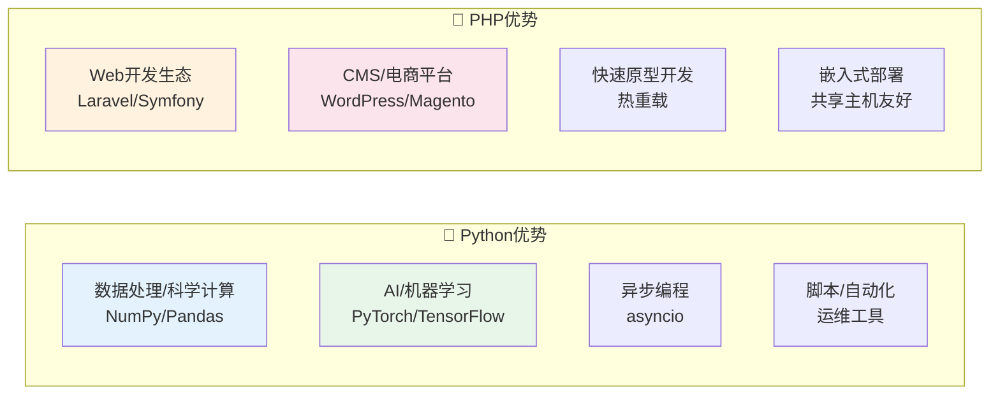

# 17 — Python与AI集成

> 核心规律：Python强在数据/AI，PHP强在Web，两者互补
> 一句话：选择正确的工具做正确的事

---

## 一、核心规律

### 1.1 Python vs PHP 对比



### 1.2 协作模式

```
常见协作方式：
├── PHP调用Python脚本（subprocess）
├── Python提供API，PHP通过HTTP调用
├── 消息队列解耦（Python消费队列，处理AI任务）
└── 微服务架构（Python作为AI服务独立部署）
```

---

## 二、Python核心语法

### 2.1 基础类型

```python
# 基础类型
name: str = "Python"          # 字符串
age: int = 34                  # 整数
price: float = 99.99          # 浮点数
is_valid: bool = True          # 布尔
items: list = [1, 2, 3]       # 列表（可变）
coords: tuple = (1, 2)        # 元组（不可变）
user: dict = {"name": "张三"}  # 字典
unique_ids: set = {1, 2, 3}   # 集合（去重）

# 类型注解（Python 3.5+）
from typing import Optional, List, Dict

def greet(name: str, age: int = 18) -> str:
    return f"Hello, {name}, age {age}"
```

### 2.2 面向对象

```python
class Animal:
    kingdom = "Animalia"  # 类属性
    
    def __init__(self, name: str, age: int):
        self.name = name          # 实例属性
        self.__age = age          # 私有属性
    
    def speak(self) -> str:       # 实例方法
        return f"{self.name} makes a sound"
    
    @classmethod                  # 类方法
    def from_birthday(cls, name: str, birthday: int) -> 'Animal':
        age = 2024 - birthday
        return cls(name, age)
    
    @property                     # 属性装饰器
    def age(self) -> int:
        return self.__age
    
    @age.setter
    def age(self, value: int) -> None:
        if value < 0:
            raise ValueError("Age cannot be negative")
        self.__age = value
```

### 2.3 高级特性

```python
# 装饰器
import functools
import time

def timer(func):
    @functools.wraps(func)
    def wrapper(*args, **kwargs):
        start = time.perf_counter()
        result = func(*args, **kwargs)
        elapsed = time.perf_counter() - start
        print(f"{func.__name__} took {elapsed:.4f}s")
        return result
    return wrapper

# 生成器
def generate_numbers(n: int):
    for i in range(n):
        yield i * 2  # 惰性求值

# 上下文管理器
class DatabaseConnection:
    def __enter__(self):
        self.conn = connect_db()
        return self.conn
    def __exit__(self, exc_type, exc_val, exc_tb):
        self.conn.close()
        return False

# 使用
with DatabaseConnection() as db:
    db.execute("SELECT * FROM users")
```

---

## 三、AI集成实践

### 3.1 调用LLM API

```python
import openai

# 配置
openai.api_key = "sk-xxx"

# 简单对话
response = openai.ChatCompletion.create(
    model="gpt-4",
    messages=[
        {"role": "system", "content": "你是一个助手"},
        {"role": "user", "content": "你好"}
    ]
)
print(response.choices[0].message.content)

# 流式输出
for chunk in openai.ChatCompletion.create(
    model="gpt-4",
    messages=[{"role": "user", "content": " Hello"}],
    stream=True
):
    if chunk.choices[0].delta.content:
        print(chunk.choices[0].delta.content, end="")
```

### 3.2 与PHP协作

```php
// PHP调用Python脚本
$result = shell_exec('python3 ai_service.py "分析这段文本"');

// 或通过HTTP API调用Python服务
$response = Http::post('http://localhost:8000/analyze', [
    'text' => '需要分析的文本'
]);

// Python侧（FastAPI）
from fastapi import FastAPI
import openai

app = FastAPI()

@app.post("/analyze")
async def analyze(request: dict):
    text = request['text']
    response = openai.ChatCompletion.create(
        model="gpt-4",
        messages=[{"role": "user", "content": text}]
    )
    return {"result": response.choices[0].message.content}
```

---

## 四、常用库

| 库 | 用途 | 示例 |
|----|------|------|
| **requests** | HTTP请求 | `requests.get(url)` |
| **pandas** | 数据处理 | `pd.read_csv()` |
| **numpy** | 数值计算 | `np.array()` |
| **flask/fastapi** | Web服务 | `@app.route()` |
| **sqlalchemy** | ORM | `session.query()` |
| **celery** | 异步任务 | `@app.task` |
| **openai** | LLM调用 | `ChatCompletion.create()` |
| **transformers** | 模型推理 | `pipeline()` |

---

## 五、本章总结

> **核心规律：Python和PHP是互补而非竞争关系。Python强在数据/AI/自动化，PHP强在Web全栈。现代项目中两者常常共存。**

### 关键记忆点
- ✅ Python语法简洁，动态类型，适合快速开发
- ✅ 装饰器/生成器/上下文管理器是Python三大高级特性
- ✅ Python + LLM API = AI功能快速集成
- ✅ PHP与Python可通过HTTP API或子进程协作

---

## 延伸阅读

- [python3/01~08](./python3/) — 现有Python专题内容
- [16 Go语言与高并发](./16-Go语言与高并发.md) — Go与Python对比
- [18 系统安全设计](./18-系统安全设计.md) — AI系统的安全考虑
