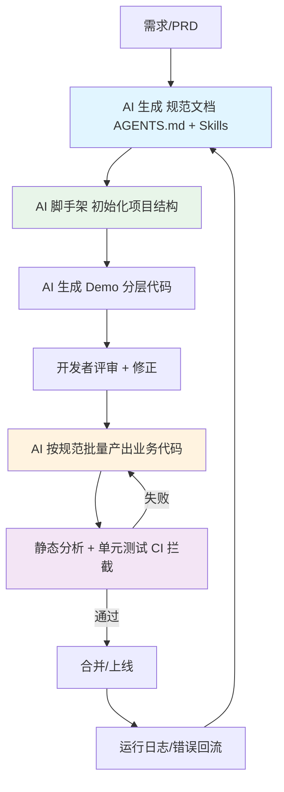
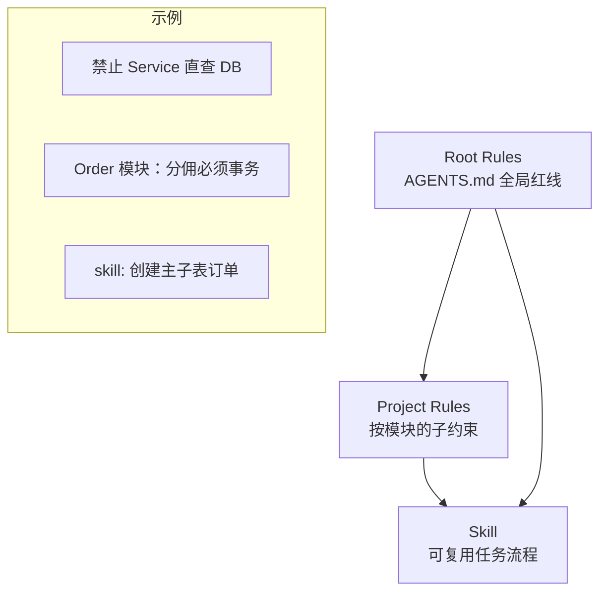
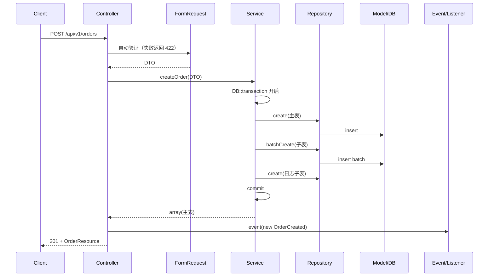
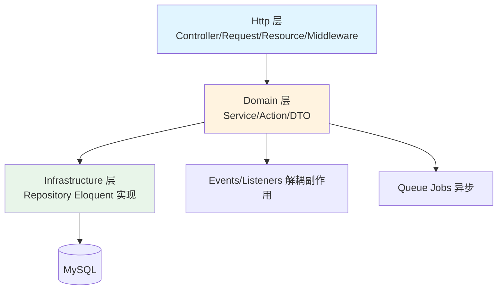
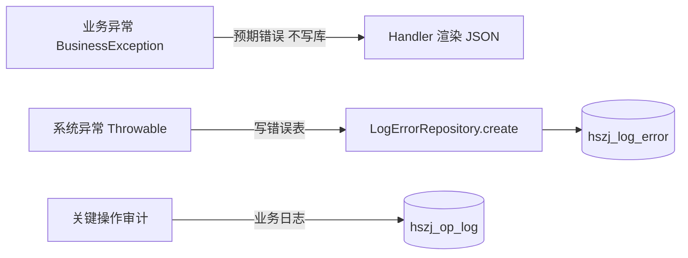
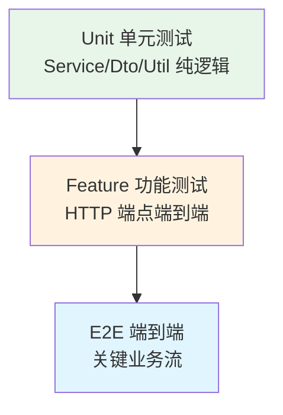
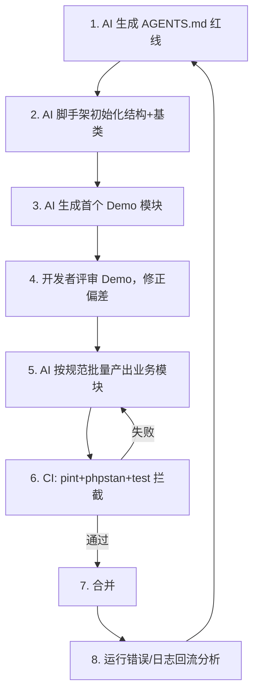

# Laravel 后端服务从 0 到 1 开发最佳实践指南（AI-Native 版）

> 适用对象：以 Laravel 作为后端 API 服务的团队 / 个人开发者
> 版本基准：Laravel 12.x / PHP 8.2+（兼容 11.x）
> 核心理念：**全面拥抱 AI**——用 AI 完成项目初始化、规范制定、提示词规则、Demo 生成、通用代码抽象、调用链路设计与代码组织
> 数据访问层：**统一采用 Repository 模式**（接口 + Eloquent 实现，返回 array）
> 依据来源：Laravel 官方文档与发布说明（分层、Form Request、API Resource、异常渲染、Sanctum 等最佳实践）+ 国内大厂（字节 / 阿里等）PHP/Laravel 实际落地规范（强制分层、统一响应、静态分析 CI、强类型 DTO、Repository 接口契约）
> 编写原则：本指南不绑定任何特定存量项目的实现细节，仅吸收通用优点、规避通用反模式
> 编写日期：2026-08-27

---

## 0. 理念：AI-Native 开发闭环



**关键认知**：AI 不是「代码补全工具」，而是「规范执行引擎」。你给它**清晰的边界、基类、约束**，它就能稳定产出可维护代码；你给模糊指令，它就复刻你已有的混乱。本文档的每一节都是「给 AI 的约束」。

---

## 1. 项目初始化（AI 辅助脚手架）

### 1.1 标准初始化命令

```bash
# 1. 创建项目（Docker 开发环境推荐 Sail）
composer create-project laravel/laravel:^12 hshome-api
cd hshome-api

# 2. 开发环境容器化（AI 可生成 docker-compose.yml）
# 包含：php:8.2-fpm、mysql:8.4、redis:7、mailpit
docker compose up -d

# 3. 质量工具链（必须）
composer require --dev laravel/pint phpstan/phpstan:^2 \
    phpstan/extension-installer pestphp/pest --with-all-dependencies
# 或 phpunit（二选一，Pest 兼容 PHPUnit）

# 4. API 鉴权
composer require laravel/sanctum
php artisan vendor:publish --provider="Laravel\Sanctum\SanctumServiceProvider"
```

### 1.2 让 AI 生成脚手架的提示词模板

```text
你是一名资深 Laravel 架构师。请为「电商订单系统」初始化项目结构，要求：
1. 采用 DDD 模块化目录（见第 7 节），不要默认的 app/Http/Controllers 平铺
2. 生成 BaseController / BaseService / BaseRepository / BaseModel / BaseRequest / BaseResource 六个基类（见第 8 节）
3. 配置统一的 API 响应格式（success/error/paginate）
4. 配置 bootstrap/app.php 的 withExceptions 统一错误信封
5. 生成 phpstan.neon（level 6）、pint.json、CI workflow
6. 数据访问层统一用 Repository 模式（接口 + Eloquent 实现，返回 array）
7. 输出每个文件的完整代码，不要省略
```

### 1.3 必须立即配置的 4 个文件

| 文件 | 作用 |
|------|------|
| `AGENTS.md` / `CLAUDE.md` | 给 AI 的「红线规则」（见第 2 节） |
| `phpstan.neon` | 静态分析，拦截类型错误与分层违规 |
| `pint.json` | 代码风格统一（PSR-12） |
| `.github/workflows/ci.yml` | 每次 PR 跑 pint + phpstan + test |

---

## 2. 开发规范制定（给 AI 的红线文档）

把以下规范写入项目根 `AGENTS.md`（AI 编码时会严格遵守）：

```markdown
# 开发约束（AI 必须遵循）

## 红线（违反即为错误）
1. 数据访问只能在 Repository：Service/Controller 禁止 Model::where/DB::table/DB::select
2. Repository 只做数据读写，不做业务组装；业务组装放 Service
3. 禁止写死表名：多表关联用 $this->model->getTable() 拼接
4. Repository 方法返回 array（非对象/Collection）
5. 禁止 Log:: 门面：错误用 LogErrorRepository 写错误表
6. 异常向上抛：业务错误用 error() 抛 BusinessException；catch 块不吞异常

## 分层职责
- Controller：收参、调 Service、返回 Resource，禁止业务逻辑
- Service：业务逻辑、事务编排、调 Repository，禁止直接查库
- Repository：数据读写，返回 array
- Model：表结构、关联定义，不含业务

## 命名
- 类：XxxController / XxxService / XxxRepository / XxxResource
- 方法：动词+名词（createOrder / listByUser）
- 枚举：XxxStatus / XxxType，带 label()
```

> **教训来源**：许多存量项目虽有 AGENTS.md 但代码未落地，根因是**没有 CI 静态拦截**。规范必须配合 phpstan 规则与评审才能生效。

---

## 3. 提示词规则（Prompt Rules for AI Coding）

### 3.1 三层提示词体系



### 3.2 编写 Skill 的模板（放 `.agents/skills/` 或 `.dsh/skills/`）

```yaml
---
name: create-master-detail
description: 创建主表-子表联动的写操作（如订单+订单项），含事务与返回结构
---
# 步骤
1. 在 Service 方法内用 DB::transaction 包裹
2. 先写主表（repository->create），拿到主表 ID/SN
3. 再批量写子表（repository->batchCreate）
4. 写操作日志子表
5. 返回主表 array（非对象）
# 约束
- 禁止在 Service 直接 Model::create
- 子表批量用 insert([...]) 而非循环 create
- 事务失败必须 throw，禁止 catch 后静默返回
```

### 3.3 给 AI 的「防幻觉」指令

```text
- 涉及数据库字段时，必须先 DESCRIBE 表确认真实字段名，禁止凭推测写字段
- 新增方法前先检查是否存在可复用方法，存在则复用
- 每次修改后必须 php -l 语法检查 + 核心方法 tinker 自测
- 禁止写死表名、禁止 Log:: 门面、禁止根目录临时文件
- 数据访问必须走 Repository，禁止 Service 内 Model::where
```

---

## 4. Demo 代码（标准分层示例）

以「创建订单」为例，展示 AI 应按此结构产出：

**Controller（薄层）**
```php
final class OrderController extends BaseController
{
    public function __construct(private OrderService $orderService) {}

    public function store(StoreOrderRequest $request): JsonResponse
    {
        $order = $this->orderService->createOrder($request->toDto());
        return ApiResponse::success(new OrderResource($order), 201);
    }
}
```

**Request（验证 + DTO 转换）**
```php
final class StoreOrderRequest extends BaseRequest
{
    public function rules(): array
    {
        return [
            'items' => ['required', 'array', 'min:1'],
            'items.*.sku' => ['required', 'string'],
            'items.*.qty' => ['required', 'integer', 'min:1'],
        ];
    }

    public function toDto(): CreateOrderData
    {
        return new CreateOrderData(
            userId: (int) $this->user()->id,
            items: $this->validated('items'),
        );
    }
}
```

**DTO（强类型，跨层传递）**
```php
final readonly class CreateOrderData
{
    public function __construct(
        public int $userId,
        public array $items,
    ) {}
}
```

**Service（业务 + 事务）**
```php
final class OrderService extends BaseService
{
    public function __construct(
        private OrderRepository $orderRepository,
        private OrderItemRepository $orderItemRepository,
        private OrderLogRepository $orderLogRepository,
    ) {}

    public function createOrder(CreateOrderData $data): array
    {
        return $this->transaction(function () use ($data): array {
            $orderSn = generateNo('ORD');
            $order = $this->orderRepository->create([
                'order_sn' => $orderSn,
                'user_id' => $data->userId,
                'status' => OrderStatus::PENDING->value,
            ]);
            $this->orderItemRepository->batchCreate($orderSn, $data->items);
            $this->orderLogRepository->create(['order_sn' => $orderSn, 'action' => 'create']);
            return $order; // array
        });
    }
}
```

**Repository（纯数据访问，返回 array）**
```php
final class OrderRepository extends BaseRepository
{
    protected function getModel(): Model
    {
        return new Order();
    }

    public function batchCreate(string $orderSn, array $items): void
    {
        $rows = array_map(fn ($it) => [
            'order_sn' => $orderSn,
            'sku' => $it['sku'],
            'qty' => $it['qty'],
        ], $items);
        OrderItem::insert($rows); // 批量，非循环 create
    }
}
```

---

## 5. 通用函数处理

### 5.1 分层原则

| 类型 | 位置 | 示例 |
|------|------|------|
| 全局辅助（无状态） | `app/helpers.php`（function_exists 守卫） | `success/error/snowflakeId/centToYuan/bcAddMany` |
| 业务辅助类 | `app/Helpers/` | `OrderHelper`、`DatetimeHelper` |
| 第三方封装 | `app/Util/` | `WechatPayUtil`、`FileUtil` |
| 跨层通用 | `app/Support/Traits/` | `SerializeDate`、`PaginationTrait` |

### 5.2 禁止事项

- ❌ 全局函数越层查库：`getUserInfo()` 直接 `User::where` + 依赖 `request()`（不可测试）
- ❌ Helper 内用 `Log::`（应走 LogErrorRepository）
- ✅ 全局函数只做纯计算/格式转换（金额、编号、时间），不碰 DB 与 Request

### 5.3 推荐通用函数清单

```php
// 金额：分转元、元转分、高精度加减
centToYuan(int $cent): string
yuanToCent(string $yuan): int
bcAddMany(array $nums, int $scale = 2): string

// 编号：雪花ID、业务单号（Redis 自增+打乱）
snowflakeId(): int
generateNo(string $prefix): string

// 响应（全局统一）
success($data = null, int $code = 0): JsonResponse
error(string $msg, int $code = 400, $data = []): void  // throw BusinessException

// 上下文
getRequestId(): string   // 从 request->attributes 取，无则生成
getClientIp(): string
```

---

## 6. 代码调用链路



**约束**：
- Controller 不碰 DB、不写事务
- Service 持有事务边界，调 Repository 拿 array
- 跨模块副作用走 Event/Listener（解耦）

---

## 7. 代码组织方式（DDD 模块化）

### 7.1 推荐目录（业务域优先）

```text
app/
├── Console/                # 命令（Cron/Job/Test 分目录）
├── Exceptions/             # BusinessException 等
├── Http/
│   ├── Middleware/         # 认证、RequestId、限流
│   └── Resources/          # API Resource（输出转换）
├── Domain/                 # ★ 业务域
│   ├── Order/
│   │   ├── Actions/        # 单一用例（可选，复杂业务用）
│   │   ├── DataTransferObjects/
│   │   ├── Models/
│   │   ├── Repositories/   # ★ Repository 接口
│   │   └── Services/
│   ├── User/
│   └── Commission/
├── Infrastructure/         # Eloquent 实现、第三方封装
│   ├── Repositories/       # ★ Repository 接口的实现
│   └── Services/
├── Support/               # 共享 helpers、traits、value objects
└── Providers/
```

### 7.2 模块边界图



### 7.3 何时用模块 vs 平铺

| 场景 | 选择 |
|------|------|
| 单人小项目 / MVP | 平铺 `app/Http/Controllers` + `app/Services` |
| 多业务域 / 团队 | DDD 模块化（上图） |
| 超大型 / 需独立部署 | `nwidart/laravel-modules` 物理隔离模块 |

### 7.4 数据访问层：统一采用 Repository 模式

**核心结论**：本指南统一采用 **Repository 模式** 作为数据访问层。依据：
- Laravel 官方虽不强制 Repository（Taylor Otwell 认为 Eloquent 本身即 Repository 实现，额外接口对小项目属过度抽象），但官方也不反对；对于需要分层、可测试、可维护的中大型 API 服务，Repository 是业界（含国内大厂）验证过的稳妥选择。
- Repository 通过「接口 + Eloquent 实现」提供契约，Service 依赖接口而非具体类，便于 mock 测试与多数据源切换。
- 相比轻量数据访问类（Dao 风格具体类），Repository 的接口边界更清晰，静态分析与代码评审更易约束「Service 不得直查 DB」。

**与轻量数据访问类（Dao 风格）的差异**（帮助理解选型）：

| 维度 | 轻量 Dao（具体类） | Repository（接口+实现） |
|------|---------------------|---------------------|
| 抽象层级 | 贴近表/模型 | 贴近业务领域集合 |
| 接口契约 | 无接口，直接具体类 | Interface + Eloquent 实现，容器绑定 |
| 测试友好度 | 中（mock 具体类/DB） | 高（mock 接口，零 DB） |
| 过度设计风险 | 低 | 中（三件套，中大型项目值得） |
| 国内落地 | 常见 | 常见（大厂偏好接口契约） |

**统一规范**：
- 每个聚合/领域一个 Repository Interface（放 `Domain/{Module}/Repositories/`），Eloquent 实现放 `Infrastructure/Repositories/`。
- Repository 方法返回 **array**（非 Eloquent 对象/Collection），杜绝上层依赖模型细节。
- Service 只依赖 Repository 接口，禁止 `Model::where / DB::table`。
- 禁止在 Service 内直接 new Model 或写 SQL——所有数据读写经 Repository。
- **选型不再分档**：无论项目大小，统一用 Repository（小型项目也可用轻量 Repository，不必退回散落查询）。关键是「Service 永远不直接碰 DB」。

---

## 8. 基类文件及通用方法

### 8.1 六个基类职责

| 基类 | 通用方法 | 约束 |
|------|---------|------|
| `BaseController` | `success/error/paginate` 响应封装 | 不含业务逻辑 |
| `BaseService` | `transaction(Closure)` 事务包裹、`paginate()` 分页 | 禁止直查 DB |
| `BaseRepository` | `infoById/infoByIdAndLock/infoOrThrowException/updateInfo/updateStatus/list` | 返回 array |
| `BaseModel` | `SoftDeletes`、`$timestamps`、`dateFormat`、`getTable()` | 不含业务 |
| `BaseRequest` | 统一 `failedValidation` 返回 JSON 422 | 只做验证 |
| `BaseResource` | `toArray()` 字段白名单 | 禁止泄露敏感字段 |

### 8.2 BaseRepository 通用实现（返回 array）

```php
abstract class BaseRepository
{
    abstract protected function getModel(): Model;

    public function infoById(int $id, array $fields = ['*']): ?array
    {
        $row = $this->getModel()->newQuery()->find($id, $fields);
        return $row?->toArray();
    }

    public function infoOrThrowException(int $id, array $fields = ['*']): array
    {
        $row = $this->infoById($id, $fields);
        if ($row === null) {
            error('数据不存在', Code::NOT_FOUND->value);
        }
        return $row;
    }

    public function infoByIdAndLock(int $id, array $fields = ['*']): ?array
    {
        $row = $this->getModel()->newQuery()->lockForUpdate()->find($id, $fields);
        return $row?->toArray();
    }

    public function updateInfo(int $id, array $data): int
    {
        return $this->getModel()->newQuery()->whereKey($id)->update($data);
    }

    public function list(array $where, array $fields = ['*']): array
    {
        return $this->getModel()->newQuery()->where($where)->get($fields)->toArray();
    }
}
```

### 8.3 BaseService 事务封装

```php
abstract class BaseService
{
    protected function transaction(Closure $callback): mixed
    {
        return DB::transaction($callback);
    }

    protected function paginate(Builder $query, int $perPage = 20): array
    {
        $page = $query->paginate($perPage);
        return [
            'list' => $page->items(),
            'total' => $page->total(),
            'page' => $page->currentPage(),
            'per_page' => $page->perPage(),
        ];
    }
}
```

---

## 9. 日志处理

### 9.1 双轨制（推荐）



### 9.2 规范实现

```php
// 错误表写入（替代 Log::）
final class LogErrorRepository extends BaseRepository
{
    protected function getModel(): Model { return new LogError(); }

    public function create(array $data): void
    {
        $data['request_id'] = getRequestId();
        $data['message'] = mb_substr($data['message'] ?? '', 0, 255);
        $data['file'] = mb_substr($data['file'] ?? '', 0, 255);
        $data['trace'] = mb_substr($data['trace'] ?? '', 0, 65535); // 必须截断
        LogError::insert($data);
    }
}

// Handler（bootstrap/app.php 或 Handler.php）
$exceptions->render(function (Throwable $e, Request $request) {
    if ($e instanceof BusinessException) {
        return ApiResponse::error($e->getMessage(), $e->getCode(), $e->getData());
    }
    // 系统异常：写错误表（复用 Repository，不写死表名）
    app(LogErrorRepository::class)->create([
        'message' => $e->getMessage(),
        'file' => $e->getFile(),
        'line' => $e->getLine(),
        'trace' => $e->getTraceAsString(),
    ]);
    return ApiResponse::error('系统错误', 500);
});
```

### 9.3 禁止事项

- ❌ `Log::info/error/warning`（违反红线，且无法集中检索）
- ❌ `DB::table('hszj_log_error')->insert(...)`（写死表名 + 不截断 trace）
- ✅ 错误表必须有 migration 文件纳入版本控制

---

## 10. 主表-子表通用代码抽象（重点）

### 10.1 痛点

订单/分佣/支付等主子表场景重复出现：主表写入 → 子表批量 → 日志 → 事务。若每个 Service 手写，易遗漏事务或写错顺序。

### 10.2 通用抽象：MasterDetailCreator（放 Repository 基类的 Trait）

```php
// 通用主子表写入 Trait（放 Infrastructure/Repositories 或 Support/Traits）
trait MasterDetailCreator
{
    /**
     * 主子表联动写入（事务保证原子性）
     * @param array $master 主表数据
     * @param array $details 子表数据（二维）
     * @param string $fk 子表关联主表的键名（如 order_sn）
     * @param class-string<Model> $detailModel 子表模型
     * @param array|null $log 操作日志（可选）
     */
    protected function createWithDetails(
        array $master,
        array $details,
        string $fk,
        string $detailModel,
        ?array $log = null
    ): array {
        return DB::transaction(function () use ($master, $details, $fk, $detailModel, $log): array {
            $masterRow = $this->getModel()->newQuery()->create($master);
            $masterKey = $masterRow->{$masterRow->getKeyName()};
            $fkValue = $master[$fk] ?? $masterKey;

            if (!empty($details)) {
                $rows = array_map(fn ($d) => array_merge($d, [$fk => $fkValue]), $details);
                (new $detailModel)->newQuery()->insert($rows); // 批量
            }
            if ($log !== null) {
                $this->logRepository->create(array_merge($log, [$fk => $fkValue]));
            }
            return $masterRow->toArray();
        });
    }
}
```

### 10.3 使用示例（OrderRepository 复用）

```php
final class OrderRepository extends BaseRepository
{
    use MasterDetailCreator;

    protected function getModel(): Model { return new Order(); }

    public function createOrder(array $master, array $items, ?array $log = null): array
    {
        return $this->createWithDetails($master, $items, 'order_sn', OrderItem::class, $log);
    }
}
```

### 10.4 主子表查询抽象

```php
// BaseRepository 扩展：主表 + 子表一并取出
public function infoWithDetails(
    int $id,
    string $detailModel,
    string $fk,
    array $masterFields = ['*'],
    array $detailFields = ['*']
): ?array {
    $master = $this->infoById($id, $masterFields);
    if ($master === null) return null;
    $fkValue = $master[$fk] ?? $master['id'];
    $details = (new $detailModel)->newQuery()->where($fk, $fkValue)->get($detailFields)->toArray();
    $master['details'] = $details;
    return $master;
}
```

### 10.5 事务边界铁律

| 规则 | 说明 |
|------|------|
| 事务只在 Service 层 | Repository 不持有事务（避免层次混乱） |
| 主子表必须同一事务 | 中途失败整体回滚，禁止部分写入 |
| catch 必须 throw | 禁止「只记日志不抛出」（分佣失败被吞是真实事故） |
| 批量用 insert | 禁止循环 create（N+1 写） |

---

## 11. 常见设计模式约束

| 模式 | 适用场景 | 约束 |
|------|---------|------|
| **Repository** | 数据访问抽象 | 接口在 Domain，Eloquent 实现在 Infrastructure；Service 依赖接口；返回 array |
| **DTO** | 跨层数据传递 | `readonly` 不可变；`fromRequest()` 单一转换点 |
| **Action** | 单一复杂用例 | 一个 public 方法，无 HTTP 依赖，可复用（Controller/Job/Command 同调） |
| **Factory** | 支付/通知策略 | `PaymentFactory::make($channel)` 返回策略对象 |
| **State Machine** | 订单/状态流转 | `OrderStateMachine` 集中状态迁移，禁止散落 if |
| **Event/Listener** | 跨模块副作用 | 支付成功后发事件，分佣/通知异步解耦 |
| **Middleware** | 横切关注点 | Token 校验、RequestId、限流 |
| **Policy** | 授权 | 模型级权限，禁止 Controller 内 `if ($user->role!='admin')` |

### 反模式（禁止）

```text
❌ Service 内 Model::where / DB::table        → 破坏分层
❌ Controller 内写业务逻辑                    → 不可测试
❌ 返回原始 Eloquent 模型给前端               → 敏感字段泄露 + 契约脆弱
❌ 全局 Helper 查库                          → 不可测试
❌ catch 后静默返回                          → 故障被掩盖
❌ 硬编码表名 / 魔法字符串                   → 用 getTable() / 枚举
```

---

## 12. 测试与 CI

### 12.1 测试金字塔



### 12.2 必须有的测试

```php
// Feature：订单创建（验证事务 + 主子表 + 响应结构）
test('user can create order with items', function () {
    $user = User::factory()->create();
    $response = $this->actingAs($user)->postJson('/api/v1/orders', [
        'items' => [['sku' => 'A', 'qty' => 2]],
    ]);
    $response->assertCreated()
        ->assertJsonStructure(['data' => ['order_sn', 'status']]);
    assertDatabaseHas('orders', ['user_id' => $user->id]);
    assertDatabaseCount('order_items', 1);
});

// Unit：分佣计算（纯逻辑，mock Repository 接口）
test('commission ratio computes correctly', function () {
    $repo = Mockery::mock(OrderRepositoryInterface::class);
    $service = new CommissionService($repo);
    expect($service->calc(10000, 20))->toBe(2000.0);
});
```

### 12.3 CI 工作流（`.github/workflows/ci.yml`）

```yaml
steps:
  - run: composer install
  - run: ./vendor/bin/pint --test
  - run: ./vendor/bin/phpstan analyse
  - run: ./vendor/bin/pest
```

### 12.4 防 N+1（开发期拦截）

```php
// AppServiceProvider::boot()
Model::preventLazyLoading(! $this->app->isProduction());
```

---

## 13. AI 辅助开发工作流（闭环落地）



### 13.1 给 AI 的「每次任务」标准提示词

```text
执行任务前先检查是否有匹配 Skill；遵循 AGENTS.md 红线：
- 数据访问只在 Repository，返回 array
- 禁止写死表名、禁止 Log::、禁止根目录临时文件
- 涉及字段先 DESCRIBE 确认
- 修改后 php -l + tinker 自测
输出：git diff 风格变更预览，等我确认再执行
```

### 13.2 质量闸门（必须）

| 闸门 | 工具 | 拦截内容 |
|------|------|---------|
| 风格 | Pint | 格式不一致 |
| 类型/分层 | PHPStan level 6+ | 类型错误、Service 直查 DB（自定义规则） |
| 契约 | Pest Feature | 响应结构、主子表一致性 |
| 评审 | PR + 人工 | 业务逻辑正确性 |

---

## 14. 常见反模式速查（基于官方 + 大厂规范）

以下为业界 Laravel 项目高频反模式，新项目应在规范与 CI 中直接拦截（不依赖任何特定存量项目，仅归纳通用教训）：

| 反模式 | 后果 | 正确做法 |
|--------|------|---------|
| Service / Controller 直接 `Model::where / DB::table` | 分层崩塌、无法 mock、SQL 散落 | 数据访问收口到 Repository |
| 返回原始 Eloquent 模型给前端 | 敏感字段泄露、契约随表结构漂移 | 用 API Resource 白名单转换 |
| Controller 内写业务逻辑 | 不可测试、重复代码 | 业务逻辑下沉 Service / Action |
| `catch` 后静默返回不抛出 | 故障被掩盖、数据不一致 | catch 后必须 throw 或显式记录 |
| 硬编码表名 / 魔法字符串 | 多库 / 改名大面积失效 | 用 `getTable()` / 枚举常量 |
| 全局 Helper 内查库 | 不可测试、破坏分层 | Helper 只做纯计算 / 格式 |
| 巨型类（2000+ 行） | 回归风险高、难 review | Action / 模块拆分 |
| 测试为 0，靠手工 tinker | 无回归保障 | CI 强制 Feature + Unit |
| 规范文档与代码脱节 | 红线形同虚设 | 规范 + phpstan 自定义规则 + 评审 三保险 |
| 事务边界混乱（Service / Repository 各写各的） | 部分写入、数据不一致 | 事务只在 Service 层，主子表同事务 |
| 数据访问层不统一（Service 直查 Model 与 Repository 并存） | 认知分裂、职责重叠 | 统一 Repository，Service 禁直查 DB |

---

> **总结**：Laravel 后端的最佳实践，本质是「**用结构约束行为，用 AI 放大结构**」。先把 AGENTS.md 红线、六个基类、主子表抽象、统一日志/异常这些「骨架」用 AI 一次性立稳，再让 AI 在骨架上填肉——产出的代码自然分层清晰、可测试、易维护。没有骨架的 AI 编码，只会把今天的混乱复制成明天的债务。
