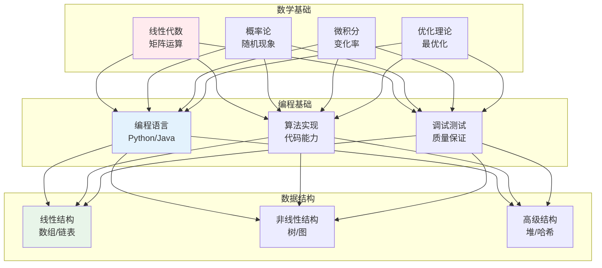
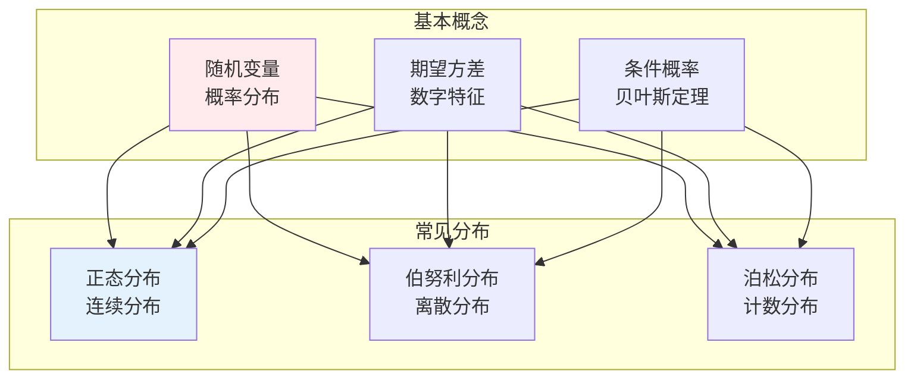
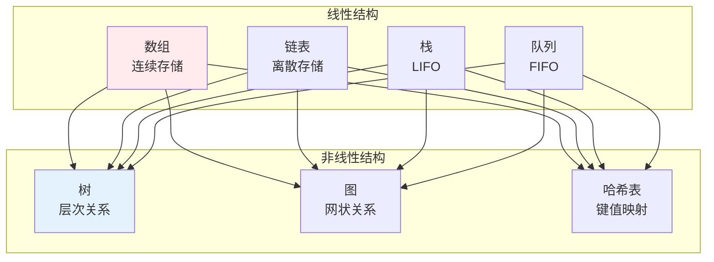

# 基础知识

> **核心观点**：扎实的基础知识是学习AI-IT的前提，包括数学、编程、数据结构等核心内容。

---

## 📊 基础知识体系



---

## 📐 数学基础

### 线性代数

| 概念 | 内涵 | 应用 |
|------|------|------|
| 向量 | 一维数组 | 特征表示 |
| 矩阵 | 二维数组 | 数据存储 |
| 矩阵乘法 | 线性变换 | 神经网络 |
| 特征值分解 | 矩阵分析 | 降维 |
| 奇异值分解 | 矩阵分解 | 推荐系统 |

### 概率论



### 微积分

| 概念 | 内涵 | 应用 |
|------|------|------|
| 导数 | 变化率 | 梯度下降 |
| 偏导数 | 多元函数导数 | 多参数优化 |
| 链式法则 | 复合函数求导 | 反向传播 |
| 积分 | 累积求和 | 概率密度 |

### 优化理论

```
优化问题三要素：
1. 决策变量：需要确定的参数
2. 目标函数：需要最小化/最大化
3. 约束条件：限制条件
```

---

## 💻 编程基础

### Python编程

| 特点 | 优势 | 应用 |
|------|------|------|
| 语法简洁 | 易学易用 | 快速开发 |
| 丰富库 | 生态完善 | AI/数据分析 |
| 社区活跃 | 资源丰富 | 问题解决 |

### 数据结构



### 算法

| 类型 | 例子 | 复杂度 |
|------|------|--------|
| 排序算法 | 快速排序、归并排序 | O(n log n) |
| 搜索算法 | 二分查找、深度优先 | O(log n) |
| 图算法 | Dijkstra、A* | O(V²) |
| 动态规划 | 背包问题、最短路径 | 依问题而定 |

---

## 🎯 核心结论

### 基础知识的重要性

1. **数学是工具**：提供形式化描述
2. **编程是手段**：实现算法想法
3. **数据结构是基础**：组织数据方式
4. **算法是灵魂**：解决问题方法
5. **实践是关键**：理论结合实践

### 学习路径

```
基础知识学习四步骤：
1. 数学基础：线代、概率、微积分
2. 编程语言：Python/Java
3. 数据结构：数组、链表、树
4. 算法设计：排序、搜索、动态规划
```

---

## 📚 参考文献

1. 《线性代数》- 同济大学
2. 《概率论与数理统计》- 浙江大学
3. 《高等数学》- 同济大学
4. 《Python编程：从入门到实践》
5. 《算法导论》- Thomas Cormen
6. 《数据结构》- 严蔚敏
7. 《深入理解计算机系统》
8. 《计算机程序的构造和解释》