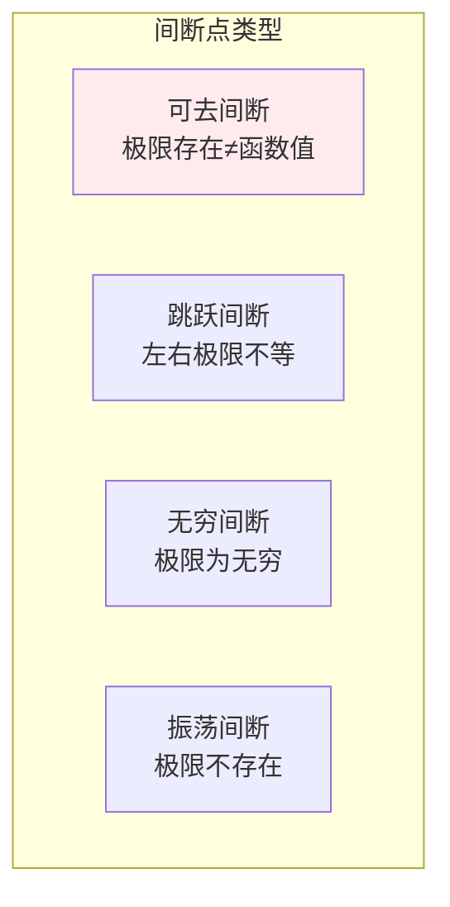

# 极限与连续

> **核心观点**：极限是微积分的基础，连续性是微分和积分的前提条件。

---

## 📊 极限基本概念

### 极限定义

| 类型 | 定义 | 记法 |
|------|------|------|
| 数列极限 | \|aₙ - A\| → 0 | lim(n→∞) aₙ = A |
| 函数极限 | \|f(x) - L\| → 0 | lim(x→x₀) f(x) = L |
| 单侧极限 | x→x₀⁺ 或 x→x₀⁻ | 右极限/左极限 |

### 极限性质

```mermaid
graph TB
    subgraph 极限运算法则
        A1[和差法则<br/>lim[f±g] = limf ± limg]
        A2[积商法则<br/>lim[f·g] = limf · limg]
        A3[复合函数<br/>lim f(g(x)) = f(limg(x))]
    end    
    A1 & A2 & A3
    
    style A1 fill:#ffebee
```

---

## 📈 连续性

### 连续定义

| 概念 | 定义 | 意义 |
|------|------|------|
| 连续 | lim(x→x₀)f(x) = f(x₀) | 无跳跃、无断点 |
| 一致连续 | δ与x₀无关 | 全局连续 |
| 间断点 | 不连续的点 | 跳跃、可去、无穷 |

### 间断点分类



---

## 🔢 无穷小与无穷大

### 无穷小

| 概念 | 定义 | 性质 |
|------|------|------|
| 无穷小 | limα(x) = 0 | 极限为0 |
| 高阶无穷小 | limβ/α = 0 | β比α更快趋于0 |
| 同阶无穷小 | limβ/α = C | 同速趋于0 |

### 等价无穷小

| 等价关系 | 条件 |
|----------|------|
| sinx ~ x | x→0 |
| tanx ~ x | x→0 |
| 1-cosx ~ x²/2 | x→0 |
| ln(1+x) ~ x | x→0 |
| eˣ-1 ~ x | x→0 |

---

## 🎯 重要极限

### 两个重要极限

| 极限 | 公式 | 意义 |
|------|------|------|
| sinx/x | lim(x→0) sinx/x = 1 | 三角函数极限 |
| (1+1/x)ˣ | lim(x→∞)(1+1/x)ˣ = e | 自然常数e |

---

## 🤖 机器学习应用

### 连续性假设

| 应用 | 内容 | 意义 |
|------|------|------|
| 损失函数 | 连续可导 | 可微优化 |
| 激活函数 | 连续 | 梯度存在 |
| 模型假设 | 连续映射 | 泛化能力 |

---

## 🎯 核心结论

### 极限与连续核心概念

1. **极限**：函数趋近的值
2. **连续**：无跳跃、无断点
3. **可微**：连续+光滑
4. **可积**：连续或有限间断
5. **应用**：微分和积分的基础

### 学习路径

```
极限与连续学习四步骤：
1. 极限定义：ε-δ语言
2. 极限运算：法则和性质
3. 连续性：定义和分类
4. 应用：微分和积分的基础
```

---

## 📚 参考文献

1. 《高等数学》- 同济大学
2. 《微积分》- James Stewart
3. 《普林斯顿微积分读本》
4. 《数学分析》- 陈纪修
5. 《Calculus Made Easy》- Silvanus Thompson
6. 《微积分教程》
7. 《极限与连续》
8. 《数学分析新讲》- 张筑生