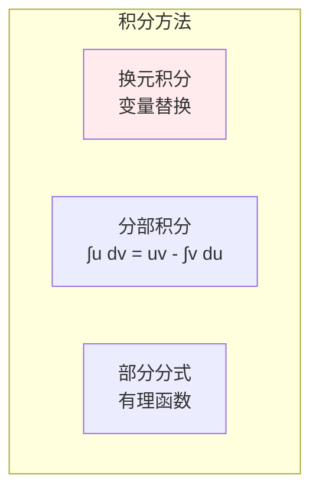
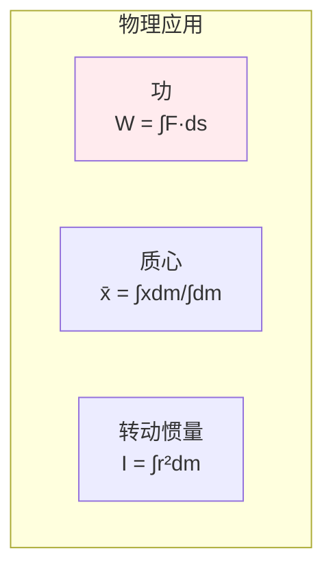

# 积分学

> **核心观点**：积分是微分的逆运算，是计算面积、体积和累积量的工具。

---

## 📊 积分基本概念

### 不定积分

| 概念 | 定义 | 意义 |
|------|------|------|
| 不定积分 | ∫f(x)dx = F(x) + C | 原函数族 |
| 被积函数 | f(x) | 要积分的函数 |
| 积分变量 | dx | 积分变量 |
| 积分常数 | C | 任意常数 |

### 定积分

```mermaid
graph TB
    subgraph 定积分
        A1[黎曼和<br/>∑f(xᵢ)Δxᵢ]
        A2[极限过程<br/>n→∞]
        A3[积分值<br/>面积/体积]
        A4[牛顿-莱布尼茨<br/>∫ₐᵇf(x)dx = F(b)-F(a)]
    end    
    A1 --> A2 --> A3 --> A4
    
    style A1 fill:#ffebee
```

---

## 🔢 积分公式

### 基本积分公式

| 函数 | 积分 | 说明 |
|------|------|------|
| xⁿ | xⁿ⁺¹/(n+1) + C | 幂函数 |
| 1/x | ln\|x\| + C | 对数函数 |
| eˣ | eˣ + C | 指数函数 |
| sinx | -cosx + C | 三角函数 |
| cosx | sinx + C | 三角函数 |

### 积分方法



---

## 📈 微积分基本定理

### 牛顿-莱布尼茨公式

| 定理 | 公式 | 意义 |
|------|------|------|
| 牛顿-莱布尼茨 | ∫ₐᵇf(x)dx = F(b) - F(a) | 微分与积分互逆 |
| 变上限积分 | d/dx∫ₐˣf(t)dt = f(x) | 原函数存在 |

### 定积分性质

```
定积分性质：
1. 线性性：∫(af+bg) = a∫f + b∫g
2. 区间可加：∫ₐᵇ = ∫ₐᶜ + ∫ᶜᵇ
3. 保号性：f≥0 → ∫f ≥ 0
4. 中值定理：∫ₐᵇf = f(ξ)(b-a)
```

---

## 🎯 应用

### 几何应用

| 应用 | 公式 | 说明 |
|------|------|------|
| 曲线长度 | L = ∫√(1+(y')²)dx | 弧长公式 |
| 旋转体积 | V = π∫y²dx | 绕x轴旋转 |
| 面积 | A = ∫|f(x)-g(x)|dx | 两曲线间面积 |

### 物理应用



---

## 🤖 机器学习应用

### 期望与方差

| 概念 | 公式 | 应用 |
|------|------|------|
| 期望 | E[X] = ∫xf(x)dx | 期望计算 |
| 方差 | Var(X) = ∫(x-μ)²f(x)dx | 方差计算 |
| 概率 | P(a<X<b) = ∫ₐᵇf(x)dx | 概率计算 |

---

## 🎯 核心结论

### 积分学核心概念

1. **不定积分**：原函数族
2. **定积分**：面积/累积量
3. **微积分基本定理**：微分与积分互逆
4. **积分方法**：换元、分部、部分分式
5. **应用**：几何、物理、概率

### 学习路径

```
积分学学习四步骤：
1. 不定积分：基本公式、积分方法
2. 定积分：定义、性质
3. 微积分基本定理：牛顿-莱布尼茨
4. 应用：几何、物理、概率
```

---

## 📚 参考文献

1. 《高等数学》- 同济大学
2. 《微积分》- James Stewart
3. 《普林斯顿微积分读本》
4. 《数学分析》- 陈纪修
5. 《积分学》
6. 《微积分应用》
7. 《Calculus Made Easy》
8. 《数学分析新讲》- 张筑生