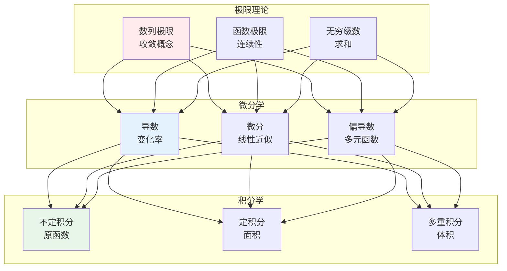
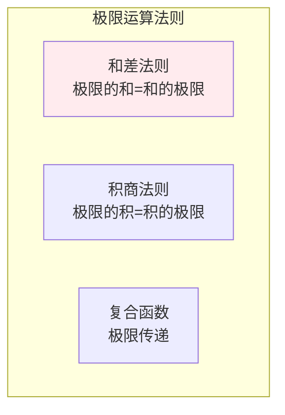

# 微积分

> **核心观点**：微积分是研究变化和累积的数学分支，是优化算法和连续建模的数学基础。

---

## 📊 微积分体系



---

## 📐 极限理论

### 极限定义

| 类型 | 定义 | 记法 |
|------|------|------|
| 数列极限 | |aₙ - A| → 0 | lim(n→∞) aₙ = A |
| 函数极限 | |f(x) - L| → 0 | lim(x→x₀) f(x) = L |

### 极限性质



### 连续性

| 概念 | 定义 | 意义 |
|------|------|------|
| 连续 | lim(x→x₀)f(x) = f(x₀) | 无跳跃 |
| 一致连续 | δ与x₀无关 | 全局连续 |
| 可去间断 | 极限存在≠函数值 | 可修补 |
| 跳跃间断 | 左右极限不等 | 不可修补 |

---

## 📈 微分学

### 导数定义

| 定义 | 公式 | 意义 |
|------|------|------|
| 极限定义 | f'(x) = lim(h→0)[f(x+h)-f(x)]/h | 瞬时变化率 |
| 几何意义 | 切线斜率 | 局部线性化 |

### 求导法则

```mermaid
graph TB
    subgraph 基本法则
        A1[常数法则<br/>(c)' = 0]
        A2[幂法则<br/>(xⁿ)' = nxⁿ⁻¹]
        A3[乘法法则<br/>(uv)' = u'v + uv']
        A4[链式法则<br/>(f(g(x)))' = f'(g(x))g'(x)]
    end    
    A1 & A2 & A3 & A4
    
    style A1 fill:#ffebee
```

### 常见函数导数

| 函数 | 导数 | 应用 |
|------|------|------|
| 常数 | 0 | 基准 |
| 幂函数 | nxⁿ⁻¹ | 多项式 |
| 指数函数 | eˣ | 增长模型 |
| 对数函数 | 1/x | 韦伯定律 |
| 三角函数 | sin/cos互换 | 周期现象 |

### 偏导数与梯度

| 概念 | 定义 | 意义 |
|------|------|------|
| 偏导数 | ∂f/∂x | 单变量变化率 |
| 梯度 | ∇f = (∂f/∂x₁,...,∂f/∂xₙ) | 最速上升方向 |
| 方向导数 | ∇f·u | 方向变化率 |

```
梯度下降原理：
θₙₑw = θ - α∇f(θ)

- α：学习率
- ∇f(θ)：梯度方向
- 负梯度：最速下降
```

---

## 📏 积分学

### 不定积分

| 公式 | 意义 |
|------|------|
| ∫f(x)dx = F(x) + C | 原函数族 |
| ∫xⁿdx = xⁿ⁺¹/(n+1) + C | 幂函数 |
| ∫eˣdx = eˣ + C | 指数函数 |
| ∫sinxdx = -cosx + C | 三角函数 |

### 定积分

```mermaid
graph TB
    subgraph 定积分定义
        A1[黎曼和<br/>∑f(xᵢ)Δxᵢ]
        A2[极限过程<br/>n→∞]
        A3[积分值<br/>面积]
    end    
    A1 --> A2 --> A3
    
    style A1 fill:#ffebee
```

### 微积分基本定理

| 定理 | 内容 | 意义 |
|------|------|------|
| 牛顿-莱布尼茨公式 | ∫ₐᵇf(x)dx = F(b)-F(a) | 微分与积分互逆 |
| 变上限积分 | d/dx∫ₐˣf(t)dt = f(x) | 原函数存在 |

---

## 🤖 机器学习应用

### 损失函数优化

```mermaid
flowchart LR
    A[损失函数<br/>L(θ)] --> B[求导<br/>∇L(θ)]
    B --> C[梯度下降<br/>更新参数]
    C --> D[收敛<br/>最优解]
    
    style A fill:#fff3e0
    style B fill:#e3f2fd
    style C fill:#e8f5e9
    style D fill:#fce4ec
```

### 反向传播

| 层次 | 运算 | 微积分应用 |
|------|------|----------|
| 前向传播 | y = f(Wx+b) | 函数复合 |
| 损失计算 | L = loss(y, ŷ) | 损失函数 |
| 反向传播 | ∂L/∂W = ∂L/∂y·∂y/∂W | 链式法则 |

### 积分应用

| 应用 | 公式 | 场景 |
|------|------|------|
| 期望 | E[X] = ∫xf(x)dx | 期望计算 |
| 方差 | Var(X) = ∫(x-μ)²f(x)dx | 方差计算 |
| 概率 | P(a<X<b) = ∫ₐᵇf(x)dx | 概率计算 |

---

## 🎯 核心结论

### 微积分核心概念

1. **极限**：连续性的基础
2. **导数**：变化率的度量
3. **积分**：累积的计算
4. **基本定理**：微分与积分互逆
5. **应用**：优化与建模

### 学习路径

```
微积分学习四步骤：
1. 极限与连续：收敛概念
2. 微分学：导数与偏导数
3. 积分学：不定积分与定积分
4. 机器学习应用：优化与反向传播
```

---

## 📚 参考文献

1. 《高等数学》- 同济大学
2. 《微积分》- James Stewart
3. 《普林斯顿微积分读本》
4. 《机器学习中的数学》- 微积分部分
5. 《深度学习》- 数学基础
6. 《Mathematics for Machine Learning》
7. 《Calculus Made Easy》- Silvanus Thompson
8. 《微积分及其应用》- 刘绍学