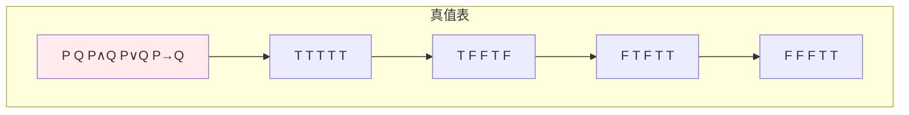
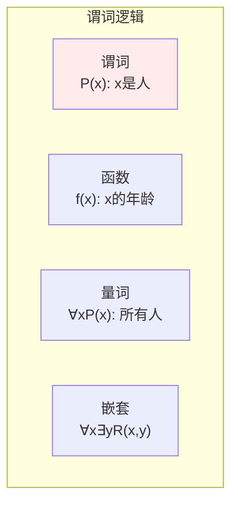
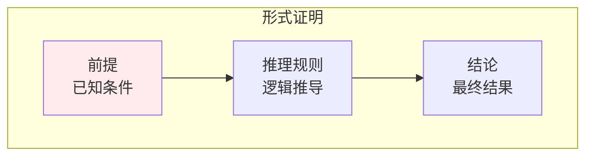
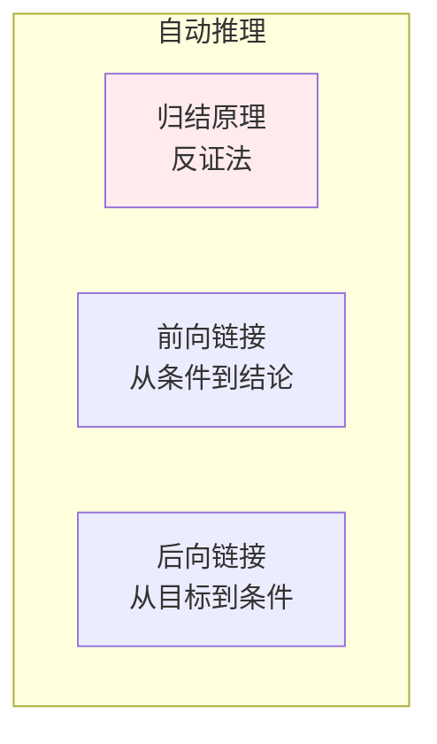

# 数理逻辑

> **核心观点**：数理逻辑是形式化推理的基础，是知识表示和自动推理的数学工具。

---

## 📊 命题逻辑

### 命题与联结词

| 联结词 | 符号 | 含义 | 真值表 |
|--------|------|------|--------|
| 否定 | ¬P | 非 | 取反 |
| 合取 | P∧Q | 与 | 同真为真 |
| 析取 | P∨Q | 或 | 同假为假 |
| 蕴含 | P→Q | 如果...那么 | P假或Q真 |
| 等价 | P↔Q | 当且仅当 | 相同为真 |

### 真值表



### 逻辑等价

| 等价式 | 内容 |
|--------|------|
| 德摩根律 | ¬(P∧Q) ≡ ¬P∨¬Q |
| 蕴含等价 | P→Q ≡ ¬P∨Q |
| 双重否定 | ¬¬P ≡ P |

---

## 📈 谓词逻辑

### 量词

| 量词 | 符号 | 含义 | 例子 |
|------|------|------|------|
| 全称量词 | ∀ | 对所有 | ∀xP(x) |
| 存在量词 | ∃ | 存在 | ∃xP(x) |

### 谓词逻辑公式



---

## 🔗 推理规则

### 基本推理规则

| 规则 | 形式 | 意义 |
|------|------|------|
| 假言推理 | P, P→Q ⊢ Q | Modus Ponens |
| 拒取式 | ¬Q, P→Q ⊢ ¬P | Modus Tollens |
| 三段论 | P→Q, Q→R ⊢ P→R | 假言三段论 |
| 合取引入 | P, Q ⊢ P∧Q | 合取 |
| 析取消去 | P∨Q, ¬P ⊢ Q | 析取三段论 |

### 形式证明



---

## 🤖 机器学习应用

### 知识表示

| 应用 | 内容 | 意义 |
|------|------|------|
| 本体 | 概念和关系 | 知识图谱 |
| 规则 | if-then规则 | 专家系统 |
| 约束 | 逻辑约束 | 逻辑编程 |

### 自动推理



---

## 🎯 核心结论

### 数理逻辑核心概念

1. **命题逻辑**：真值运算
2. **谓词逻辑**：量词约束
3. **推理规则**：有效推理
4. **形式证明**：严格推导
5. **应用**：知识表示、自动推理

### 学习路径

```
数理逻辑学习四步骤：
1. 命题逻辑：联结词、真值表
2. 谓词逻辑：量词、公式
3. 推理规则：假言推理、拒取式
4. 应用：知识表示、自动推理
```

---

## 📚 参考文献

1. 《离散数学及其应用》- Kenneth Rosen
2. 《数理逻辑》- 汪芳庭
3. 《逻辑学导论》- Irving Copi
4. 《人工智能逻辑基础》
5. 《知识表示与推理》
6. 《自动推理》
7. 《逻辑与可计算性》
8. 《离散数学》- 屈婉玲