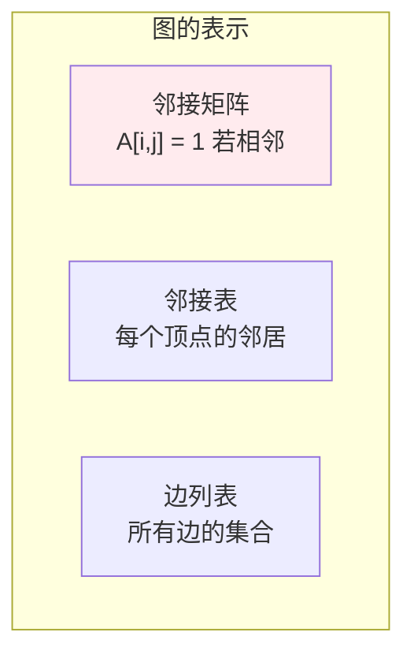
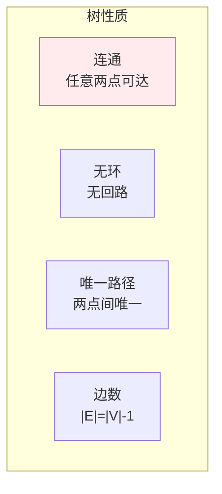
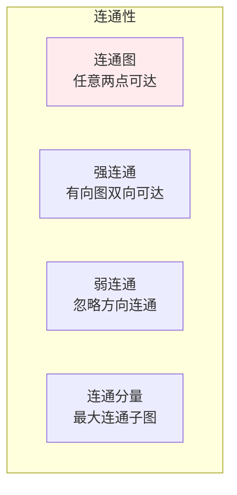
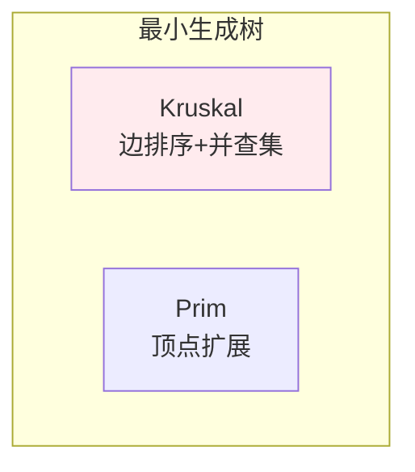
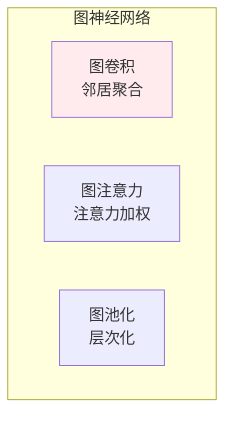

# 图论

> **核心观点**：图是描述对象间关系的数学模型，是网络分析和社交网络的理论基础。

---

## 📊 图的基本概念

### 图的定义

| 概念 | 定义 | 表示 |
|------|------|------|
| 图 | 顶点和边的集合 | G=(V,E) |
| 有向图 | 边有方向 | <u,v> |
| 无向图 | 边无方向 | {u,v} |
| 加权图 | 边有权重 | w(u,v) |

### 图的表示



---

## 📈 特殊图

### 特殊图类型

| 类型 | 定义 | 性质 |
|------|------|------|
| 完全图 | 所有顶点相连 | 边数=n(n-1)/2 |
| 二分图 | 顶点分为两组 | 可2-染色 |
| 平面图 | 可平面嵌入 | 边不相交 |
| 树 | 连通无环 | 边数=n-1 |

### 树的性质



---

## 🔢 图的性质

### 度与路径

| 概念 | 定义 | 意义 |
|------|------|------|
| 度 | 连接边数 | 节点重要性 |
| 入度 | 指向的边数 | 有向图 |
| 出度 | 发出的边数 | 有向图 |
| 路径 | 边的序列 | 连通性 |

### 连通性



---

## 🎯 图算法

### 遍历算法

| 算法 | 原理 | 应用 |
|------|------|------|
| BFS | 广度优先 | 最短路径 |
| DFS | 深度优先 | 拓扑排序 |

### 最短路径

| 算法 | 复杂度 | 特点 |
|------|--------|------|
| Dijkstra | O(V²) | 非负权 |
| Bellman-Ford | O(VE) | 负权边 |
| Floyd | O(V³) | 全源最短路径 |

### 最小生成树



---

## 🤖 机器学习应用

### 图神经网络



### 社交网络分析

| 应用 | 方法 | 意义 |
|------|------|------|
| 社区发现 | 图分割 | 群组识别 |
| 中心性分析 | 度/介数/接近中心性 | 影响力排序 |
| 链接预测 | 图特征 | 关系预测 |

---

## 🎯 核心结论

### 图论核心概念

1. **图**：对象和关系的数学模型
2. **度**：节点连接数
3. **路径**：边的序列
4. **连通性**：可达性
5. **算法**：遍历、最短路径、最小生成树

### 学习路径

```
图论学习四步骤：
1. 基本概念：顶点、边、度
2. 特殊图：树、完全图、二分图
3. 图算法：遍历、最短路径
4. 应用：图神经网络、社交网络
```

---

## 📚 参考文献

1. 《图论及其算法》- Bondy
2. 《图论导引》- West
3. 《离散数学》- 屈婉玲
4. 《图神经网络》
5. 《社交网络分析》
6. 《网络科学》
7. 《图论》- 王树禾
8. 《算法导论》- 图算法部分