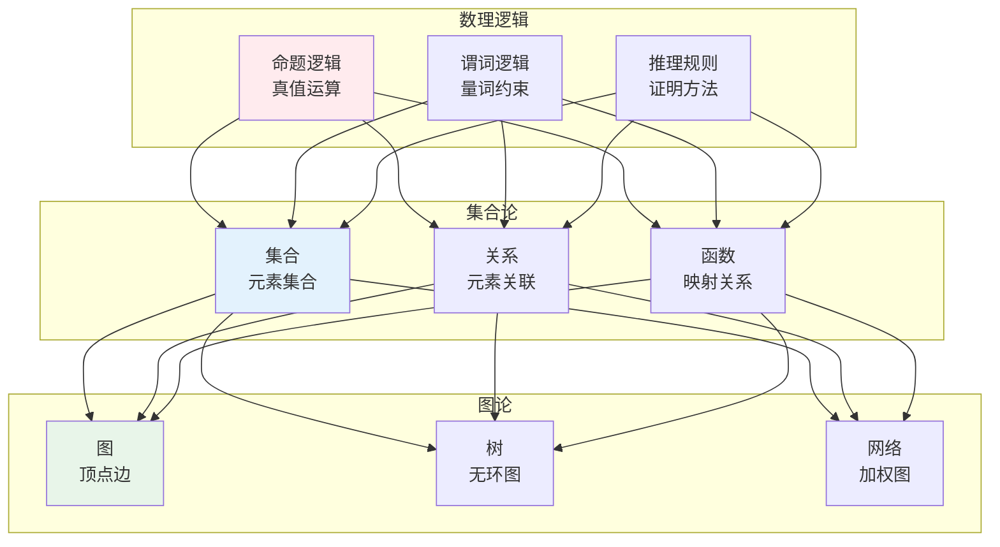
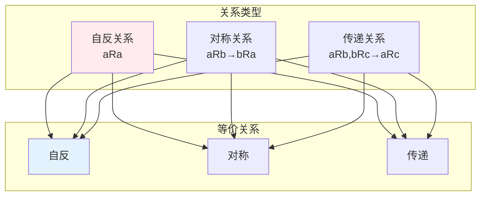
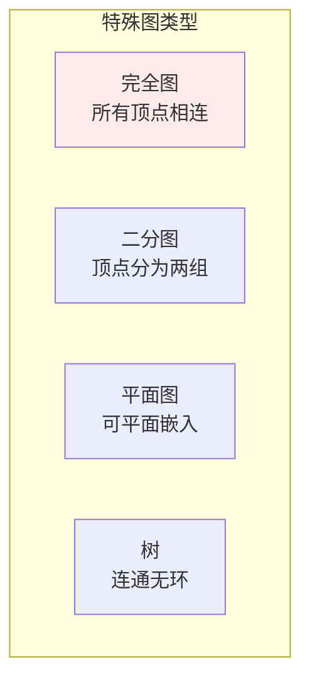

# 离散数学

## 🗂️ 内容导航

| 名称 | 说明 | 链接 |
|------|------|------|
| 数理逻辑 | 理解命题逻辑与谓词逻辑 | [进入](01-mathematical-logic.md) |
| 图论 | 理解图的基本概念与算法 | [进入](02-graph-theory.md) |

---


> **核心观点**：离散数学研究离散对象的数学结构，是计算机科学和算法设计的数学基础。

---

## 📊 离散数学体系



---

## 📐 数理逻辑

### 命题逻辑

| 运算 | 符号 | 真值表 |
|------|------|--------|
| 否定 | ¬P | 取反 |
| 合取 | P∧Q | 同真为真 |
| 析取 | P∨Q | 同假为假 |
| 蕴含 | P→Q | P假或Q真 |
| 等价 | P↔Q | 相同为真 |

### 谓词逻辑

```mermaid
graph TB
    subgraph 量词
        A1[全称量词<br/>∀x P(x)]
        A2[存在量词<br/>∃x P(x)]
    end    
    subgraph 应用
        B1[数学证明<br/>形式化]
        B2[知识表示<br/>AI推理]
        B3[程序验证<br/>正确性]
    end
    
    A1 & A2 --> B1 & B2 & B3
    
    style A1 fill:#ffebee
    style B1 fill:#e3f2fd
```

### 推理规则

| 规则 | 形式 | 意义 |
|------|------|------|
| 假言推理 | P, P→Q ⊢ Q | 有效推理 |
| 拒取式 | ¬Q, P→Q ⊢ ¬P | 逆否推理 |
| 三段论 | P→Q, Q→R ⊢ P→R | 链式推理 |

---

## 📊 集合论

### 集合运算

| 运算 | 定义 | 性质 |
|------|------|------|
| 并集 | A∪B = {x∈A或x∈B} | 交换律、结合律 |
| 交集 | A∩B = {x∈A且x∈B} | 交换律、结合律 |
| 差集 | A-B = {x∈A且x∉B} | 非交换 |
| 补集 | A' = {x∉A} | 对合律 |

### 关系



### 函数

| 类型 | 定义 | 例子 |
|------|------|------|
| 单射 | 不同元素映射到不同 | 一对一 |
| 满射 | 值域=陪域 | 映射覆盖 |
| 双射 | 一一对应 | 可逆映射 |

---

## 🌐 图论

### 图的基本概念

| 概念 | 定义 | 表示 |
|------|------|------|
| 图 | 顶点和边的集合 | G=(V,E) |
| 有向图 | 边有方向 | <u,v> |
| 无向图 | 边无方向 | {u,v} |
| 加权图 | 边有权重 | w(u,v) |

### 特殊图



### 图的性质

| 性质 | 定义 | 应用 |
|------|------|------|
| 连通性 | 任意两点可达 | 网络分析 |
| 度 | 连接边数 | 节点重要性 |
| 路径 | 边的序列 | 路由算法 |
| 环 | 起点=终点的路径 | 循环检测 |

---

## 🎯 算法基础

### 算法复杂度

```
时间复杂度：
- O(1)：常数时间
- O(log n)：对数时间
- O(n)：线性时间
- O(n log n)：线性对数
- O(n²)：平方时间
- O(2ⁿ)：指数时间
```

### 算法设计范式

| 范式 | 核心思想 | 例子 |
|------|----------|------|
| 分治法 | 分解-解决-合并 | 归并排序 |
| 动态规划 | 最优子结构 | 背包问题 |
| 贪心算法 | 局部最优 | 最短路径 |
| 回溯法 | 穷举搜索 | 八皇后 |

---

## 🎯 核心结论

### 离散数学核心概念

1. **逻辑**：形式化推理
2. **集合**：数据组织
3. **关系**：元素关联
4. **图**：结构表示
5. **算法**：问题求解

### 学习路径

```
离散数学学习四步骤：
1. 数理逻辑：命题、谓词、推理
2. 集合论：集合、关系、函数
3. 图论：图、树、网络
4. 算法应用：复杂度、设计范式
```

---

## 📚 参考文献

1. 《离散数学及其应用》- Kenneth Rosen
2. 《离散数学》- 屈婉玲
3. 《图论及其算法》- Bondy
4. 《组合数学》- Richard Brualdi
5. 《算法导论》- Thomas Cormen
6. 《离散数学与应用》
7. 《数理逻辑》
8. 《图论导引》