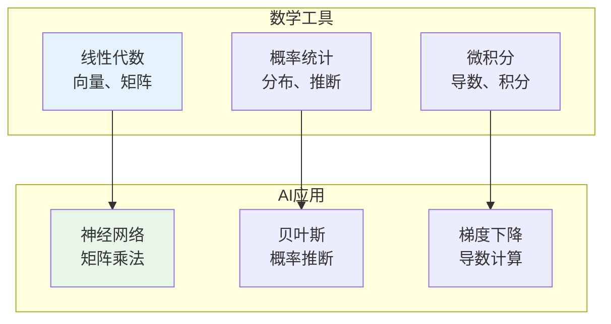

# 数学基础

> **重要提示**：数学的主目录在 [自然科学/数学](/natural-sciences/mathematics/index.md)，这里只介绍AI-IT特有的数学应用。

---

## 🎯 一句话理解AI-IT的数学

**AI-IT的数学就是把数学用在电脑上，让机器变聪明！**

---

## 🔗 快速跳转

| 数学分支 | 主目录位置 | AI-IT应用 |
|----------|------------|-----------|
| 线性代数 | [自然科学/数学/线性代数](/natural-sciences/mathematics/index.md) | 图像处理、推荐系统 |
| 概率统计 | [自然科学/数学/概率统计](/natural-sciences/mathematics/index.md) | 机器学习、数据分析 |
| 微积分 | [自然科学/数学/微积分](/natural-sciences/mathematics/index.md) | 梯度下降、优化 |
| 优化理论 | [自然科学/数学/优化](/natural-sciences/mathematics/index.md) | 模型训练 |
| 离散数学 | [自然科学/数学/离散数学](/natural-sciences/mathematics/index.md) | 算法、图神经网络 |
| 信息论 | [自然科学/数学/信息论](/natural-sciences/mathematics/index.md) | 损失函数、特征选择 |

---

## 📚 AI-IT特有的数学应用

### 🤖 机器学习中的数学

| 数学分支 | AI应用 | 为什么重要 |
|----------|--------|------------|
| 线性代数 | 神经网络、PCA | 数据表示和变换 |
| 概率统计 | 朴素贝叶斯、GMM | 不确定性建模 |
| 微积分 | 反向传播、优化 | 让模型学习 |
| 优化理论 | SGD、Adam | 找到最优参数 |
| 信息论 | 交叉熵、KL散度 | 衡量模型好坏 |

---

## 🎮 AI数学闯关游戏

---

## 💡 给小学生的话

> AI的数学和普通数学是一样的！
> 
> 先去 [自然科学/数学](/natural-sciences/mathematics/index.md) 学好基础，再来这里看AI怎么用！
> 
> 记住：基础打牢，AI才能学好！

---

**每个AI数学家都曾经是初学者！**