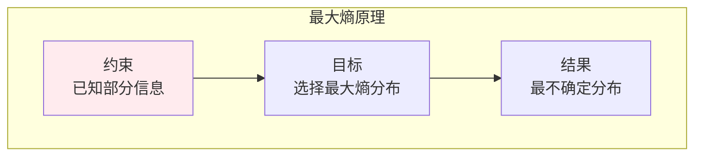

# 信息熵

> **核心观点**：信息熵是度量不确定性的数学工具，是信息论的核心概念。

---

## 📊 信息熵基本概念

### 定义

| 概念 | 公式 | 意义 |
|------|------|------|
| 自信息 | I(x) = -log₂P(x) | 单个事件的信息量 |
| 信息熵 | H(X) = -∑P(x)log₂P(x) | 平均不确定性 |

### 熵的性质

```mermaid
graph TB
    subgraph 熵性质
        A1[非负性<br/>H(X) ≥ 0]
        A2[确定性<br/>P=1时H=0]
        A3[最大熵<br/>均匀分布最大]
        A4[可加性<br/>独立变量熵可加]
    end    
    A1 & A2 & A3 & A4
    
    style A1 fill:#ffebee
```

---

## 📈 常见分布的熵

| 分布 | 熵 | 特点 |
|------|------|------|
| 伯努利 | -plog₂p-(1-p)log₂(1-p) | 二元分布 |
| 均匀分布 | log₂n | 最大熵 |
| 高斯分布 | ½log₂(2πeσ²) | 连续分布 |

### 最大熵原理



---

## 🔗 联合熵与条件熵

### 熵的链式法则

| 概念 | 公式 | 意义 |
|------|------|------|
| 联合熵 | H(X,Y) = -∑P(x,y)logP(x,y) | 联合不确定性 |
| 条件熵 | H(X\|Y) = H(X,Y) - H(Y) | Y给定后X的不确定性 |
| 链式法则 | H(X,Y) = H(X) + H(X\|Y) | 联合=条件+边缘 |

---

## 🤖 机器学习应用

### 交叉熵损失

```mermaid
graph TB
    subgraph 交叉熵
        A1[二分类<br/>H = -[ylogŷ + (1-y)log(1-ŷ)]]
        A2[多分类<br/>H = -∑yᵢlogŷᵢ]
    end    
    A1 & A2
    
    style A1 fill:#ffebee
```

### 决策树

| 应用 | 内容 | 意义 |
|------|------|------|
| 信息增益 | H(D) - H(D\|A) | 特征选择 |
| 基尼不纯度 | 1-∑pᵢ² | 分裂标准 |

---

## 🎯 核心结论

### 信息熵核心概念

1. **自信息**：单个事件的信息量
2. **信息熵**：平均不确定性
3. **最大熵**：最不确定分布
4. **链式法则**：联合熵分解
5. **应用**：损失函数、特征选择

### 学习路径

```
信息熵学习四步骤：
1. 自信息：定义、性质
2. 信息熵：定义、最大熵原理
3. 联合熵与条件熵：链式法则
4. 应用：交叉熵、决策树
```

---

## 📚 参考文献

1. 《信息论基础》- Thomas Cover
2. 《信息论与编码》- 傅祖芸
3. 《Elements of Information Theory》
4. 《Information Theory, Inference, and Learning Algorithms》
5. 《信息熵》
6. 《最大熵原理》
7. 《交叉熵》
8. 《决策树》