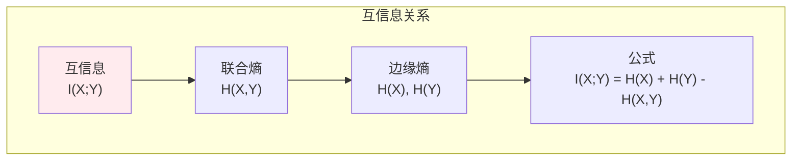
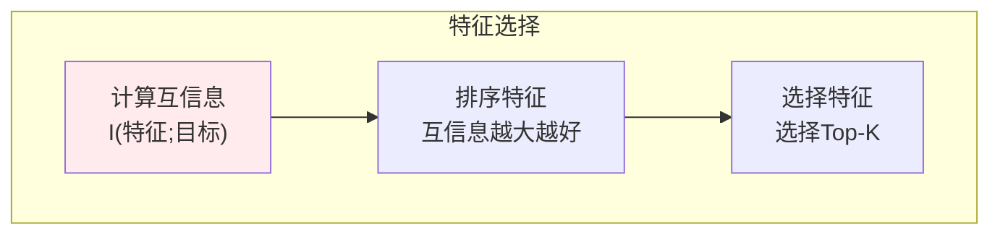
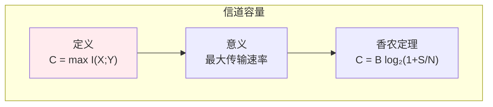

# 互信息

> **核心观点**：互信息度量两个变量间的共享信息量，是特征选择和聚类分析的重要工具。

---

## 📊 互信息基本概念

### 定义

| 概念 | 公式 | 意义 |
|------|------|------|
| 互信息 | I(X;Y) = H(X) - H(X\|Y) | X和Y共享的信息量 |
| 对称性 | I(X;Y) = I(Y;X) | 方向无关 |
| 非负性 | I(X;Y) ≥ 0 | 始终非负 |

### 互信息与熵的关系



---

## 📈 互信息性质

### 基本性质

| 性质 | 内容 | 意义 |
|------|------|------|
| 非负性 | I(X;Y) ≥ 0 | 共享信息≥0 |
| 独立时为0 | I(X;Y) = 0 iff X,Y独立 | 无共享信息 |
| 不超过单变量熵 | I(X;Y) ≤ min(H(X), H(Y)) | 上界 |

### 归一化互信息

| 概念 | 公式 | 特点 |
|------|------|------|
| NMI | I(X;Y)/√(H(X)H(Y)) | 消除尺度影响 |
| 范围 | [0,1] | 便于比较 |

---

## 🤖 机器学习应用

### 特征选择



### 聚类评估

| 应用 | 方法 | 意义 |
|------|------|------|
| 聚类质量 | NMI(聚类;标签) | 与真实标签一致性 |
| 特征聚类 | I(特征1;特征2) | 特征相关性 |

### 信道容量



---

## 🎯 核心结论

### 互信息核心概念

1. **定义**：两个变量共享的信息量
2. **对称性**：方向无关
3. **非负性**：始终≥0
4. **独立时为0**：无共享信息
5. **应用**：特征选择、聚类评估

### 学习路径

```
互信息学习四步骤：
1. 基本概念：定义、性质
2. 与熵的关系：公式推导
3. 归一化互信息：消除尺度
4. 应用：特征选择、聚类评估
```

---

## 📚 参考文献

1. 《信息论基础》- Thomas Cover
2. 《信息论与编码》- 傅祖芸
3. 《Elements of Information Theory》
4. 《互信息》
5. 《特征选择》
6. 《聚类分析》
7. 《信道容量》
8. 《信息论应用》