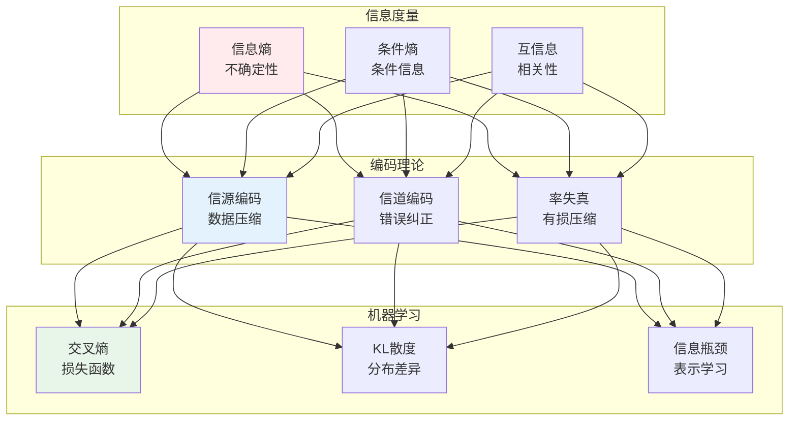
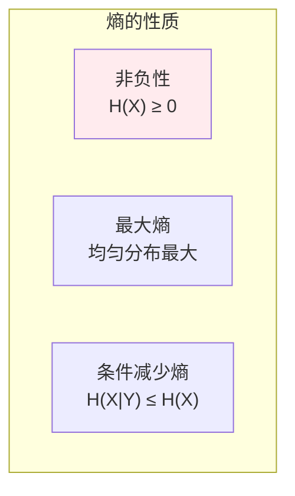
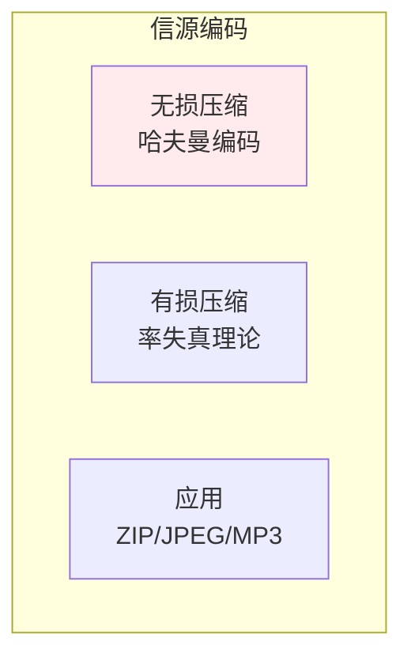
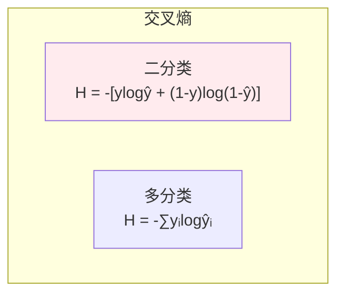
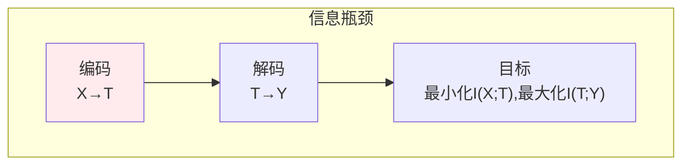

# 信息论

## 🗂️ 内容导航

| 名称 | 说明 | 链接 |
|------|------|------|
| 信息熵 | 理解信息熵的概念与性质 | [进入](01-information-entropy.md) |
| 互信息 | 理解互信息的概念与应用 | [进入](02-mutual-information.md) |
| KL散度 | 理解KL散度的概念与应用 | [进入](03-kl-divergence.md) |

---


> **核心观点**：信息论研究信息的度量、传输和处理，是通信和数据压缩的理论基础。

---

## 📊 信息论体系



---

## 📐 信息度量

### 自信息

| 概念 | 公式 | 意义 |
|------|------|------|
| 自信息 | I(x) = -log₂P(x) | 事件发生的信息量 |
| 单位 | 比特（bit） | 信息度量单位 |

```
自信息性质：
1. 确定事件：I(x) = 0（没有不确定性）
2. 不可能发生事件：I(x) → ∞
3. 独立事件：I(x,y) = I(x) + I(y)
```

### 信息熵



| 分布 | 熵 | 特点 |
|------|------|------|
| 均匀分布 | log₂n | 最大熵 |
| 伯努利分布 | -plog₂p-(1-p)log₂(1-p) | 二元分布 |
| 确定分布 | 0 | 最小熵 |

### 联合熵与条件熵

| 概念 | 公式 | 意义 |
|------|------|------|
| 联合熵 | H(X,Y) = -∑P(x,y)logP(x,y) | 联合不确定性 |
| 条件熵 | H(X|Y) = H(X,Y) - H(Y) | Y给定后X的不确定性 |
| 链式法则 | H(X,Y) = H(X) + H(X|Y) | 联合=条件+边缘 |

### 互信息

| 概念 | 公式 | 意义 |
|------|------|------|
| 互信息 | I(X;Y) = H(X) - H(X|Y) | X和Y的共享信息 |
| 性质 | I(X;Y) = I(Y;X) | 对称性 |

```
互信息应用：
1. 特征选择：选择与目标相关的特征
2. 聚类分析：衡量聚类质量
3. 信道容量：最大传输速率
```

---

## 📦 编码理论

### 信源编码



### 信道编码

| 编码类型 | 特点 | 应用 |
|----------|------|------|
| 奇偶校验 | 简单检错 | 数据传输 |
| 海明码 | 纠单错 | 内存纠错 |
| 卷积码 | 流式编码 | 无线通信 |
| Turbo码 | 近香农限 | 3G/4G |

### 香农定理

| 定理 | 内容 | 意义 |
|------|------|------|
| 信道编码定理 | 存在速率达容量的编码 | 理论极限 |
| 信源编码定理 | 熵是压缩下界 | 压缩极限 |

```
信道容量公式：
C = max I(X;Y) = B log₂(1 + S/N)

- C：信道容量
- B：带宽
- S/N：信噪比
```

---

## 🤖 机器学习应用

### 交叉熵损失



| 损失函数 | 公式 | 应用 |
|----------|------|------|
| 二元交叉熵 | -[ylogŷ+(1-y)log(1-ŷ)] | 二分类 |
| 多类交叉熵 | -∑yᵢlogŷᵢ | 多分类 |
| 带权交叉熵 | -∑wᵢyᵢlogŷᵢ | 类别不平衡 |

### KL散度

| 概念 | 公式 | 意义 |
|------|------|------|
| KL散度 | DKL(P‖Q) = ∑P(x)log[P(x)/Q(x)] | 分布差异 |
| 非对称性 | DKL(P‖Q) ≠ DKL(Q‖P) | 方向依赖 |
| 非负性 | DKL(P‖Q) ≥ 0 | 始终非负 |

```
KL散度应用：
1. 变分自编码器（VAE）
2. 知识蒸馏
3. 强化学习策略优化
```

### 信息瓶颈



---

## 🎯 核心结论

### 信息论核心概念

1. **信息**：不确定性的度量
2. **熵**：平均不确定性
3. **互信息**：共享信息量
4. **编码**：信息表示方法
5. **信道容量**：传输极限

### 学习路径

```
信息论学习四步骤：
1. 信息度量：自信息、熵、互信息
2. 编码理论：信源编码、信道编码
3. 机器学习应用：交叉熵、KL散度
4. 深度学习：信息瓶颈、表示学习
```

---

## 📚 参考文献

1. 《信息论基础》- Thomas Cover
2. 《信息论与编码》- 傅祖芸
3. 《Elements of Information Theory》
4. 《Information Theory, Inference, and Learning Algorithms》- MacKay
5. 《深度学习》- 信息论部分
6. 《信息论与机器学习》
7. 《编码理论》
8. 《通信原理》