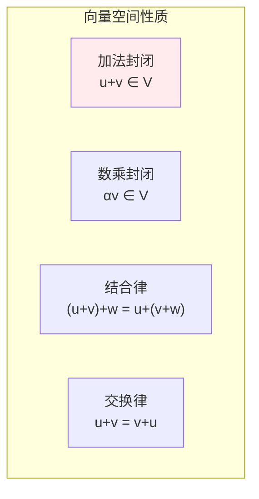
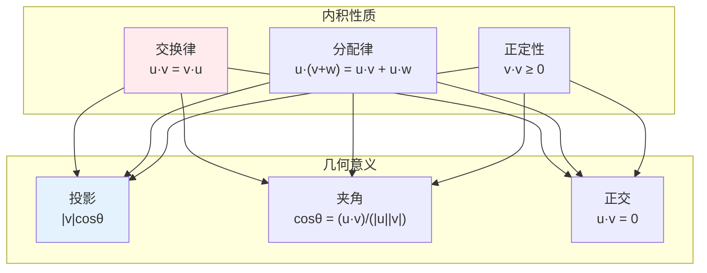
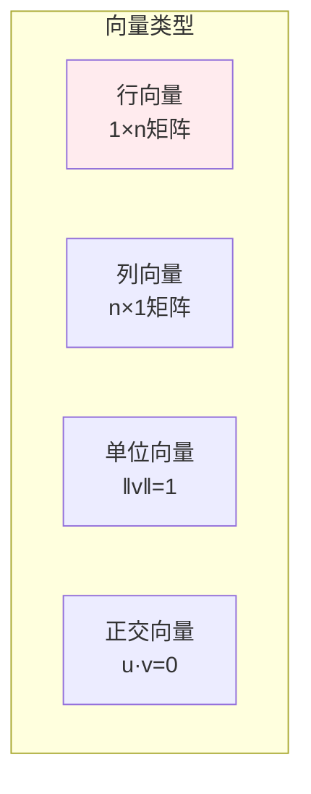
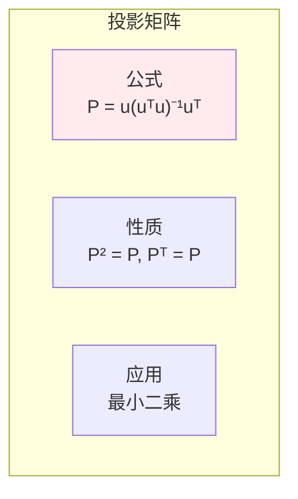
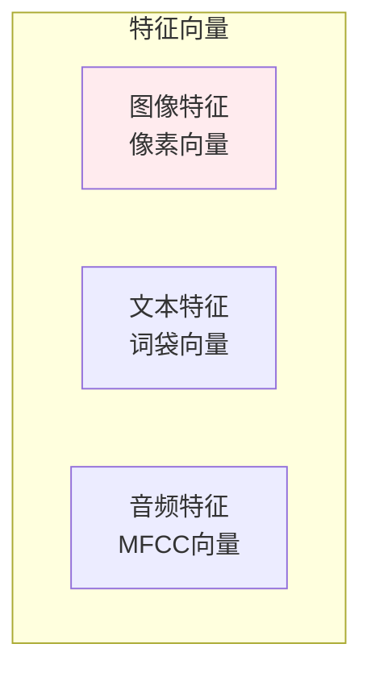

# 向量

> **核心观点**：向量是有大小和方向的量，是线性代数的基本对象，也是机器学习中数据表示的基础。

---

## 📊 向量基本概念

### 向量定义

| 概念 | 定义 | 表示 |
|------|------|------|
| 向量 | 有大小和方向的量 | **v** = [v₁, v₂, ..., vₙ] |
| 标量 | 只有大小的量 | a = 3 |
| 零向量 | 大小为0的向量 | **0** = [0, 0, ..., 0] |

### 向量空间



---

## 🔢 向量运算

### 基本运算

| 运算 | 定义 | 几何意义 |
|------|------|----------|
| 向量加法 | **u**+**v** = [u₁+v₁, ..., uₙ+vₙ] | 平行四边形法则 |
| 数乘 | α**v** = [αv₁, ..., αvₙ] | 缩放/反向 |
| 内积 | **u**·**v** = ∑uᵢvᵢ | 投影长度 |

### 内积详解



### 向量范数

| 范数类型 | 公式 | 特点 | 应用 |
|----------|------|------|------|
| L1范数 | ‖**v**‖₁ = ∑|vᵢ| | 产生稀疏 | 特征选择 |
| L2范数 | ‖**v**‖₂ = √(∑vᵢ²) | 欧氏距离 | 正则化 |
| L∞范数 | ‖**v**‖∞ = max|vᵢ| | 最大值 | 鲁棒优化 |

```
范数应用：
1. L1正则化：产生稀疏解（LASSO）
2. L2正则化：防止过拟合（Ridge）
3. 距离度量：相似性计算
4. 梯度裁剪：防止梯度爆炸
```

---

## 📐 向量类型

### 按维度分类

| 类型 | 维度 | 例子 |
|------|------|------|
| 2D向量 | 2 | [x, y] 图像坐标 |
| 3D向量 | 3 | [x, y, z] 空间坐标 |
| nD向量 | n | 特征向量 |

### 按性质分类



---

## 🎯 向量投影

### 向量投影公式

| 概念 | 公式 | 意义 |
|------|------|------|
| 投影 | proj_**u**(**v**) = (**v**·**u**/**u**·**u**)**u** | v在u方向的投影 |
| 正交分量 | **v** - proj_**u**(**v**) | 垂直于u的分量 |

### 投影矩阵



---

## 🤖 机器学习应用

### 特征表示



### 相似度计算

| 方法 | 公式 | 特点 |
|------|------|------|
| 余弦相似度 | cos(θ) = **u**·**v**/‖**u**‖‖**v**‖ | 方向相似性 |
| 欧氏距离 | ‖**u**-**v**‖₂ | 绝对距离 |
| 曼哈顿距离 | ‖**u**-**v**‖₁ | 城市街区距离 |

### 词向量

| 模型 | 原理 | 特点 |
|------|------|------|
| Word2Vec | 上下文预测 | 语义相似 |
| GloVe | 共现矩阵 | 全局统计 |
| FastText | 子词信息 | 处理OOV |

---

## 🎯 核心结论

### 向量核心概念

1. **大小与方向**：向量的两个属性
2. **内积**：度量相似性
3. **范数**：度量大小
4. **投影**：度量相关性
5. **正交**：独立性度量

### 学习路径

```
向量学习四步骤：
1. 基本概念：定义、表示
2. 运算方法：加法、内积、范数
3. 几何意义：投影、正交
4. 应用实践：相似度计算、特征表示
```

---

## 📚 参考文献

1. 《线性代数及其应用》- Gilbert Strang
2. 《线性代数》- 同济大学
3. 《向量分析》- 吴崇试
4. 《机器学习中的线性代数》
5. 《深度学习》- 向量部分
6. 《Mathematics for Machine Learning》
7. 《线性代数应该这样学》- Sheldon Axler
8. 《3Blue1Brown线性代数的本质》