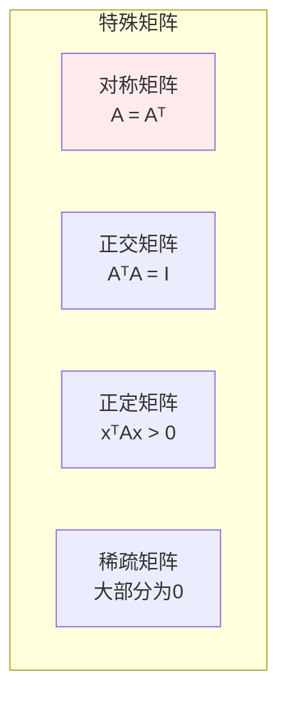
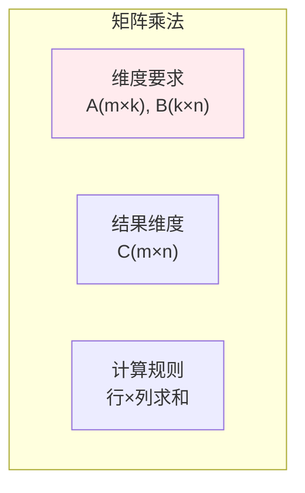
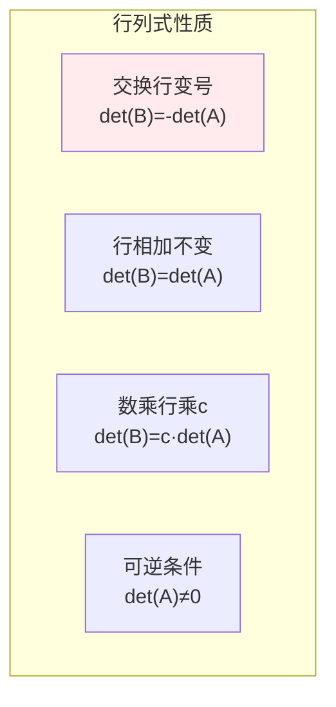
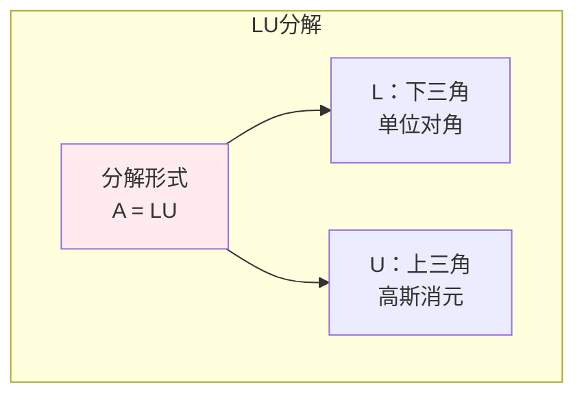
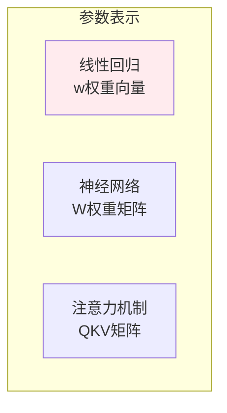

# 矩阵

> **核心观点**：矩阵是数的矩形阵列，是线性变换的表示，是机器学习中参数和数据的核心表示。

---

## 📊 矩阵基本概念

### 矩阵定义

| 概念 | 定义 | 记法 |
|------|------|------|
| 矩阵 | m×n数表 | A ∈ ℝᵐˣⁿ |
| 方阵 | m=n | A ∈ ℝⁿˣⁿ |
| 对角矩阵 | 非对角元素为0 | diag(a₁₁,...,aₙₙ) |
| 单位矩阵 | 对角线为1 | I |
| 零矩阵 | 元素全为0 | 0 |

### 矩阵特殊类型



---

## 🔢 矩阵运算

### 基本运算

| 运算 | 定义 | 性质 |
|------|------|------|
| 矩阵加法 | (A+B)ᵢⱼ = aᵢⱼ+bᵢⱼ | 交换律、结合律 |
| 数乘 | (cA)ᵢⱼ = caᵢⱼ | 分配律 |
| 矩阵乘法 | (AB)ᵢⱼ = ∑ₖaᵢₖbₖⱼ | 结合律、分配律 |

### 矩阵乘法详解



| 性质 | 说明 | 注意 |
|------|------|------|
| 交换律 | AB ≠ BA | 一般不成立 |
| 结合律 | (AB)C = A(BC) | 成立 |
| 分配律 | A(B+C) = AB+AC | 成立 |

### 转置运算

| 运算 | 定义 | 性质 |
|------|------|------|
| 转置 | (Aᵀ)ᵢⱼ = aⱼᵢ | (Aᵀ)ᵀ = A |
| 和的转置 | (A+B)ᵀ = Aᵀ+Bᵀ | 成立 |
| 积的转置 | (AB)ᵀ = BᵀAᵀ | 顺序反转 |

### 逆矩阵

| 概念 | 定义 | 条件 |
|------|------|------|
| 逆矩阵 | AA⁻¹ = A⁻¹A = I | A可逆（非奇异） |
| 伴随矩阵 | adj(A) = Cᵀ | C是余子式矩阵 |
| 逆矩阵公式 | A⁻¹ = adj(A)/det(A) | det(A)≠0 |

---

## 📐 行列式

### 行列式定义

| 阶数 | 公式 | 意义 |
|------|------|------|
| 2阶 | det(A) = a₁₁a₂₂-a₁₂a₂₁ | 平行四边形面积 |
| 3阶 | 萨鲁斯法则 | 平行六面体体积 |
| n阶 | 余子式展开 | n维体积 |

### 行列式性质



---

## 🔗 矩阵分解

### LU分解



### Cholesky分解

| 条件 | 分解形式 | 应用 |
|------|----------|------|
| A对称正定 | A = LLᵀ | 快速求解 |

### QR分解

| 分解形式 | Q | R |
|----------|------|------|
| A = QR | 正交矩阵 | 上三角矩阵 |

---

## 🤖 机器学习应用

### 参数矩阵



### 数据矩阵

| 表示方式 | 形状 | 例子 |
|----------|------|------|
| 样本-特征 | m×n | X[i,j]表示第i个样本的第j个特征 |
| 图像矩阵 | h×w×c | 像素值矩阵 |
| 文档-词 | d×v | 词频矩阵 |

### 矩阵运算应用

| 运算 | 应用 | 例子 |
|------|------|------|
| 矩阵乘法 | 线性变换 | y = Wx + b |
| 矩阵转置 | 注意力计算 | Attention(Q,K,V) |
| 矩阵求逆 | 正规方程 | w = (XᵀX)⁻¹Xᵀy |

---

## 🎯 核心结论

### 矩阵核心概念

1. **矩阵乘法**：线性变换的组合
2. **行列式**：体积变化率
3. **逆矩阵**：变换的逆操作
4. **转置**：行列互换
5. **分解**：矩阵的结构分析

### 学习路径

```
矩阵学习四步骤：
1. 基本运算：加法、乘法、转置
2. 特殊矩阵：对称、正交、正定
3. 矩阵分解：LU、QR、SVD
4. 应用实践：参数表示、线性变换
```

---

## 📚 参考文献

1. 《线性代数及其应用》- Gilbert Strang
2. 《矩阵分析与应用》- Roger Horn
3. 《线性代数》- 同济大学
4. 《矩阵论》- 方保镕
5. 《机器学习中的矩阵方法》
6. 《深度学习》- 矩阵部分
7. 《Matrix Computations》- Gene Golub
8. 《矩阵计算》- 徐树方