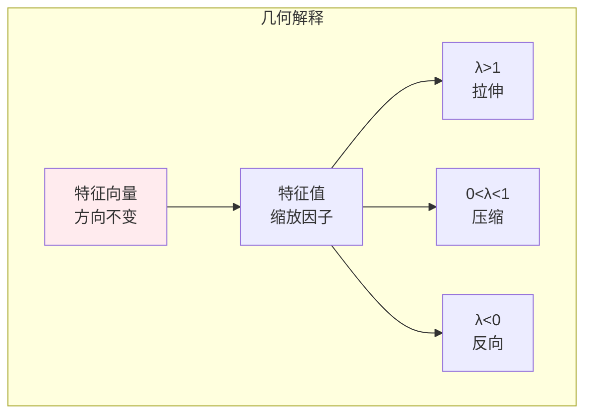
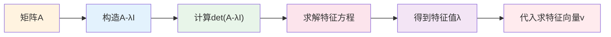
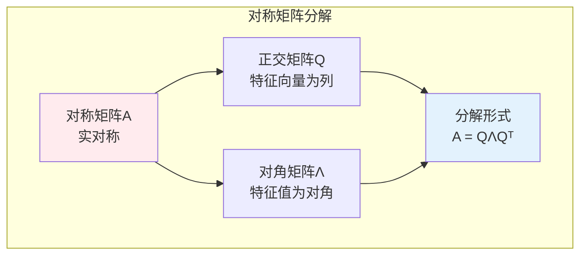
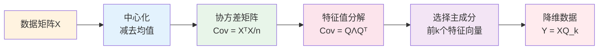
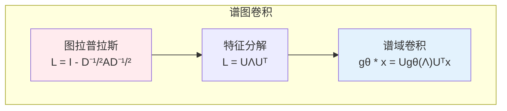

# 特征值分解

> **核心观点**：特征值分解揭示矩阵的内在结构，是主成分分析、谱聚类等机器学习方法的数学基础。

---

## 📊 特征值基本概念

### 定义

| 概念 | 定义 | 意义 |
|------|------|------|
| 特征值 | Av = λv 中的 λ | 变换的缩放因子 |
| 特征向量 | Av = λv 中的 v | 变换的不变方向 |
| 特征空间 | (A-λI)v = 0 的解空间 | 不变子空间 |

### 几何意义



---

## 🔢 计算方法

### 特征方程

| 步骤 | 公式 | 说明 |
|------|------|------|
| 特征方程 | det(A-λI) = 0 | 求特征值 |
| 特征值 | λ₁, λ₂, ..., λₙ | n次方程的根 |
| 特征向量 | (A-λᵢI)v = 0 | 求解线性方程组 |

### 计算示例



---

## 📐 特征值分解

### 分解形式

| 矩阵 | 分解形式 | 条件 |
|------|----------|------|
| 对角化 | A = PDP⁻¹ | A有n个线性无关特征向量 |
| 对称矩阵 | A = QΛQᵀ | A对称，Q正交 |

### 对称矩阵特征分解



### 特征值性质

| 性质 | 公式 | 意义 |
|------|------|------|
| 迹 | tr(A) = ∑λᵢ | 特征值之和 |
| 行列式 | det(A) = ∏λᵢ | 特征值之积 |
| 秩 | rank(A) | 非零特征值个数 |

---

## 🤖 机器学习应用

### 主成分分析（PCA）



### 谱聚类

| 步骤 | 内容 | 作用 |
|------|------|------|
| 构建图 | 计算相似度矩阵 | 数据关系 |
| 拉普拉斯矩阵 | L = D - W | 图结构 |
| 特征分解 | 取前k个特征向量 | 降维 |
| 聚类 | 对特征向量K-means | 分组 |

### 图神经网络



---

## 🎯 核心结论

### 特征值分解核心概念

1. **特征值**：变换的缩放因子
2. **特征向量**：不变方向
3. **对角化**：矩阵的简化表示
4. **对称矩阵**：正交对角化
5. **应用**：降维、聚类、图分析

### 学习路径

```
特征值分解学习四步骤：
1. 基本概念：特征值、特征向量
2. 计算方法：特征方程、求解
3. 分解形式：对角化、正交对角化
4. 应用实践：PCA、谱聚类
```

---

## 📚 参考文献

1. 《线性代数及其应用》- Gilbert Strang
2. 《矩阵分析与应用》- Roger Horn
3. 《Pattern Recognition and Machine Learning》
4. 《机器学习中的特征值方法》
5. 《深度学习》- 降维部分
6. 《谱图理论》
7. 《主成分分析》
8. 《线性代数应该这样学》