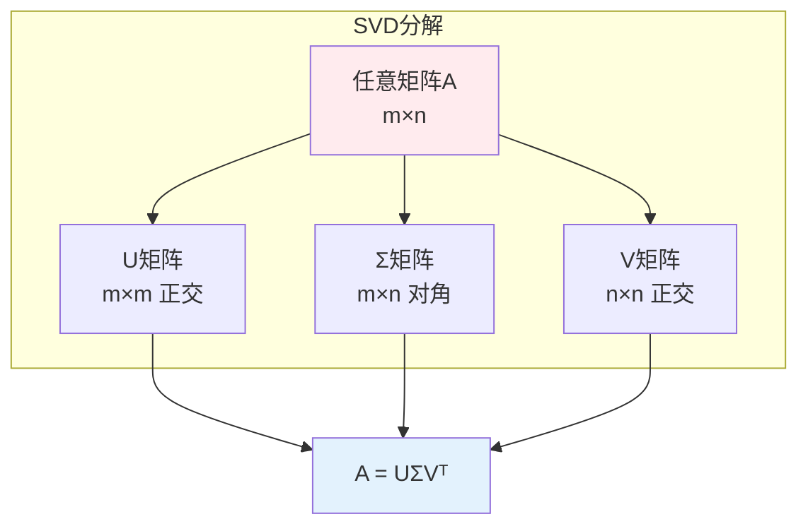
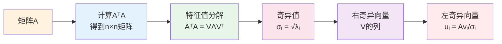
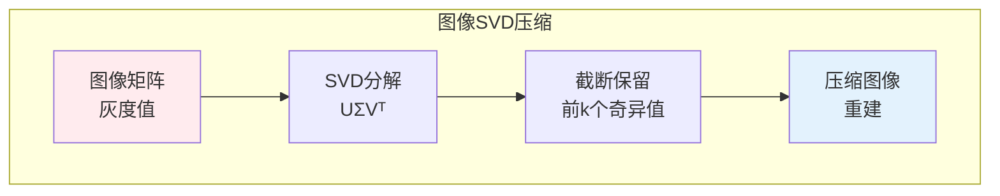

# 奇异值分解（SVD）

> **核心观点**：SVD是矩阵分解的通用方法，任何矩阵都可以分解为UΣVᵀ形式，是降维、推荐系统的核心技术。

---

## 📊 SVD基本概念

### 定义

| 概念 | 定义 | 性质 |
|------|------|------|
| 奇异值 | Σ对角线上的值 | 非负、降序排列 |
| 左奇异向量 | U的列向量 | 正交、单位向量 |
| 右奇异向量 | V的列向量 | 正交、单位向量 |

### 分解形式



---

## 🔢 计算方法

### SVD计算步骤



### 经济SVD

| 类型 | 形状 | 说明 |
|------|------|------|
| 完整SVD | U(m×m), Σ(m×n), V(n×n) | 标准形式 |
| 经济SVD | U(m×n), Σ(n×n), V(n×n) | 去除零列 |
| 截断SVD | U(m×k), Σ(k×k), V(n×k) | 降维近似 |

---

## 📐 SVD性质

### 基本性质

| 性质 | 内容 | 意义 |
|------|------|------|
| 奇异值非负 | σᵢ ≥ 0 | 基本性质 |
| 降序排列 | σ₁ ≥ σ₂ ≥ ... ≥ σᵣ > 0 | 重要性排序 |
| 奇异值唯一 | σᵢ唯一确定 | 分解唯一 |
| 向量不唯一 | 符号可变 | 方向不唯一 |

### 矩阵性质

```mermaid
graph TB
    subgraph SVD揭示的性质
        A1[秩<br/>非零奇异值个数]
        A2[范数<br/>‖A‖ = σ₁]
        A3[条件数<br/>κ(A) = σ₁/σᵣ]
        A4[Frobenius范数<br/>‖A‖_F = √(∑σᵢ²)]
    end    
    A1 & A2 & A3 & A4
    
    style A1 fill:#ffebee
```

---

## 🎯 截断SVD

### 低秩近似

| 概念 | 公式 | 意义 |
|------|------|------|
| 截断SVD | A ≈ UₖΣₖVₖᵀ | 最优k秩近似 |
| 近似误差 | ‖A - Aₖ‖_F = √(∑ᵢ>kσᵢ²) | 奇异值衰减 |

### 低秩近似性质

```mermaid
graph TB
    subgraph 截断SVD性质
        A1[最优性<br/>Eckart-Young定理]
        A2[误差控制<br/>由奇异值决定]
        A3[能量保留<br/>∑σᵢ²(k)/∑σᵢ²(n)]
    end    
    A1 & A2 & A3
    
    style A1 fill:#ffebee
```

---

## 🤖 机器学习应用

### 推荐系统

```mermaid
graph TB
    subgraph 矩阵分解推荐
        A1[用户-物品矩阵<br/>R(m×n)]
        A2[SVD分解<br/>R = UΣVᵀ]
        A3[低秩近似<br/>R ≈ UₖΣₖVₖᵀ]
        A4[预测评分<br/>R̂ = UₖΣₖVₖᵀ]
    end    
    A1 --> A2 --> A3 --> A4
    
    style A1 fill:#ffebee
    style A4 fill:#e3f2fd
```

### 潜在语义分析（LSA）

| 步骤 | 内容 | 作用 |
|------|------|------|
| 构建词文档矩阵 | TF-IDF | 文本表示 |
| SVD分解 | A = UΣVᵀ | 降维 |
| 潜在语义 | 取前k维 | 语义空间 |

### 图像压缩



### 主成分分析

| 方法 | 实现 | 说明 |
|------|------|------|
| SVD实现PCA | X = UΣVᵀ | 避免协方差矩阵计算 |
| 经济SVD | X = UₖΣₖVₖᵀ | 直接得到主成分 |

---

## 🎯 核心结论

### SVD核心概念

1. **通用分解**：任何矩阵都可SVD
2. **最优近似**：截断SVD是最优低秩近似
3. **降维工具**：保留主要信息
4. **推荐系统**：矩阵分解的基础
5. **语义分析**：潜在语义空间

### 学习路径

```
SVD学习四步骤：
1. 基本概念：奇异值、奇异向量
2. 计算方法：特征值分解法
3. 截断SVD：低秩近似、误差控制
4. 应用实践：推荐系统、LSA、图像压缩
```

---

## 📚 参考文献

1. 《线性代数及其应用》- Gilbert Strang
2. 《矩阵分析与应用》- Roger Horn
3. 《Pattern Recognition and Machine Learning》
4. 《矩阵分解与推荐系统》
5. 《潜在语义分析》
6. 《深度学习》- 降维部分
7. 《SVD与PCA》
8. 《矩阵计算》- Gene Golub