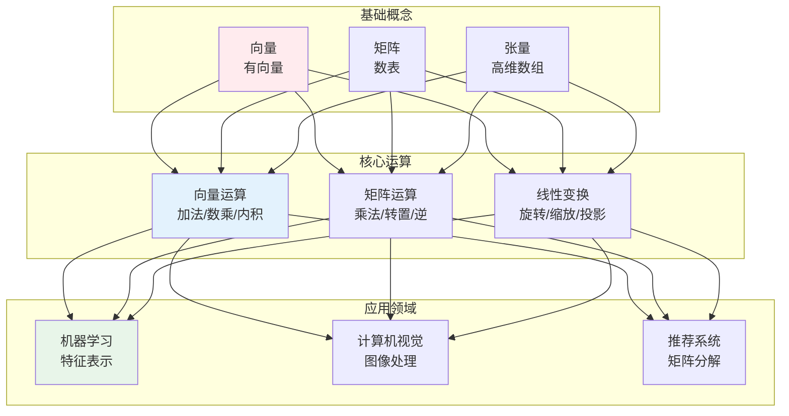
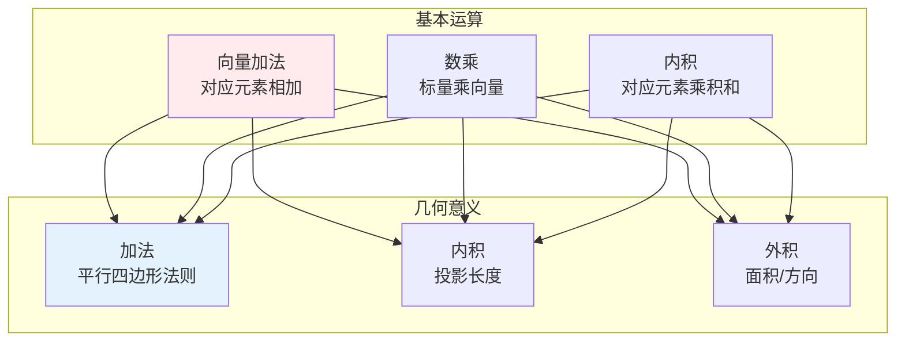
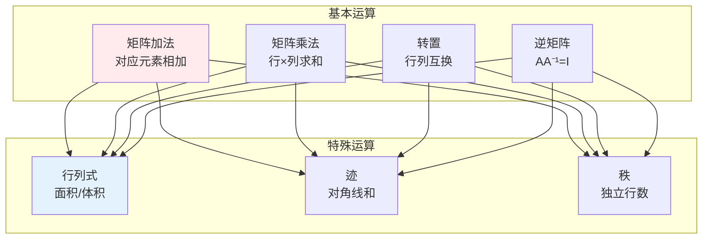
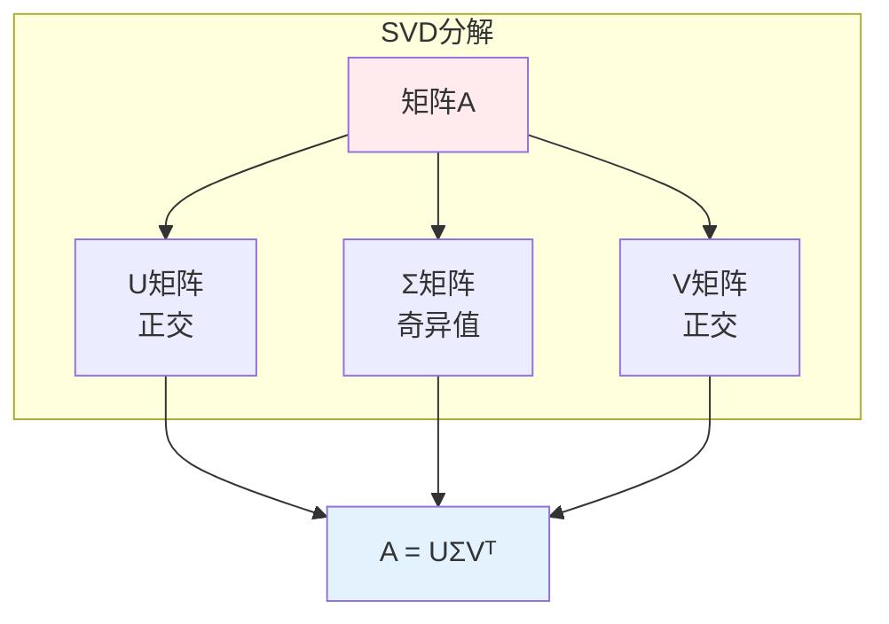
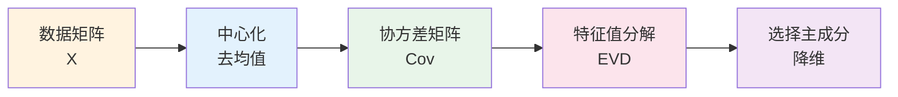

# 线性代数

> **核心观点**：线性代数是研究向量空间和线性映射的数学分支，是机器学习和深度学习的数学基础。

---

## 📊 线性代数体系



---

## 📐 向量

### 向量定义

| 概念 | 定义 | 例子 |
|------|------|------|
| 向量 | 有大小和方向的量 | 速度、力 |
| 标量 | 只有大小的量 | 温度、质量 |
| 向量空间 | 向量的集合 | R²、R³ |

### 向量运算



### 向量范数

| 范数类型 | 公式 | 特点 |
|----------|------|------|
| L1范数 | ‖x‖₁ = ∑|xᵢ| | 稀疏性 |
| L2范数 | ‖x‖₂ = √(∑xᵢ²) | 欧氏距离 |
| L∞范数 | ‖x‖∞ = max|xᵢ| | 最大值 |

```
范数应用：
1. L1正则化：产生稀疏解
2. L2正则化：防止过拟合
3. 距离度量：相似性计算
```

---

## 📊 矩阵

### 矩阵定义

| 概念 | 定义 | 记法 |
|------|------|------|
| 矩阵 | 矩形数表 | A ∈ Rᵐˣⁿ |
| 方阵 | 行数=列数 | A ∈ Rⁿˣⁿ |
| 单位矩阵 | 对角线为1 | I |
| 零矩阵 | 元素全为0 | 0 |

### 矩阵运算



### 特征值分解

| 概念 | 定义 | 意义 |
|------|------|------|
| 特征值 | Av = λv 中的 λ | 变换缩放因子 |
| 特征向量 | Av = λv 中的 v | 不变方向 |
| 特征分解 | A = VΛV⁻¹ | 矩阵分析 |

```
特征值分解应用：
1. 主成分分析（PCA）
2. 谱聚类
3. 矩阵幂计算
4. 稳定性分析
```

### 奇异值分解（SVD）



| 应用 | 方法 | 原理 |
|------|------|------|
| 降维 | 截断SVD | 保留主要特征 |
| 推荐系统 | 矩阵分解 | 隐因子模型 |
| 图像压缩 | 低秩近似 | 减少存储 |
| 去噪 | 阈值处理 | 去除小奇异值 |

---

## 🔄 线性变换

### 线性变换性质

| 性质 | 定义 | 意义 |
|------|------|------|
| 加性 | T(u+v) = T(u)+T(v) | 保持加法 |
| 齐性 | T(cu) = cT(u) | 保持数乘 |

### 常见线性变换

```mermaid
graph TB
    subgraph 二维变换
        A1[旋转<br/>角度θ]
        A2[缩放<br/>因子s]
        A3[反射<br/>轴对称]
        A4[剪切<br/>平行移动]
    end    
    subgraph 矩阵表示
        B1[旋转矩阵<br/>[cosθ, -sinθ; sinθ, cosθ]]
        B2[缩放矩阵<br/>[s, 0; 0, s]]
    end
    
    A1 & A2 & A3 & A4 --> B1 & B2
    
    style A1 fill:#ffebee
    style B1 fill:#e3f2fd
```

---

## 🤖 机器学习应用

### 主成分分析（PCA）



### 线性回归

```
线性回归矩阵形式：
y = Xw + b

正规方程解：
w = (XᵀX)⁻¹Xᵀy

最小二乘法：
w = argmin‖y - Xw‖²
```

### 神经网络

| 层次 | 运算 | 矩阵形式 |
|------|------|----------|
| 全连接 | 加权求和 | y = Wx + b |
| 卷积 | 卷积核滑动 | Y = X * K |
| 注意力 | QK^TV | A = softmax(QK^T/√d)V |

---

## 🎯 核心结论

### 线性代数核心概念

1. **向量**：数据的基本表示
2. **矩阵**：线性变换的表示
3. **特征值**：矩阵的固有属性
4. **分解**：矩阵的简化分析
5. **变换**：数据的映射操作

### 学习路径

```
线性代数学习四步骤：
1. 向量与矩阵运算
2. 特征值与特征向量
3. 矩阵分解（SVD、EVD）
4. 机器学习应用
```

---

## 📚 参考文献

1. 《线性代数及其应用》- Gilbert Strang
2. 《线性代数》- 同济大学
3. 《矩阵分析与应用》- Roger Horn
4. 《机器学习中的线性代数》
5. 《深度学习》- Ian Goodfellow
6. 《Pattern Recognition and Machine Learning》
7. 《线性代数应该这样学》- Sheldon Axler
8. 《3Blue1Brown线性代数的本质》