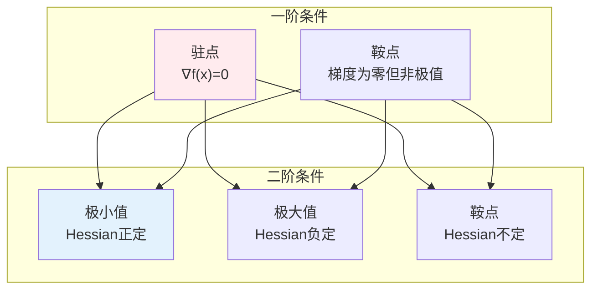
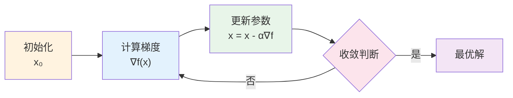
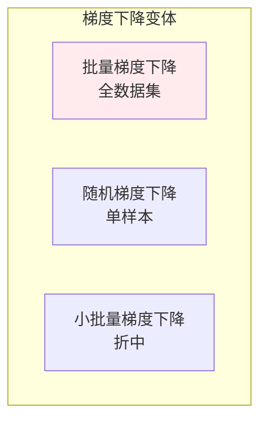
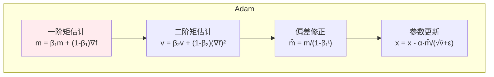
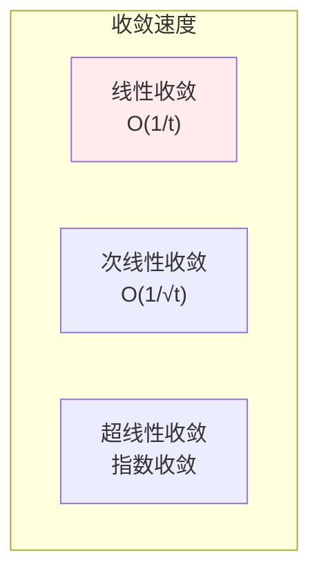

# 无约束优化

> **核心观点**：无约束优化研究如何在没有限制条件下最小化目标函数，是机器学习训练的核心。

---

## 📊 优化基本概念

### 优化问题形式

| 概念 | 公式 | 意义 |
|------|------|------|
| 目标函数 | f(x) | 要最小化的函数 |
| 决策变量 | x | 要优化的变量 |
| 局部最优 | f(x*) ≤ f(x), ∀x∈N(x*) | 邻域内最优 |
| 全局最优 | f(x*) ≤ f(x), ∀x | 全局最小 |

### 最优性条件



---

## 📈 梯度下降法

### 算法流程



### 学习率策略

| 策略 | 公式 | 特点 |
|------|------|------|
| 固定学习率 | α | 简单但需调参 |
| 衰减学习率 | α/√t | 逐步减小 |
| 余弦退火 | α·cos(πt/T) | 周期性变化 |
| 自适应学习率 | Adam/RMSProp | 自动调整 |

---

## 🔄 梯度下降变体

### 变体比较



| 变体 | 优点 | 缺点 |
|------|------|------|
| 批量梯度下降 | 收敛稳定 | 内存大、速度慢 |
| 随机梯度下降 | 内存小、速度快 | 收敛不稳 |
| 小批量梯度下降 | 平衡效率 | 需调参 |

---

## 🚀 动量方法

### 动量原理

| 方法 | 公式 | 特点 |
|------|------|------|
| 动量 | v = γv + α∇f; x = x - v | 加速收敛 |
| Nesterov动量 | 先看一步再算梯度 | 更准确 |
| Adam | 动量+自适应学习率 | 鲁棒性强 |

### Adam优化器



---

## 🎯 收敛性分析

### 收敛条件

| 条件 | 内容 | 意义 |
|------|------|------|
| Lipschitz连续 | \|∇f(x)-∇f(y)\| ≤ L\|x-y\| | 梯度变化有界 |
| 强凸性 | f(y) ≥ f(x)+∇f(x)ᵀ(y-x)+μ/2\|y-x\|² | 曲率有下界 |

### 收敛速度



---

## 🤖 机器学习应用

### 神经网络训练

| 步骤 | 内容 | 优化方法 |
|------|------|----------|
| 前向传播 | 计算输出 | 函数复合 |
| 损失计算 | 比较预测与真实 | 损失函数 |
| 反向传播 | 计算梯度 | 链式法则 |
| 参数更新 | 梯度下降 | 优化器 |

### 超参数调优

| 方法 | 原理 | 优缺点 |
|------|------|--------|
| 网格搜索 | 穷举搜索 | 全面但耗时 |
| 随机搜索 | 随机采样 | 高效但不保证 |
| 贝叶斯优化 | 概率模型 | 智能但复杂 |

---

## 🎯 核心结论

### 无约束优化核心概念

1. **梯度**：最速下降方向
2. **学习率**：步长控制
3. **收敛性**：算法终止条件
4. **自适应方法**：自动调整学习率
5. **应用**：神经网络训练

### 学习路径

```
无约束优化学习四步骤：
1. 基本概念：目标函数、梯度
2. 梯度下降：基本算法、学习率
3. 变体方法：动量、Adam
4. 应用：神经网络训练
```

---

## 📚 参考文献

1. 《最优化导论》- Edwin Chong
2. 《数值优化》- Jorge Nocedal
3. 《凸优化》- Stephen Boyd
4. 《深度学习优化》
5. 《机器学习中的优化》
6. 《梯度下降法》
7. 《Adam优化器》
8. 《优化方法》- 刘浩