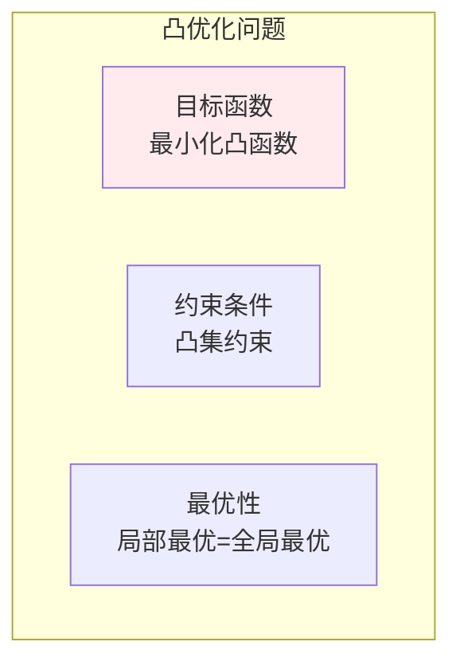
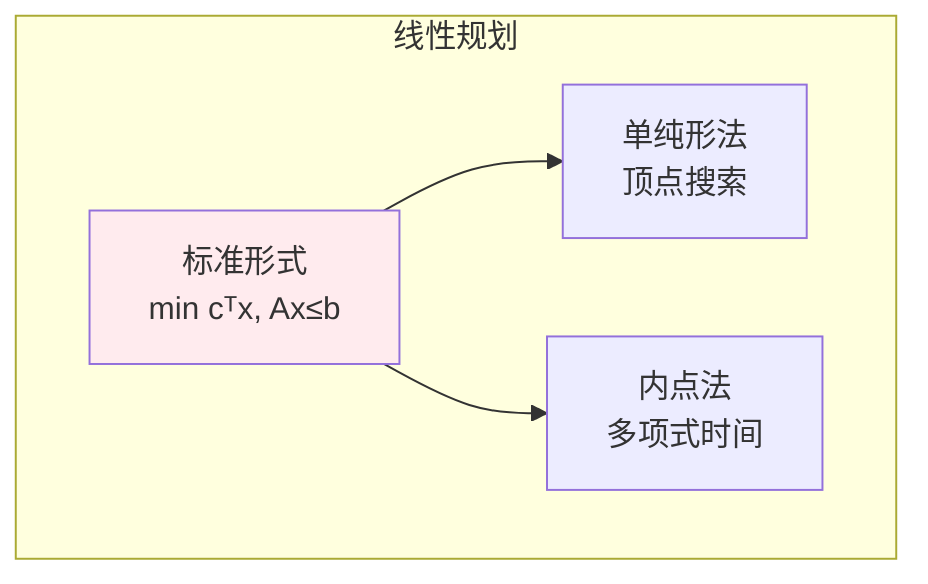
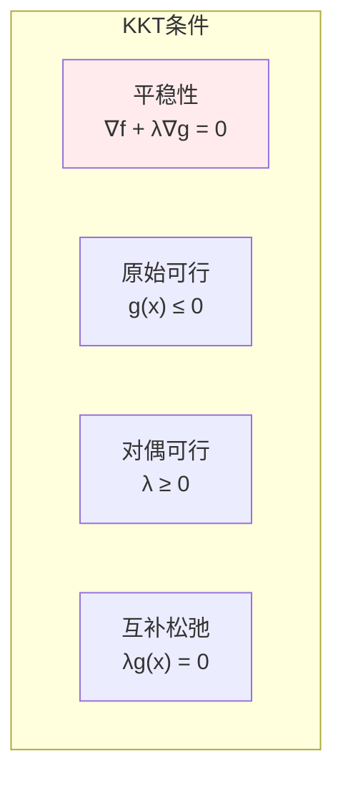
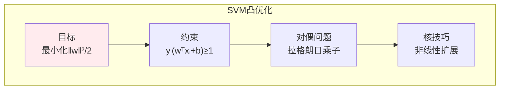

# 凸优化

> **核心观点**：凸优化问题具有全局最优保证，是机器学习中许多问题的理想形式。

---

## 📊 凸优化基本概念

### 凸集与凸函数

| 概念 | 定义 | 性质 |
|------|------|------|
| 凸集 | 任意两点连线在集合内 | 无"凹陷" |
| 凸函数 | f(θx+(1-θ)y) ≤ θf(x)+(1-θ)f(y) | 弦在函数上方 |
| 严格凸 | f(θx+(1-θ)y) < θf(x)+(1-θ)f(y) | 唯一全局最优 |

### 凸优化问题



---

## 🔢 常见凸优化问题

### 问题类型

| 类型 | 形式 | 例子 |
|------|------|------|
| 线性规划 | min cᵀx, Ax≤b | 资源分配 |
| 二次规划 | min xᵀQx+cᵀx | SVM |
| 半正定规划 | min tr(CX), AX=B | 矩阵优化 |
| 二阶锥规划 | min cᵀx, ‖Ax+b‖≤cᵀx+d | 鲁棒优化 |

### 线性规划



---

## 📈 对偶理论

### 对偶问题

| 概念 | 内容 | 意义 |
|------|------|------|
| 原始问题 | min f(x), g(x)≤0 | 原始优化 |
| 对偶问题 | max θ(λ), λ≥0 | 对偶优化 |
| 强对偶 | 最优值相等 | 理想情况 |

### KKT条件



---

## 🤖 机器学习应用

### 支持向量机（SVM）



### 正则化

| 方法 | 形式 | 意义 |
|------|------|------|
| L1正则 | min f(x) + λ\|x\|₁ | 产生稀疏 |
| L2正则 | min f(x) + λ\|x\|² | 防止过拟合 |

---

## 🎯 核心结论

### 凸优化核心概念

1. **凸性**：全局最优保证
2. **对偶理论**：问题转化
3. **KKT条件**：最优性判据
4. **SVM**：凸优化经典应用
5. **正则化**：结构风险最小化

### 学习路径

```
凸优化学习四步骤：
1. 凸集与凸函数：定义、性质
2. 凸优化问题：线性规划、二次规划
3. 对偶理论：KKT条件
4. 应用：SVM、正则化
```

---

## 📚 参考文献

1. 《凸优化》- Stephen Boyd
2. 《最优化导论》- Edwin Chong
3. 《凸优化基础》
4. 《支持向量机》
5. 《机器学习中的凸优化》
6. 《线性规划》
7. 《非线性规划》- Dimitri Bertsekas
8. 《优化方法》