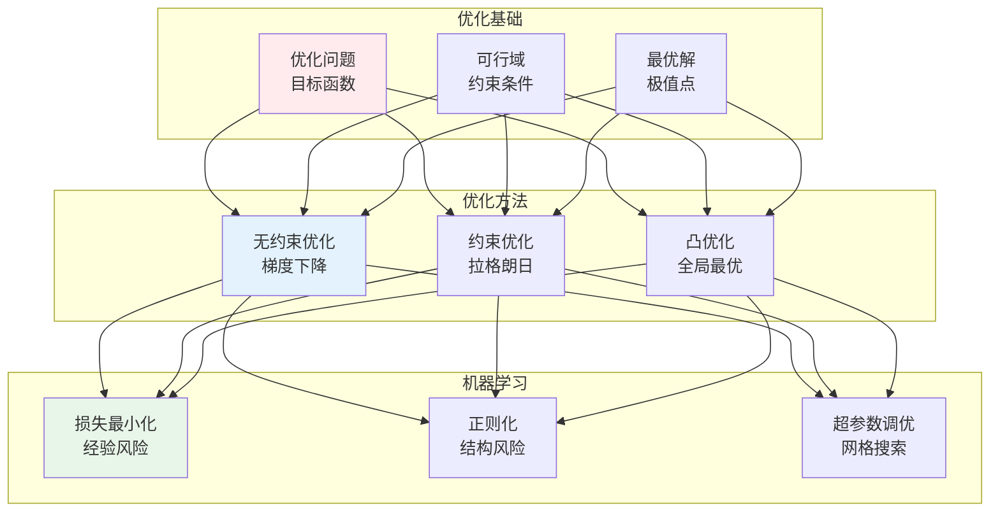
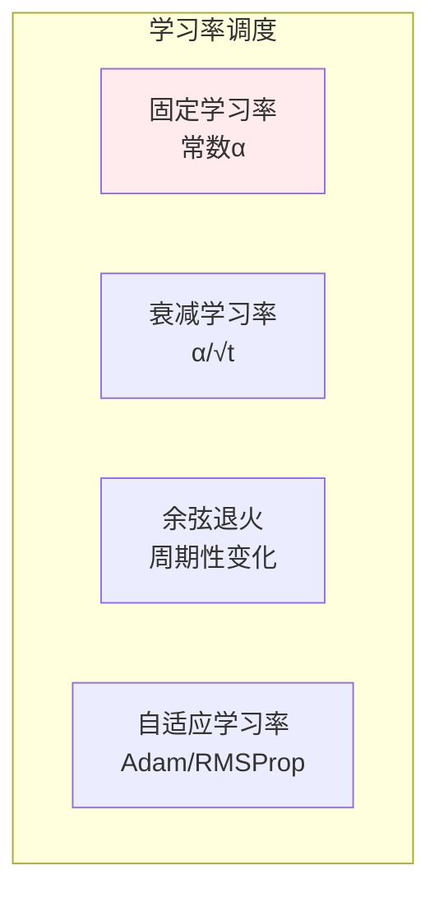
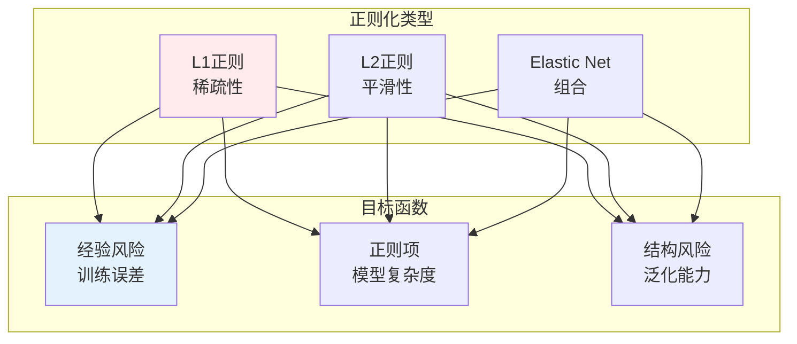

# 优化理论

> **核心观点**：优化理论研究如何在约束条件下寻找最优解，是机器学习训练算法的数学基础。

---

## 📊 优化理论体系



---

## 📐 优化基础

### 优化问题形式

| 类型 | 形式 | 例子 |
|------|------|------|
| 无约束优化 | min f(x) | 线性回归 |
| 等式约束 | min f(x) s.t. h(x)=0 | 拉格朗日乘子法 |
| 不等式约束 | min f(x) s.t. g(x)≤0 | SVM |

### 最优性条件

```mermaid
graph TB
    subgraph 一阶条件
        A1[驻点<br/>∇f(x)=0]
        A2[鞍点<br/>梯度为零但非极值]
    end    
    subgraph 二阶条件
        B1[极小值<br/>Hessian正定]
        B2[极大值<br/>Hessian负定]
        B3[鞍点<br/>Hessian不定]
    end
    
    A1 & A2 --> B1 & B2 & B3
    
    style A1 fill:#ffebee
    style B1 fill:#e3f2fd
```

### 凸优化

| 概念 | 定义 | 意义 |
|------|------|------|
| 凸集 | 任意两点连线在集合内 | 无局部最优 |
| 凸函数 | 二阶导数≥0 | 全局最优 |
| 凸优化 | 凸目标+凸约束 | 有效求解 |

```
凸优化重要性：
1. 局部最优=全局最优
2. 有高效算法
3. 理论分析完善
4. 应用广泛
```

---

## 📈 无约束优化

### 梯度下降法

```mermaid
flowchart LR
    A[初始化<br/>x₀] --> B[计算梯度<br/>∇f(x)]
    B --> C[更新参数<br/>x = x - α∇f]
    C --> D{收敛判断}
    D -->|否| B
    D -->|是| E[最优解]
    
    style A fill:#fff3e0
    style B fill:#e3f2fd
    style C fill:#e8f5e9
    style D fill:#fce4ec
    style E fill:#f3e5f5
```

### 梯度下降变体

| 变体 | 特点 | 优点 | 缺点 |
|------|------|------|------|
| 批量梯度下降 | 全部数据 | 稳定收敛 | 内存大 |
| 随机梯度下降 | 单样本 | 内存小 | 收敛不稳 |
| 小批量梯度下降 | 折中 | 效率高 | 需调参 |

### 学习率策略



### 动量方法

| 方法 | 原理 | 优点 |
|------|------|------|
| 动量 | 积累历史梯度 | 加速收敛 |
| Nesterov动量 | 先看一步再算梯度 | 更准确 |
| Adam | 动量+自适应学习率 | 鲁棒性强 |

---

## 🔒 约束优化

### 拉格朗日乘子法

| 概念 | 公式 | 意义 |
|------|------|------|
| 拉格朗日函数 | L(x,λ) = f(x) + λh(x) | 转化为无约束 |
| KKT条件 | ∇ₓL=0, ∇λL=0 | 最优性条件 |

### 对偶理论

```mermaid
graph TB
    subgraph 对偶问题
        A1[原始问题<br/>min f(x)]
        A2[对偶问题<br/>max g(λ)]
        A3[强对偶<br/>最优值相等]
    end    
    A1 --> A2 --> A3
    
    style A1 fill:#ffebee
    style A3 fill:#e3f2fd
```

---

## 🤖 机器学习应用

### 损失函数优化

| 损失函数 | 形式 | 特点 |
|----------|------|------|
| 0-1损失 | I(ŷ≠y) | 理想但不可导 |
| 合页损失 | max(0,1-yf(x)) | SVM |
| 交叉熵 | -∑y log ŷ | 分类问题 |
| MSE | (y-ŷ)² | 回归问题 |

### 正则化



### 超参数优化

| 方法 | 原理 | 优缺点 |
|------|------|--------|
| 网格搜索 | 穷举搜索 | 全面但耗时 |
| 随机搜索 | 随机采样 | 高效但不保证 |
| 贝叶斯优化 | 概率模型 | 智能但复杂 |

---

## 🎯 核心结论

### 优化理论核心概念

1. **目标函数**：需要最小化/最大化
2. **可行域**：约束条件定义
3. **梯度**：最速下降方向
4. **凸性**：全局最优保证
5. **收敛性**：算法终止条件

### 学习路径

```
优化理论学习四步骤：
1. 优化基础：问题形式、最优性条件
2. 无约束优化：梯度下降、动量方法
3. 约束优化：拉格朗日乘子法、KKT条件
4. 机器学习应用：损失函数、正则化
```

---

## 📚 参考文献

1. 《最优化导论》- Edwin Chong
2. 《凸优化》- Stephen Boyd
3. 《数值优化》- Jorge Nocedal
4. 《机器学习中的优化》
5. 《深度学习优化》
6. 《Nonlinear Programming》- Dimitri Bertsekas
7. 《Introduction to Nonlinear Optimization》
8. 《优化方法》- 刘浩