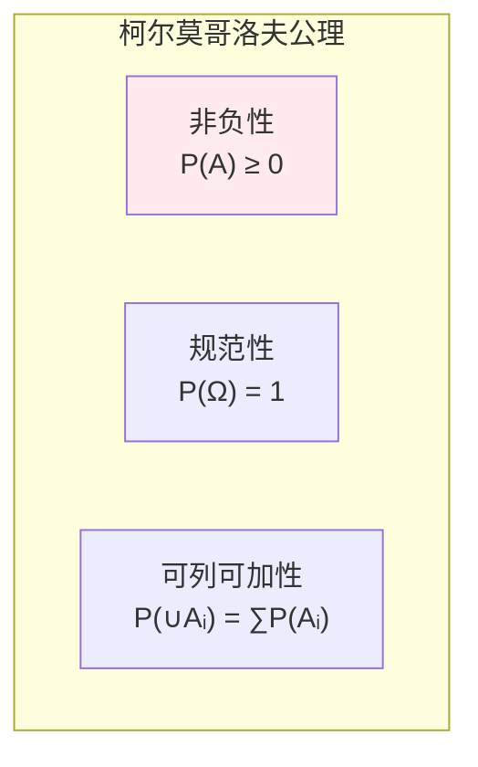
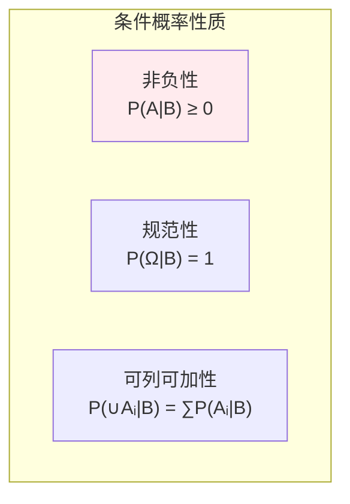
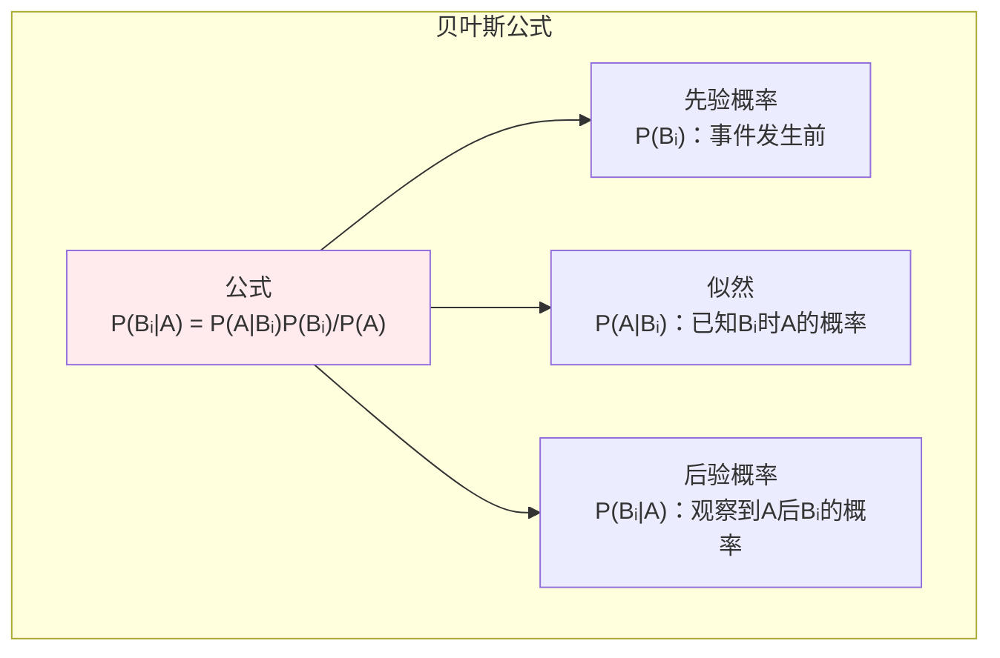
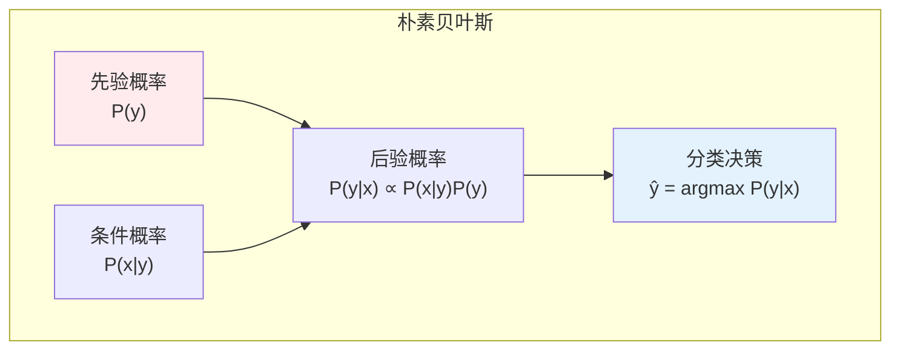

# 概率基础

> **核心观点**：概率是度量不确定性的数学工具，是统计推断和机器学习的理论基础。

---

## 📊 概率基本概念

### 概率定义

| 定义方式 | 内涵 | 适用场景 |
|----------|------|----------|
| 古典定义 | 等可能性事件的比例 | 有限样本空间 |
| 频率定义 | 频率的极限 | 大量重复试验 |
| 主观定义 | 个人信念程度 | 未知事件 |

### 概率公理



---

## 🎲 事件运算

### 事件类型

| 类型 | 定义 | 符号 |
|------|------|------|
| 必然事件 | 一定会发生 | Ω |
| 不可能事件 | 一定不发生 | ∅ |
| 对立事件 | 不发生 | A' 或 Aᶜ |
| 互斥事件 | 不能同时发生 | A∩B = ∅ |

### 事件运算

| 运算 | 定义 | 性质 |
|------|------|------|
| 并集 | A∪B = {x∈A或x∈B} | 交换律、结合律 |
| 交集 | A∩B = {x∈A且x∈B} | 交换律、结合律 |
| 差集 | A-B = {x∈A且x∉B} | 非交换 |
| 补集 | A' = {x∉A} | 对合律 |

### 德摩根律

```
德摩根律：
(A∪B)' = A'∩B'
(A∩B)' = A'∪B'

推广：
(∪Aᵢ)' = ∩Aᵢ'
(∩Aᵢ)' = ∪Aᵢ'
```

---

## 📐 条件概率

### 条件概率定义

| 概念 | 公式 | 意义 |
|------|------|------|
| 条件概率 | P(A\|B) = P(AB)/P(B) | B发生时A的概率 |
| 乘法公式 | P(AB) = P(A\|B)P(B) | 联合概率 |

### 条件概率性质



---

## 🔗 全概率公式与贝叶斯公式

### 全概率公式

| 公式 | 形式 | 意义 |
|------|------|------|
| 全概率 | P(A) = ∑P(A\|Bᵢ)P(Bᵢ) | 分解复杂事件 |
| 条件 | {Bᵢ}是样本空间划分 | 互斥且完备 |

### 贝叶斯公式



### 贝叶斯推断

| 步骤 | 内容 | 公式 |
|------|------|------|
| 1. 建立先验 | 对参数的初始信念 | P(θ) |
| 2. 收集数据 | 观察到的证据 | P(D\|θ) |
| 3. 更新后验 | 结合先验和数据 | P(θ\|D) ∝ P(D\|θ)P(θ) |

---

## 🤖 机器学习应用

### 朴素贝叶斯分类器



### 贝叶斯优化

| 应用 | 内容 | 优势 |
|------|------|------|
| 超参数优化 | 建模目标函数 | 减少评估次数 |
| 主动学习 | 选择最有价值样本 | 标注效率高 |

---

## 🎯 核心结论

### 概率基础核心概念

1. **概率**：不确定性的度量
2. **条件概率**：信息更新的基础
3. **全概率公式**：分解复杂问题
4. **贝叶斯公式**：信念更新的数学表达
5. **先验与后验**：从假设到证据的推理

### 学习路径

```
概率基础学习四步骤：
1. 概率公理：非负性、规范性、可加性
2. 事件运算：并、交、补、德摩根律
3. 条件概率：定义、乘法公式
4. 贝叶斯公式：全概率、后验概率
```

---

## 📚 参考文献

1. 《概率论与数理统计》- 浙江大学
2. 《概率论基础教程》- Sheldon Ross
3. 《统计学习方法》- 李航
4. 《Pattern Recognition and Machine Learning》- Bishop
5. 《概率统计》- 陈希孺
6. 《All of Statistics》- Larry Wasserman
7. 《贝叶斯方法》- Tim Head
8. 《深入理解贝叶斯推断》