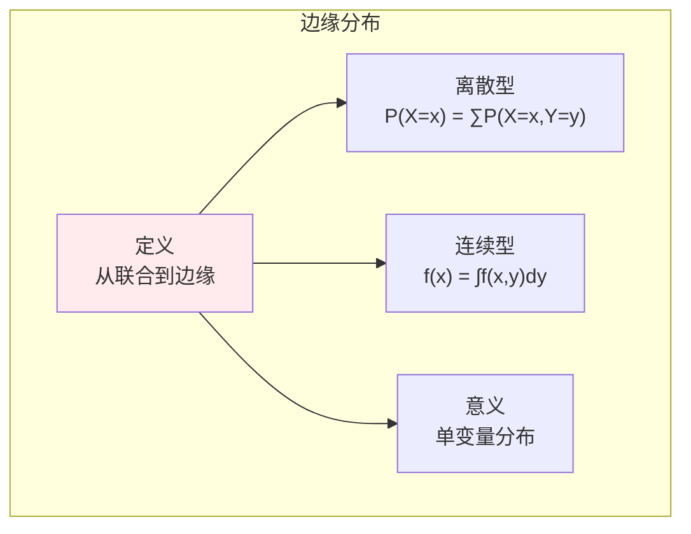
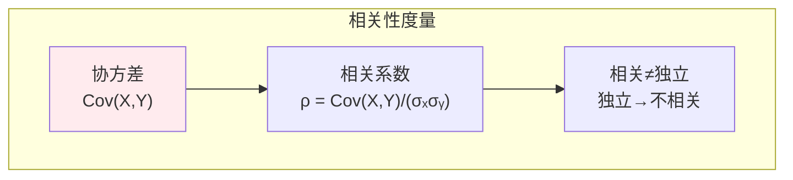
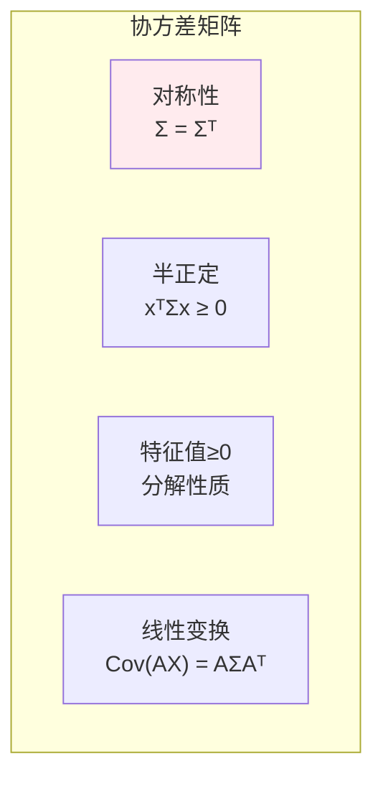
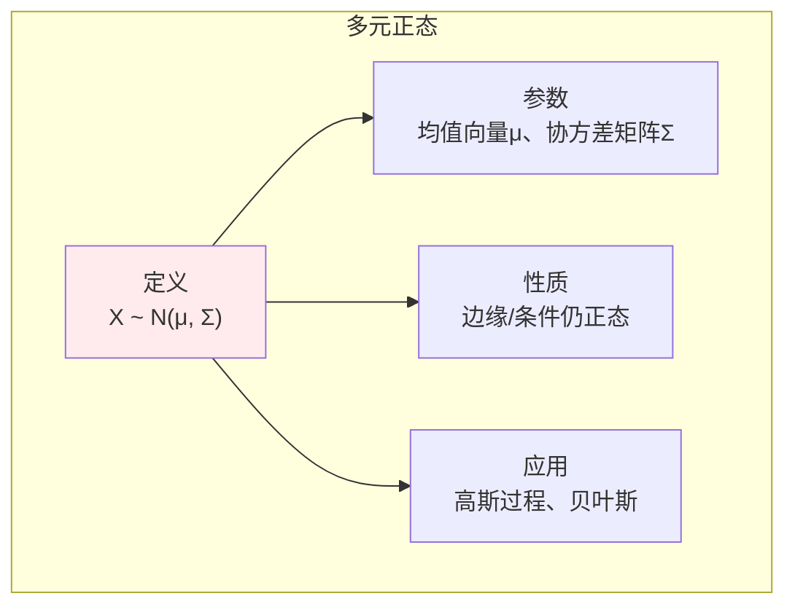

# 多维随机变量

> **核心观点**：多维随机变量描述多个随机现象的联合行为，是理解变量间关系的数学工具。

---

## 📊 多维随机变量基本概念

### 联合分布

| 概念 | 定义 | 意义 |
|------|------|------|
| 联合分布函数 | F(x,y) = P(X≤x, Y≤y) | 两变量同时取值 |
| 联合概率 | P(X=x, Y=y) | 离散型 |
| 联合密度 | f(x,y) = ∂²F/∂x∂y | 连续型 |

### 边缘分布



---

## 📈 条件分布

### 条件分布定义

| 类型 | 公式 | 意义 |
|------|------|------|
| 离散型 | P(X=x\|Y=y) = P(X=x,Y=y)/P(Y=y) | 给定Y时X的分布 |
| 连续型 | f(x\|y) = f(x,y)/f(y) | 给定Y时X的密度 |

### 条件分布性质

```
条件分布性质：
1. 非负性：f(x|y) ≥ 0
2. 归一化：∫f(x|y)dx = 1
3. 贝叶斯：f(x|y) = f(x,y)/f(y)
```

---

## 🔗 独立性与相关性

### 独立性

| 概念 | 定义 | 等价条件 |
|------|------|----------|
| 独立 | P(X≤x, Y≤y) = P(X≤x)P(Y≤y) | 联合=边缘乘积 |
| 密度独立 | f(x,y) = f(x)f(y) | 密度可分离 |

### 相关性



### 独立与不相关

| 关系 | 条件 | 说明 |
|------|------|------|
| 独立→不相关 | 独立一定不相关 | 充分条件 |
| 不相关↛独立 | 不相关不一定独立 | 除非联合正态 |

---

## 📐 协方差矩阵

### 协方差矩阵定义

| 概念 | 公式 | 性质 |
|------|------|------|
| 协方差矩阵 | Σᵢⱼ = Cov(Xᵢ, Xⱼ) | 对称、半正定 |
| 对角线 | Var(Xᵢ) | 各变量方差 |
| 非对角线 | Cov(Xᵢ, Xⱼ) | 变量间协方差 |

### 协方差矩阵性质



---

## 🤖 机器学习应用

### 多元正态分布



### 高斯混合模型（GMM）

| 概念 | 内容 | 意义 |
|------|------|------|
| 混合分布 | p(x) = ∑πₖN(x\|μₖ, Σₖ) | 多个高斯叠加 |
| EM算法 | E步计算后验，M步更新参数 | 参数估计 |

---

## 🎯 核心结论

### 多维随机变量核心概念

1. **联合分布**：多变量同时取值
2. **边缘分布**：单变量分布
3. **条件分布**：给定条件的分布
4. **独立性**：联合=边缘乘积
5. **协方差矩阵**：变量间关系

### 学习路径

```
多维随机变量学习四步骤：
1. 联合分布：定义、计算
2. 边缘分布：从联合到边缘
3. 条件分布：条件概率推广
4. 独立与相关：区别与联系
```

---

## 📚 参考文献

1. 《概率论与数理统计》- 浙江大学
2. 《概率论基础教程》- Sheldon Ross
3. 《多元统计分析》- 何晓群
4. 《Pattern Recognition and Machine Learning》- Bishop
5. 《统计学习方法》- 李航
6. 《概率统计》- 陈希孺
7. 《多元正态分布》
8. 《协方差矩阵分析》