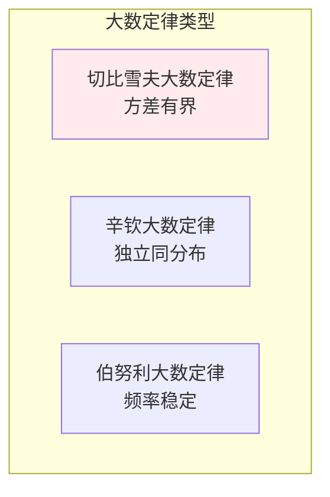
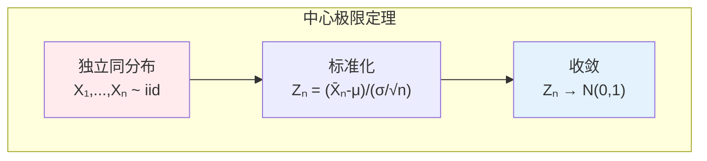
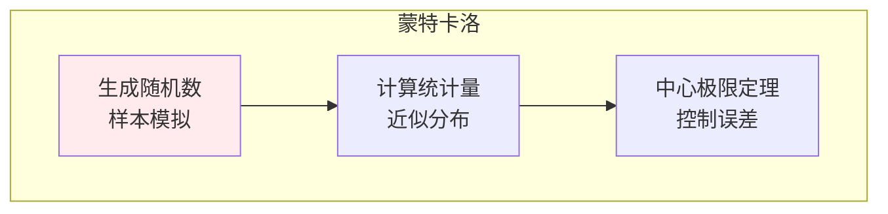

# 大数定律与中心极限定理

> **核心观点**：大数定律说明频率的稳定性，中心极限定理说明正态分布的普遍性，是统计推断的理论基石。

---

## 📊 大数定律

### 定义

| 定律 | 内涵 | 意义 |
|------|------|------|
| 弱大数定律 | X̄ₙ 依概率收敛于 μ | 频率稳定 |
| 强大数定律 | X̄ₙ 几乎必然收敛于 μ | 频率几乎必然稳定 |

### 常见大数定律



### 切比雪夫不等式

| 公式 | 内容 | 应用 |
|------|------|------|
| P(\|X-μ\|≥ε) ≤ σ²/ε² | 偏离均值的概率上界 | 证明大数定律 |

---

## 📈 中心极限定理

### 定义



### 常见中心极限定理

| 定理 | 条件 | 结论 |
|------|------|------|
| 林德伯格-莱维 | 独立同分布 | 和趋于正态 |
| 李雅普诺夫 | 独立不同分布 | 和趋于正态 |
| 棣莫弗-拉普拉斯 | 二项分布 | 近似正态 |

---

## 🎯 应用

### 参数估计

| 应用 | 原理 | 说明 |
|------|------|------|
| 置信区间 | X̄ ± zₐ/₂σ/√n | 均值区间估计 |
| 假设检验 | 构造统计量 | 判断假设真伪 |

### 蒙特卡洛模拟



---

## 🤖 机器学习应用

### 随机近似

| 方法 | 原理 | 应用 |
|------|------|------|
| SGD | 小批量梯度近似全批量 | 大规模训练 |
| 随机森林 | 随机采样近似集成 | 集成学习 |
| 蒙特卡洛Dropout | 采样近似贝叶斯推断 | 不确定性估计 |

---

## 🎯 核心结论

### 极限定理核心概念

1. **大数定律**：频率趋近概率
2. **中心极限定理**：和趋于正态
3. **正态分布**：自然界最普遍的分布
4. **统计推断**：基于极限理论
5. **机器学习**：随机近似方法

### 学习路径

```
极限理论学习四步骤：
1. 大数定律：弱/强大数定律
2. 中心极限定理：收敛到正态
3. 应用：置信区间、假设检验
4. 机器学习：SGD、蒙特卡洛
```

---

## 📚 参考文献

1. 《概率论与数理统计》- 浙江大学
2. 《概率论基础教程》- Sheldon Ross
3. 《统计学习方法》- 李航
4. 《Probability and Statistics》- DeGroot
5. 《蒙特卡洛方法》
6. 《随机过程》- 方兆本
7. 《中心极限定理》
8. 《大数定律与中心极限定理》