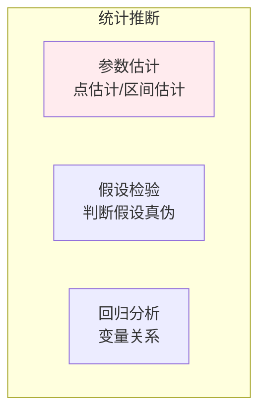
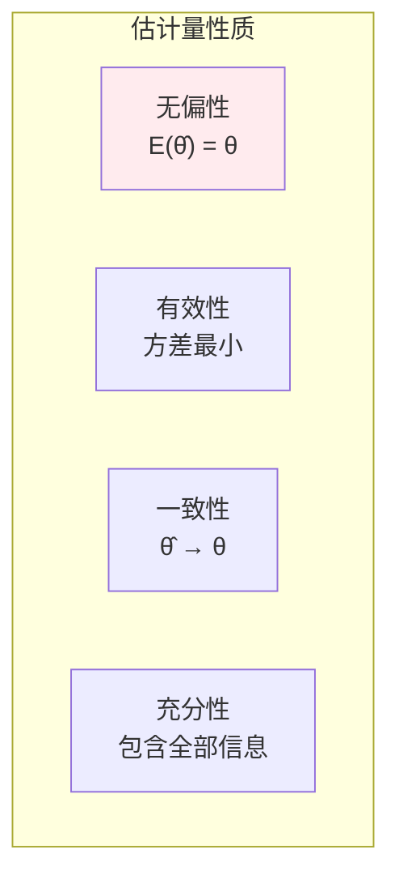
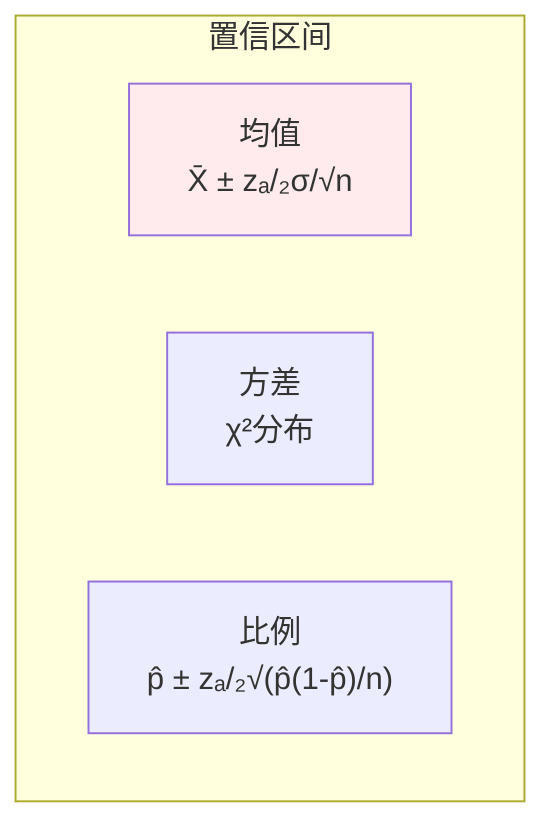
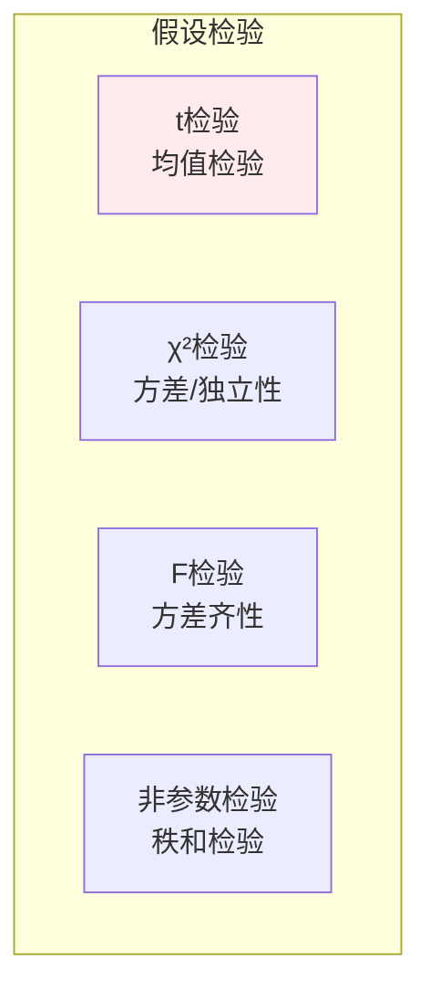
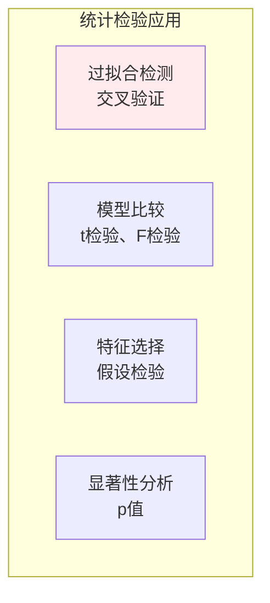

# 统计推断

> **核心观点**：统计推断是从样本数据推断总体特征的方法，是数据分析和机器学习的核心。

---

## 📊 统计推断框架



---

## 🎯 点估计

### 点估计方法

| 方法 | 原理 | 优缺点 |
|------|------|--------|
| 矩估计 | 样本矩=总体矩 | 简单但不一定最优 |
| 最大似然估计 | 使似然函数最大 | 最优但计算复杂 |
| 贝叶斯估计 | 后验众数/均值 | 融合先验信息 |

### 估计量性质



### 最大似然估计

| 步骤 | 内容 | 公式 |
|------|------|------|
| 1. 构造似然函数 | 所有样本联合概率 | L(θ) = ∏P(xᵢ\|θ) |
| 2. 对数似然 | 取对数简化计算 | l(θ) = ∑logP(xᵢ\|θ) |
| 3. 求导最大化 | 令导数为0 | ∂l/∂θ = 0 |

---

## 📐 区间估计

### 置信区间

| 概念 | 公式 | 意义 |
|------|------|------|
| 置信区间 | [θ̂₋, θ̂₊] | 参数可能范围 |
| 置信水平 | 1-α | 包含真值的概率 |

### 常用置信区间



---

## 🧪 假设检验

### 检验步骤

| 步骤 | 内容 | 说明 |
|------|------|------|
| 1. 建立假设 | H₀ vs H₁ | 原假设/备择假设 |
| 2. 选择统计量 | 检验统计量 | t检验、χ²检验 |
| 3. 确定拒绝域 | 临界值 | 显著性水平α |
| 4. 做出决策 | 拒绝/不拒绝 | p值判断 |

### 常见检验



### 第一类与第二类错误

| 错误类型 | 定义 | 概率 |
|----------|------|------|
| 第一类错误 | 拒绝真H₀ | α（显著性水平） |
| 第二类错误 | 接受假H₀ | β |
| 检验功效 | 1-β | 正确拒绝H₀的概率 |

---

## 🤖 机器学习应用

### 模型选择



### A/B测试

| 步骤 | 内容 | 方法 |
|------|------|------|
| 设计 | 随机分组 | 实验设计 |
| 采集 | 收集数据 | 样本量 |
| 分析 | 假设检验 | t检验、卡方检验 |
| 决策 | 是否显著 | p值<α |

---

## 🎯 核心结论

### 统计推断核心概念

1. **点估计**：给出参数的单一估计值
2. **区间估计**：给出参数的可能范围
3. **假设检验**：判断假设的真伪
4. **p值**：观察到的结果至少如实际极端的概率
5. **置信水平**：重复实验中包含真值的比例

### 学习路径

```
统计推断学习四步骤：
1. 点估计：矩估计、MLE
2. 区间估计：置信区间
3. 假设检验：t检验、χ²检验
4. 应用：A/B测试、模型选择
```

---

## 📚 参考文献

1. 《概率论与数理统计》- 浙江大学
2. 《统计学习方法》- 李航
3. 《统计学》- 贾俊平
4. 《统计推断》- Casella
5. 《All of Statistics》- Larry Wasserman
6. 《Introduction to the Practice of Statistics》
7. 《统计学方法》
8. 《假设检验》