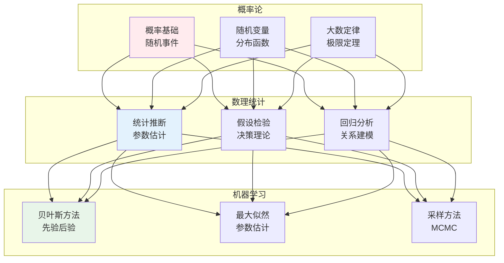
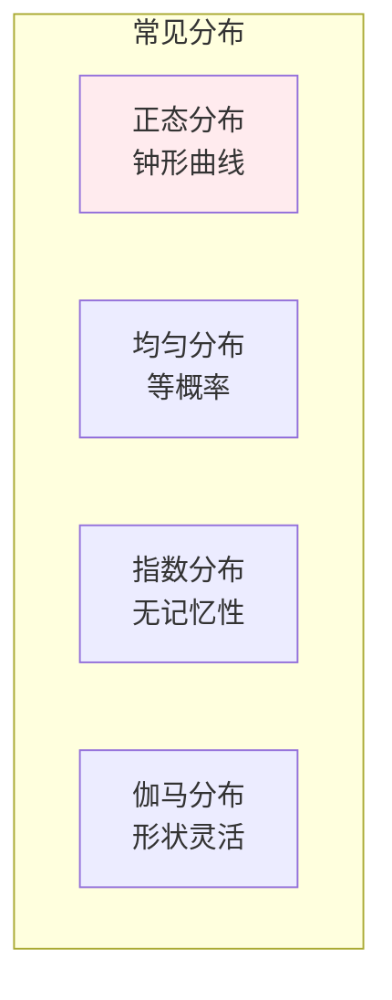
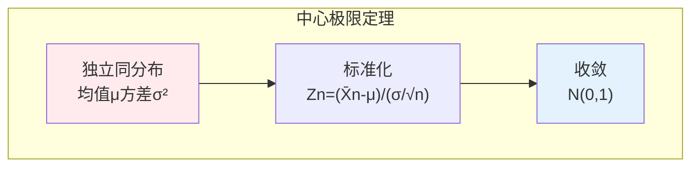
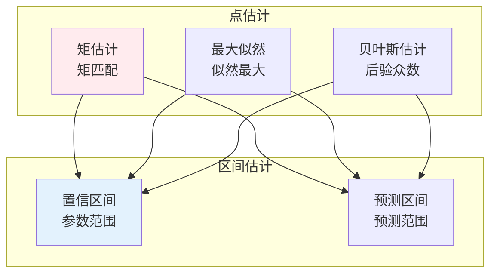
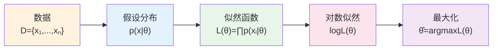

# 概率论与数理统计

## 🗂️ 内容导航

| 名称 | 说明 | 链接 |
|------|------|------|
| 概率基础 | 理解概率的基本概念与运算法则 | [进入](01-probability-basics.md) |
| 随机变量 | 理解随机变量的分布与性质 | [进入](02-random-variables.md) |
| 多维随机变量 | 理解联合分布、边缘分布与条件分布 | [进入](03-multivariate-random-variables.md) |
| 大数定律与中心极限定理 | 理解概率论的极限理论 | [进入](04-law-of-large-numbers.md) |
| 统计推断 | 理解参数估计与假设检验的核心方法 | [进入](05-statistical-inference.md) |

---


> **核心观点**：概率论研究随机现象的规律性，数理统计研究如何从数据中提取信息，是机器学习的理论基础。

---

## 📊 概率统计体系



---

## 🎲 概率基础

### 概率定义

| 定义 | 内涵 | 适用场景 |
|------|------|----------|
| 古典定义 | 等可能性 | 有限样本 |
| 频率定义 | 频率极限 | 大量重复 |
| 主观定义 | 信念程度 | 个人判断 |

### 概率公理

```
柯尔莫哥洛夫公理：
1. 非负性：P(A) ≥ 0
2. 规范性：P(Ω) = 1
3. 可列可加性：P(∪Aᵢ) = ∑P(Aᵢ)
```

### 条件概率

| 公式 | 内涵 | 应用 |
|------|------|------|
| P(A|B) = P(AB)/P(B) | 条件概率定义 | 信息更新 |
| P(AB) = P(A|B)P(B) | 乘法公式 | 联合概率 |
| P(A|B) = P(B|A)P(A)/P(B) | 贝叶斯公式 | 推断学习 |

---

## 📈 随机变量

### 离散随机变量

| 分布 | 概率函数 | 均值 | 方差 |
|------|----------|------|------|
| 伯努利 | P(X=1)=p | p | p(1-p) |
| 二项 | C(n,k)pᵏ(1-p)ⁿ⁻ᵏ | np | np(1-p) |
| 泊松 | λᵏe⁻λ/k! | λ | λ |

### 连续随机变量



### 正态分布

| 性质 | 内涵 | 应用 |
|------|------|------|
| 68-95-99.7法则 | μ±σ包含68% | 数据分析 |
| 中心极限定理 | 和趋于正态 | 统计推断 |
| 标准化 | Z=(X-μ)/σ | 比较不同尺度 |

---

## 📊 多维随机变量

### 联合分布

| 概念 | 定义 | 意义 |
|------|------|------|
| 联合分布 | P(X=x, Y=y) | 两变量同时取值 |
| 边缘分布 | P(X=x) = ∑P(X,Y) | 单变量分布 |
| 条件分布 | P(X|Y) = P(X,Y)/P(Y) | 给定条件分布 |

### 协方差与相关

| 指标 | 公式 | 意义 |
|------|------|------|
| 协方差 | Cov(X,Y) = E[(X-μₓ)(Y-μᵧ)] | 线性相关方向 |
| 相关系数 | ρ = Cov(X,Y)/(σₓσᵧ) | 线性相关强度 |

```
相关系数解释：
- ρ > 0：正相关
- ρ < 0：负相关
- ρ = 0：不相关
```

---

## 🎯 大数定律与中心极限定理

### 大数定律

| 定律 | 内涵 | 意义 |
|------|------|------|
| 弱大数定律 | 均值依概率收敛 | 频率稳定 |
| 强大数定律 | 均值几乎必然收敛 | 频率稳定 |

### 中心极限定理



---

## 📊 数理统计

### 统计量

| 统计量 | 公式 | 意义 |
|--------|------|------|
| 样本均值 | X̄ = ∑Xᵢ/n | 中心位置 |
| 样本方差 | S² = ∑(Xᵢ-X̄)²/(n-1) | 离散程度 |
| 样本矩 | E(Xᵏ) | 分布特征 |

### 参数估计



### 假设检验

| 步骤 | 内容 | 工具 |
|------|------|------|
| 建立假设 | H₀ vs H₁ | 原假设/备择假设 |
| 选择统计量 | 检验统计量 | t检验、χ²检验 |
| 确定拒绝域 | 临界值 | 显著性水平α |
| 做出决策 | 拒绝/不拒绝 | p值 |

---

## 🤖 机器学习应用

### 最大似然估计（MLE）



### 贝叶斯推断

| 概念 | 公式 | 意义 |
|------|------|------|
| 先验 | P(θ) | 信念更新前 |
| 似然 | P(D|θ) | 数据信息 |
| 后验 | P(θ|D) ∝ P(D|θ)P(θ) | 信念更新后 |

### 采样方法

```
MCMC方法：
1. Metropolis-Hastings：随机游走
2. Gibbs采样：条件分布采样
3. HMC：哈密顿动力学
```

---

## 🎯 核心结论

### 概率统计核心概念

1. **随机性**：不确定性是世界的本质
2. **分布**：随机变量的规律性
3. **估计**：从数据推断参数
4. **检验**：判断假设真伪
5. **预测**：基于历史预测未来

### 学习路径

```
概率统计学习四步骤：
1. 概率基础：事件、条件概率、贝叶斯
2. 分布理论：常见分布、性质
3. 统计推断：估计、检验、回归
4. 机器学习应用：MLE、贝叶斯、采样
```

---

## 📚 参考文献

1. 《概率论与数理统计》- 浙江大学
2. 《统计学习方法》- 李航
3. 《Pattern Recognition and Machine Learning》- Bishop
4. 《概率统计》- 陈希孺
5. 《All of Statistics》- Larry Wasserman
6. 《统计学》- 贾俊平
7. 《贝叶斯方法》- Tim Head
8. 《深入理解贝叶斯推断》