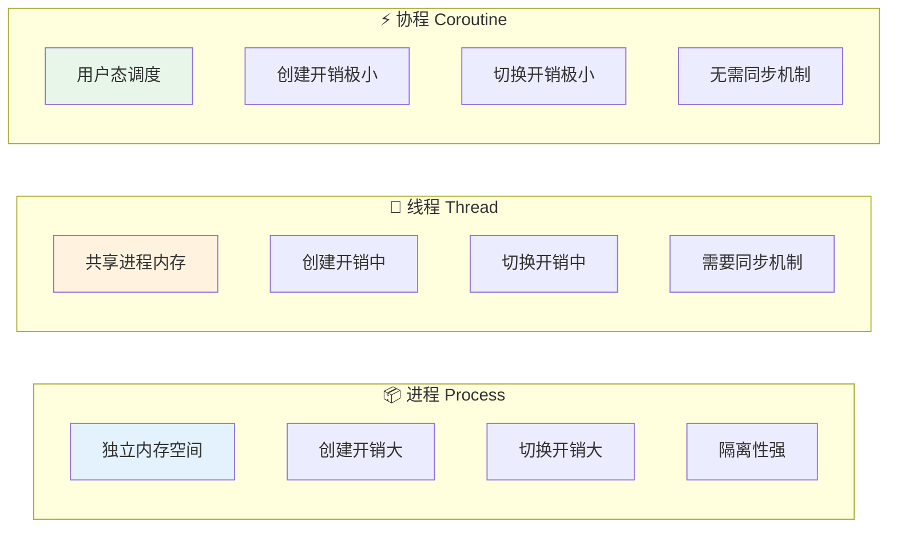
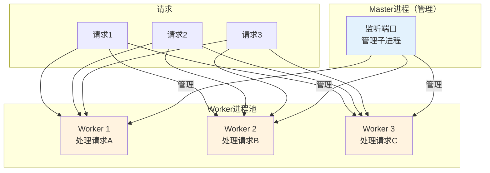
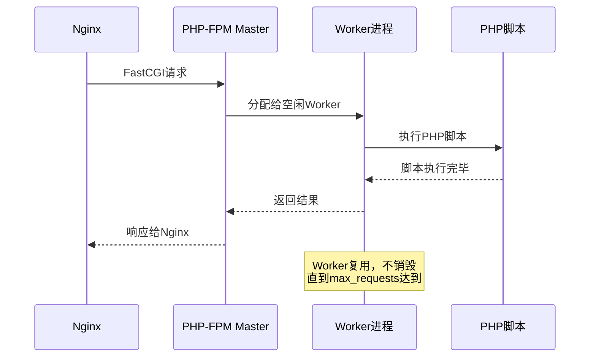
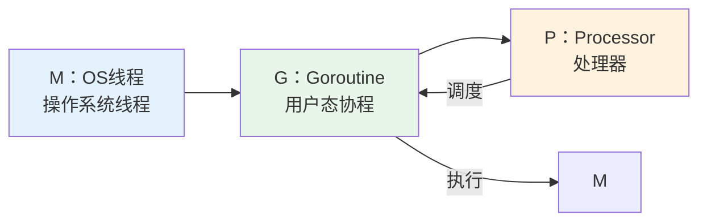
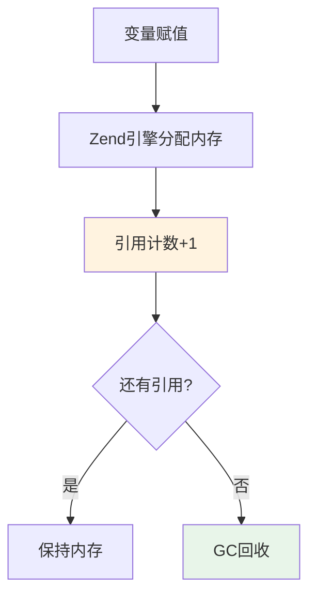
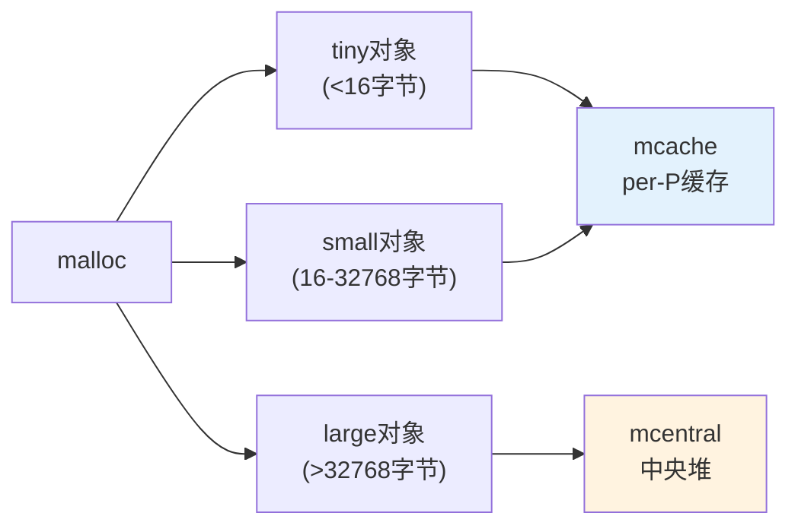

# 02 — 操作系统与进程模型

> 核心规律：进程隔离内存，线程共享内存，协程轻量级
> 一句话：理解进程模型，就理解了PHP-FPM和Go协程的本质区别

---

## 一、核心规律

### 1.1 进程 vs 线程 vs 协程



### 1.2 关键对比

| 特性 | 进程 | 线程 | 协程 |
|------|------|------|------|
| **内存** | 独立 | 共享 | 共享 |
| **创建开销** | 大 | 中 | 极小 |
| **切换开销** | 大（内核态） | 中 | 极小（用户态） |
| **并发数** | 几十个 | 几百个 | 几十万+ |
| **同步** | 不需要 | 需要锁 | 不需要 |
| **PHP-FPM** | ✅ 使用 | — | — |
| **Go** | — | — | ✅ 使用 |

> **核心规律：协程 = 线程的轻量化。Go用协程实现高并发，PHP用多进程实现隔离。**

---

## 二、PHP-FPM 进程模型

### 2.1 架构原理



### 2.2 生命周期



### 2.3 关键配置

```ini
; pool.conf
pm = dynamic              ; 进程管理方式：static/dynamic/on-demand
pm.max_children = 50      ; 最大子进程数（CPU核数×2~4）
pm.start_servers = 5      ; 启动时进程数
pm.min_spare_servers = 2  ; 最小空闲进程
pm.max_spare_servers = 10 ; 最大空闲进程
pm.max_requests = 500     ; 单进程最大请求数（防内存泄漏）
```

> **配置规律：** `max_children ≈ CPU核数 × 2~4`，`max_requests`防止内存泄漏累积

---

## 三、Go 协程模型

### 3.1 Goroutine 原理



**M : G : P = 1 : N : M 模型**
- **M (Machine)**：OS线程，真正的执行者
- **G (Goroutine)**：用户态协程，轻量级任务
- **P (Processor)**：处理器，绑定M和G

### 3.2 Channel 通信

```go
// 无缓冲channel：发送阻塞直到接收
ch := make(chan int)
go func() { ch <- 42 }()
val := <-ch  // 阻塞等待

// 缓冲channel：缓冲区满才阻塞
ch2 := make(chan int, 10)
ch2 <- 42   // 不阻塞（缓冲区有空位）
val2 := <-ch2
```

> **核心规律：Channel = 协程间的管道。不要通过共享内存通信，要通过通信共享内存。**

### 3.3 并发模式

| 模式 | 代码示例 | 适用场景 |
|------|---------|---------|
| **Fan-out** | 多个goroutine并行处理 | 批量任务 |
| **Fan-in** | 合并多个channel结果 | 结果聚合 |
| **Worker Pool** | 固定数量worker处理任务队列 | 限流/资源控制 |
| **Pipeline** | 多阶段串联处理 | 数据处理流水线 |

---

## 四、内存模型

### 4.1 PHP 内存管理



**PHP引用计数机制：**
- 每个变量有`refcount`，赋值时+1，析构时-1
- refcount=0时，内存被回收
- PHP 7+ 引入GC处理循环引用

### 4.2 Go 内存管理



> **Go内存优化技巧：** 复用对象（sync.Pool）、避免大对象、使用指针传递大结构体

---

## 五、实战要点

### 5.1 PHP-FPM 调优 checklist

```
□ max_children = CPU核数 × 2~4
□ pm.max_requests = 500~1000（防内存泄漏）
□ opcache.enable = 1（ bytecode缓存）
□ opcache.jit = 1255（PHP 8 JIT）
□ 监控 worker 进程数，避免过多/过少
```

### 5.2 Go 并发调优 checklist

```
□ 使用 sync.WaitGroup 等待多个goroutine
□ 使用 context 传递取消信号
□ 避免 goroutine 泄漏（channel未关闭）
□ 使用 sync.Pool 复用对象
□ 使用 pprof 分析 CPU/内存/协程
```

---

## 六、本章总结

> **核心规律：进程是隔离的，线程是共享的，协程是轻量的。PHP用多进程保证稳定，Go用协程追求并发。**

### 关键记忆点
- ✅ 进程隔离内存，线程共享内存
- ✅ PHP-FPM是多进程模型，max_requests防内存泄漏
- ✅ Go协程是用户态，创建开销极小
- ✅ Channel是协程通信的方式，不是共享内存

---

## 延伸阅读

- [01 HTTP与网络基础](../../network-fundamentals/01-http-basics.md) — HTTP请求在进程模型中的生命周期
- [15 PHP深度解析](../computing/02-php-deep-dive.md) — PHP-FPM进程模型深入
- [16 Go语言与高并发](../computing/03-go-concurrency.md) — Goroutine深入
